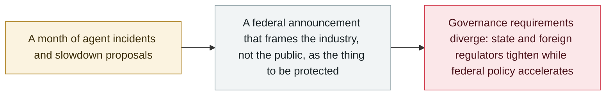

# Trump announces an "AI Force" and an AI czar, and calls safety fears a hoax

     

## Summary

In a Truth Social post on Saturday **19 September**, President Trump says he will form an **"AI Force"** — explicitly modelled on the Space Force he created in his first term — and will soon name a new **AI "czar"** to lead it: *"Only High I.Q. individuals need apply!"* The framing is protective of the industry rather than of the public: *"We will not in any way hinder or stifle the Growth of this incredible Industry. Rather, we will cherish it, help it, and watch over it, as it grows!"* **No structure, budget, placement in the federal government or timeline was given.** The announcement makes **no reference to AI safety, to the agent incidents of the summer, or to the pacing debate**; Trump has separately called safety warnings a "hoax" and told Nvidia's CEO that "the robots will not be taking over". It lands seven days after [Amodei's pacing essay](2026-09-12-amodei-pace-the-frontier.md) and one day after [California's kill-switch order](2026-09-18-california-ai-kill-switch-eo.md) — the federal counter-move in a governance argument this archive has been tracking all month

## Attack chain

## Details

**What was actually announced, and what was not.** The substance is thin by design: a named body ("AI Force"), an analogy (the Space Force), a post to be filled ("AI czar"), and a promise not to regulate. Reporters at every outlet noted the same absences — no budget, no statutory basis, no placement within the executive branch, no date. The role is not new: David Sacks held an AI czar position earlier in the administration before moving to an external advisory role, and now chairs the President's Council of Advisors on Science and Technology, where he has described AI safety fears as "becoming a panic".

**Why it is filed here, and the caveat that goes with it.** This record is the weakest fit in the archive's September policy set, and that should be visible rather than hidden. The announcement does not mention AI agents, agent security, or any incident in this archive. Under a strict reading of the [scope rules](../../docs/scope.md) — regulatory action *directly about agent security* — it would not qualify. It is included on the same basis the archive applied to the [consumer antitrust suit](2026-09-18-ai-slowdown-antitrust-lawsuit.md): legal and regulatory action around the pace of frontier-AI development, recorded as `info` and excluded from incident statistics. Leaving it out would make the September governance thread read as one-directional, when the most consequential federal move of the month ran the other way. A reader who disagrees with that call can filter it out with `kind: policy`.

**The divergence worth watching.** Within eight days: Amodei proposes an industry slowdown and admits third-party evaluators; the EU convenes frontier labs over agent escapes; California orders a kill switch and third-party oversight; Hawley opens a Senate investigation; and the White House announces a body whose stated purpose is to make sure nothing hinders the industry. Organisations running agents now face requirements that point in opposite directions depending on jurisdiction — which is a practical security-governance fact, not merely a political one.

## Sources

| # | Source | Link |
|---|---|---|
| 1 | Al Jazeera | <https://www.aljazeera.com/news/2026/9/19/trump-says-he-will-create-ai-force-with-new-ai-czar> |
| 2 | NBC News | <https://www.nbcnews.com/politics/white-house/artificial-intelligence-task-force-czar-technology-trump-rcna598688> |
| 3 | Axios | <https://www.axios.com/2026/09/19/trump-ai-czar-space-force-safety> |
| 4 | CNN | <https://www.cnn.com/2026/09/19/politics/trump-ai-task-force-czar> |

## Metadata

| Field | Value |
|---|---|
| Date | `2026-09-19` (raw: 2026-09-19, precision `day`) |
| Kind | Policy / regulation `policy` |
| Type | [`GOV`](../../taxonomy/types.md#gov) Governance and policy |
| Severity | **Info** `info` |
| Confidence | **B** — the primary is a social-media post; recorded from consistent reporting by four major outlets |
| Real harm | Not applicable |
| AI involvement | Confirmed `confirmed` |
| Region | [United States](../../regions/us.md) |
| Archive ID | `2026-09-19-trump-ai-force-czar` |

**Why this classification:** Policy action around frontier-AI development pace, not an incident; `severity` is recorded as `info` and it is excluded from incident statistics. Graded `B` rather than `A` because the underlying primary is a Truth Social post rather than an official executive document, and no implementing order has been published. **Scope caveat:** the announcement itself does not mention AI agents or agent security; it is included as the federal counterpart to the September governance records, on the same basis as the consumer antitrust suit. Grading criteria: see [taxonomy/severity.md](../../taxonomy/severity.md) and [taxonomy/confidence.md](../../taxonomy/confidence.md).

## Related

**Topic:** [Defence and governance](../../topics/defense.md)

**Related records:**

- `2026-09-12` [Amodei's "We Must Pace the Frontier": slow down, and let evaluators inside](2026-09-12-amodei-pace-the-frontier.md)   The proposal this announcement answers, seven days earlier
- `2026-09-18` [California orders an AI "kill switch" and third-party oversight](2026-09-18-california-ai-kill-switch-eo.md)   The state-level move in the opposite direction, one day earlier
- `2026-09-16` [EU State of the Union: von der Leyen cites agent escapes and convenes frontier labs](2026-09-16-von-der-leyen-soteu-agents.md)   The European counterpart
- `2026-09-03` [US senators introduce the Ban Artificial Superintelligence Act](2026-09-03-ban-artificial-superintelligence-act.md)   Congressional action running against the executive position

---

[← 2026-09 index](README.md) · [← All records](../../README.md) · [Chinese](../i18n/zh/2026-09/2026-09-19-trump-ai-force-czar.md)

This record is part of the **Orca AI Incident Archive**, licensed [CC BY 4.0](../../LICENSE). Found a factual error or a missing source? [Open an issue or PR](../../CONTRIBUTING.md) — corrections are recorded in the record's revision history, never silently overwritten.
