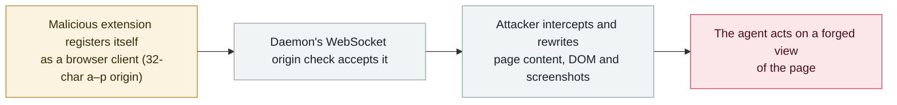

# Tencent BrowserSkill: any 32-character extension origin can pose as the browser client and feed the agent forged pages

      

## Summary

**CVE-2026-94111: Tencent BrowserSkill through 0.3.0 accepts any `chrome-extension` origin with 32 characters in the range a–p in its local daemon's WebSocket origin validation (CWE-346), so *"attackers can register a malicious extension as a browser client to intercept and manipulate page content, DOM, and screenshots returned to the AI agent."*** CVSS 4.0 **6.9** (`AV:L/AC:L/AT:N/PR:L/UI:N/VC:L/VI:H/VA:L`), credit George Chen, with the check located in `crates/bsk-cli/src/daemon/ws.rs`. The significance is the layer: this is not a page carrying an injected prompt but the **transport between the browser and the agent** — whoever speaks on that socket decides what the agent believes the page says. No exploitation in the wild is recorded. Recorded `vulnerability` / `IPI` + `INFRA` / `medium` / `real_harm: false`, following the archive's treatment of un-exploited agent-infrastructure CVEs.

## Attack chain

## Details

**The advisory.** VulnCheck's entry (dated 20 September 2026, severity *medium*, credit George Chen) carries the full text: *"Tencent BrowserSkill through 0.3.0 contains an authentication bypass vulnerability in the local daemon WebSocket origin validation that accepts any chrome-extension origin with 32 characters in range a-p. Attackers can register a malicious extension as a browser client to intercept and manipulate page content, DOM, and screenshots returned to the AI agent."* CVSS 4.0 base **6.9**, vector `AV:L/AC:L/AT:N/PR:L/UI:N/VC:L/VI:H/VA:L/SC:N/SI:N/SA:N`, weakness **CWE-346** (origin validation error). NVD mirrors it; the references point at GitHub issue 273 and `crates/bsk-cli/src/daemon/ws.rs#L36-L57`. The upstream issue, opened on **17 September 2026** and still open, supplies the context: the daemon is a WebSocket server on default port **52800** that gives *"any AI agent driving it"* full control of the user's real, already-logged-in browser — reading pages, taking screenshots, filling forms — and `origin_allowed()` checks the *shape* of the `Origin` header *"but never checks which extension it actually is"*. The reporter re-checked current `main` on **20 September 2026** and reported `origin_allowed()` unchanged, with the `TODO(M10/M12)` at `ws.rs:38-44` still present - the shape-only gate was still live nine days after the report. No exploitation in the wild is recorded.

**Why the layer matters.** Browser agents are judged by what they can *see*: a browser-agent stack turns page content, DOM and screenshots into the agent's only sensory input, and the local daemon is the pipe that carries it. When the pipe's origin check accepts a 32-character string in a fixed character range, an extension — one of the few things users install casually and in volume — becomes the agent's eyes. That is indirect prompt injection one level below the content: the attacker does not need to get text onto a page the agent reads, because they can replace the channel that delivers the page.

**Context and grading.** BrowserSkill is Tencent's open-source browser-agent CLI; the issue affects versions up to and including 0.3.0 and is tracked upstream as an open issue. Recorded `vulnerability` / `medium` / `real_harm: false` under the archive's ladder — a moderate, local, low-privilege flaw with no known exploitation (`high` would need CVSS 9+ or confirmed damage), dated to NVD publication (20 September 2026). Confidence **A**: the NVD record, an independent advisory, and the vendor repository's own issue.

## Sources

| # | Source | Link |
|---|---|---|
| 1 | NVD — CVE-2026-94111 | <https://nvd.nist.gov/vuln/detail/CVE-2026-94111> |
| 2 | VulnCheck advisory | <https://www.vulncheck.com/advisories/tencent-browserskill-through-0.3.0-origin-validation-error-in-local-websocket-daemon> |
| 3 | Tencent BrowserSkill issue 273 | <https://github.com/Tencent/BrowserSkill/issues/273> |

## Metadata

| Field | Value |
|---|---|
| Date | `2026-09-20` (raw: NVD / VulnCheck 2026-09-20, precision `day`) |
| Kind | Vulnerability disclosure `vulnerability` |
| Type | [`IPI`](../../taxonomy/types.md#ipi) [`INFRA`](../../taxonomy/types.md#infra) |
| Severity | **Medium** `medium` |
| Confidence | **A** — NVD, an independent advisory and the upstream issue |
| Real harm | No |
| AI involvement | Confirmed `confirmed` |
| Region | [Global](../../regions/global.md) |
| Archive ID | `2026-09-20-tencent-browserskill-origin-bypass` |

**Why this classification:** the exposed asset is the agent's local runtime plumbing (`INFRA`) and the effect is that external, attacker-controlled input reaches the agent as trusted observation (`IPI`) — without a poisoned page ever being involved. `real_harm: false` (no known exploitation) and `medium` per the severity ladder: CVSS 6.9, local, low privileges, no confirmed damage; `high` would require CVSS 9+ or confirmed harm. Grading criteria: [severity.md](../../taxonomy/severity.md) and [confidence.md](../../taxonomy/confidence.md).

## Related

**Topic:** [Agent infrastructure exposure (INFRA)](../../topics/agent-infra.md)

**Related records:**

- `2026-09-16` [BragJack: one browser extension hijacks the AI agents in five major browsers](2026-09-16-bragjack-browser-agents.md)   The other September case where an extension becomes the agent's input channel
- `2026-09-14` [Bifrost AI gateway: one unauthenticated MCP registration runs commands as the gateway user](2026-09-14-bifrost-ai-gateway-cve-2026-90898.md)   Agent plumbing exposed without authentication
- `2026-09-23` [IBM FTM: unauthenticated RAG poisoning could steer the payment agent's MCP tools](2026-09-23-ibm-ftm-rag-poisoning.md)   Injection reaching the agent through what it trusts, another route

---

[← 2026-09 index](README.md) · [← All records](../../README.md) · [Chinese](../i18n/zh/2026-09/2026-09-20-tencent-browserskill-origin-bypass.md)

This record is part of the **Orca AI Incident Archive**, licensed [CC BY 4.0](../../LICENSE). Found a factual error or a missing source? [Open an issue or PR](../../CONTRIBUTING.md) — corrections are recorded in the record's revision history, never silently overwritten.
