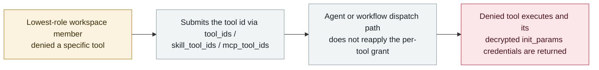

# MaxKB: the agent dispatch path lets a user denied a tool still call it and read its credentials

      

## Summary

**CVE-2026-77516: in MaxKB 2.0.0 through 2.9.2, *"a lowest-role workspace member denied access to a tool by WorkspaceUserResourcePermission can still bind its identifier through `tool_ids`, `skill_tool_ids`, or `mcp_tool_ids` and execute it through the agent or workflow dispatch path"* — and because *"tool execution decrypts server-side `init_params`, allowing the caller to receive credentials carried by the denied tool,"* the bypass returns keys, not just a result.** The advisory, titled *"Missing per-tool authorization in the agent and workflow tool-dispatch path,"* names CWE-862 (missing authorization) and CWE-639 (authorization bypass through user-controlled key); CVSS 3.1 **5.4**; *"No fixed version is available as of this review."* The structure is the point: the per-tool grant is enforced on the dedicated tool routes, but the **agent dispatch path is a second door to the same capability** that does not re-check it. Recorded `vulnerability` / `INFRA` + `CRED` / `medium` / `real_harm: false`.

## Attack chain

## Details

**The advisory.** MaxKB's GitHub security advisory **GHSA-383v-fx78-pphm**, *"Missing per-tool authorization in the agent and workflow tool-dispatch path (CWE-862 / CWE-639),"* covers versions 2.0.0 through 2.9.2 of the open-source enterprise AI assistant. NVD's synchronised description: *"a lowest-role workspace member denied access to a tool by WorkspaceUserResourcePermission can still bind its identifier through tool_ids, skill_tool_ids, or mcp_tool_ids and execute it through the agent or workflow dispatch path. The dispatch path does not reapply the per-tool grant enforced by dedicated tool routes, and tool execution decrypts server-side init_params, allowing the caller to receive credentials carried by the denied tool."* CVSS 3.1 base **5.4**; *"No fixed version is available as of this review."*

**Why the archive records it.** This is the authorisation version of a pattern the archive keeps meeting: **the agent is a second path to the same capability**. The permission model was written for the route a human calls directly; the agent or workflow dispatch path reaches the same tool through a different door, and the per-tool grant is not reapplied there. Because the tool's `init_params` are decrypted server-side at execution time, the failure does not stop at "the agent did something it should not" — it hands back the credentials the tool was configured with, which is why this is also a `CRED` record. It sits close to Noma's workflow-identity finding (09-09), where the misalignment was also between an authorisation model and the path actually taken.

**Grading.** `vulnerability` / `real_harm: false` — a published advisory with no known exploitation; `medium` under the archive's ladder (CVSS 5.4, a controlled authorisation bypass with no confirmed damage). Confidence **A**: the maintainer's advisory plus the NVD record. Note that no fixed version existed at the time of the advisory.

## Sources

| # | Source | Link |
|---|---|---|
| 1 | MaxKB security advisory GHSA-383v-fx78-pphm | <https://github.com/1Panel-dev/MaxKB/security/advisories/GHSA-383v-fx78-pphm> |
| 2 | NVD — CVE-2026-77516 | <https://nvd.nist.gov/vuln/detail/CVE-2026-77516> |

## Metadata

| Field | Value |
|---|---|
| Date | `2026-09-21` (raw: NVD / GHSA 2026-09-21, precision `day`) |
| Kind | Vulnerability disclosure `vulnerability` |
| Type | [`INFRA`](../../taxonomy/types.md#infra) [`CRED`](../../taxonomy/types.md#cred) |
| Severity | **Medium** `medium` |
| Confidence | **A** — maintainer advisory (GHSA) plus the NVD record |
| Real harm | No — no known exploitation |
| AI involvement | Confirmed `confirmed` |
| Region | [Global](../../regions/global.md) |
| Archive ID | `2026-09-21-maxkb-tool-permission-bypass` |

**Why this classification:** the failure is in the agent platform's own dispatch path and permission enforcement (`INFRA`), and what it yields is the credentials the denied tool carries (`CRED`). It is not `IPI` — no external content steers the agent; the request itself names the tool. `medium` under the archive's ladder: CVSS 5.4, an authorisation bypass with no confirmed damage; `high` would need CVSS 9+ or confirmed harm. Grading criteria: [severity.md](../../taxonomy/severity.md) and [confidence.md](../../taxonomy/confidence.md).

## Related

**Topic:** [Agent infrastructure exposure (INFRA)](../../topics/agent-infra.md)

**Related records:**

- `2026-09-09` [Workflow identity hijacking: Noma Labs turns an ordinary support email into privileged data access](2026-09-09-noma-workflow-identity-hijacking.md)   The same misalignment: an authorisation model that does not match the path taken
- `2026-09-25` [Zammad: crafted text in an AI Agent field bypasses the sanitizer](2026-09-25-zammad-ai-agent-template-rce.md)   The other September agent-platform flaw where the agent definition is the surface
- `2026-09-23` [IBM FTM: unauthenticated RAG poisoning could steer the payment agent's MCP tools](2026-09-23-ibm-ftm-rag-poisoning.md)   Tool invocation reached by a path the permission model did not anticipate

---

[← 2026-09 index](README.md) · [← All records](../../README.md) · [Chinese](../i18n/zh/2026-09/2026-09-21-maxkb-tool-permission-bypass.md)

This record is part of the **Orca AI Incident Archive**, licensed [CC BY 4.0](../../LICENSE). Found a factual error or a missing source? [Open an issue or PR](../../CONTRIBUTING.md) — corrections are recorded in the record's revision history, never silently overwritten.
