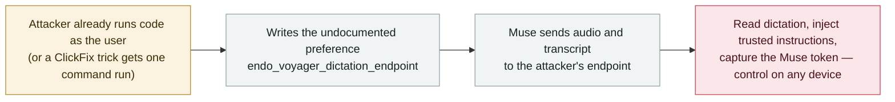

# Not-a-Mused: an undocumented Muse setting redirects dictation and hands the agent's token to an attacker

      

## Summary

**Patrick Wardle shows that a hidden preference in Meta's Muse assistant for macOS — `endo_voyager_dictation_endpoint`, stored in the app's preferences and writable by any process running as the logged-in user, with no extra permissions — decides where dictation is sent.** Point it at an attacker's address and Muse's microphone input and its transcript leave the device: the attacker can *"read what the user dictated, add extra instructions that Muse trusts and acts on, and capture a token that signs in to the user's Muse account"* — then read the account's chat history and drive the assistant on **any device where that account is signed in** (Wardle made the iPhone app report its location, run a Bluetooth scan and list smart-home commands). Muse, Meta's personal agent launched in the US this month, holds whatever access the user granted across files, email, messages, calendar and shopping; Wardle calls it *"trivial to turn Muse into the ultimate backdoor."* It cannot break into a Mac on its own — code execution as the user, or a ClickFix trick, is required — and it does not defeat macOS app isolation or Meta's cloud separation. Wardle went public without pre-notifying Meta; Meta has since pushed what he calls a "fix", with no advisory.

## Attack chain

## Details

**The finding.** Wardle published a proof of concept, *not-a-mused*, on 21 September 2026. The setting is *"undocumented and decides where Muse sends dictation"*; it is stored in the Mac app's preferences under `endo_voyager_dictation_endpoint`, and *"any program running as the logged-in user can point it at an address the attacker controls, without needing extra permissions."* After that, *"the dictation no longer goes to Meta. When the user speaks a prompt, the audio and the text go to a small program the attacker is running on the same Mac."* From there he demonstrated three things: *"read what the user dictated, add extra instructions that Muse trusts and acts on, and capture a token that signs in to the user's Muse account, then use it to read the account's chat history and control the assistant directly."*

**Why the agent is the prize.** macOS normally prevents one app from reading another app's files, microphone, camera or saved logins, so ordinary malware is limited. *"An attacker who can quietly steer Muse instead gets everything the user allowed the app to do"* — and because a Muse account can be signed in on several devices, an attacker holding the token can issue orders from anywhere: Wardle *"used it to direct the Muse app on his own iPhone to report its exact location, run a Bluetooth scan of nearby devices, and list the smart-home commands it could send."* In his tests the assistant only drafted messages rather than sending them. Security software may not notice, because the commands come from Muse — *"a normal signed app."*

**What it does not do, and how it was disclosed.** It does not defeat macOS app isolation: *"Muse sends its token along with the redirected dictation, and the attack works by getting Muse to act with access it already has."* Nor does it show that Meta's cloud isolation was broken; the flaw is in the Mac app. It *"cannot break into a Mac on its own"* — it needs code execution as the logged-in user, reachable through a ClickFix trick. Wardle deliberately did not report to Meta first, choosing full disclosure; Meta has since pushed what he calls a "fix", which The Hacker News *"could not confirm"*, and has published no advisory. Wardle says he has found further flaws in AI assistants, to be presented at Objective by the Sea in November.

**Context and grading.** Muse launched in the US this month with wide user-granted reach across files, email, messages, calendar, shopping and smart-home apps — which is exactly why the archive treats the **agent client** as agent infrastructure: the assistant concentrates permissions, so anything that can steer the client inherits them. Recorded `vulnerability` / `INFRA` + `CRED` / `medium` / `real_harm: false`: a controlled demonstration on a single machine that requires a prior foothold and has no confirmed victims, so it stays below the `high` band. Confidence **A**: the researcher's published PoC plus independent reporting in English and Chinese.

## Sources

| # | Source | Link |
|---|---|---|
| 1 | The Hacker News (22 Sep 2026) | <https://thehackernews.com/2026/09/one-hidden-meta-muse-setting-could-let.html> |
| 2 | Patrick Wardle — "not-a-mused" proof of concept (21 Sep 2026) | <https://github.com/pwardle/not-a-mused> |
| 3 | IT Home (Chinese coverage, 25 Sep 2026) | <https://finance.sina.com.cn/tech/digi/2026-09-25/doc-iniszmmz7778318.shtml> |

## Metadata

| Field | Value |
|---|---|
| Date | `2026-09-21` (raw: PoC 2026-09-21 / The Hacker News 2026-09-22, precision `day`) |
| Kind | Vulnerability disclosure `vulnerability` |
| Type | [`INFRA`](../../taxonomy/types.md#infra) [`CRED`](../../taxonomy/types.md#cred) |
| Severity | **Medium** `medium` |
| Confidence | **A** — researcher's published proof of concept plus independent reporting |
| Real harm | No — a demonstration; no confirmed victims |
| AI involvement | Confirmed `confirmed` |
| Region | [United States](../../regions/us.md) — Muse launched in the US |
| Archive ID | `2026-09-21-meta-muse-not-a-mused-dictation-hijack` |

**Why this classification:** the exposed asset is the agent's own client-side runtime and its configuration surface (`INFRA`), and what is taken is a signing token plus the ability to issue trusted instructions (`CRED`). `vulnerability` with `real_harm: false` because it is a PoC with no known exploitation. `medium` rather than `high` under the archive's ladder: a controlled, single-machine demonstration that additionally requires the attacker to already run code as the user — `high` would need confirmed damage, a CVSS 9+ flaw, or a capability demonstration that does not presuppose a foothold. Dated to the PoC release (21 September 2026). Grading criteria: [severity.md](../../taxonomy/severity.md) and [confidence.md](../../taxonomy/confidence.md).

## Related

**Topic:** [Agent infrastructure exposure (INFRA)](../../topics/agent-infra.md)

**Related records:**

- `2026-09-16` [BragJack: one browser extension hijacks the AI agents in five major browsers](2026-09-16-bragjack-browser-agents.md)   Same shape of problem on the browser surface: steer the client, inherit its permissions
- `2026-09-15` [Codex sandbox escapes](2026-09-15-codex-sandbox-escapes.md)   The other side of the boundary question — what the agent is allowed to reach
- `2026-09-18` [Zhipu's ZCode agent silently uploaded whole repositories](2026-09-18-zcode-silent-upload.md)   When the agent client itself is the leak path

---

[← 2026-09 index](README.md) · [← All records](../../README.md) · [Chinese](../i18n/zh/2026-09/2026-09-21-meta-muse-not-a-mused-dictation-hijack.md)

This record is part of the **Orca AI Incident Archive**, licensed [CC BY 4.0](../../LICENSE). Found a factual error or a missing source? [Open an issue or PR](../../CONTRIBUTING.md) — corrections are recorded in the record's revision history, never silently overwritten.
