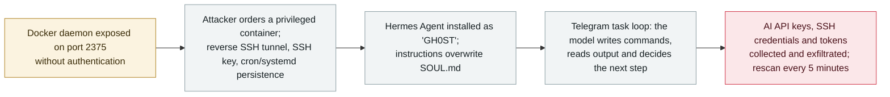

# CARBONATO: a Docker botnet installs Hermes Agent and loots AI API keys over Telegram

       

## Summary

**ThreatDown publishes CARBONATO, a botnet built around an AI agent: it compromises Docker daemons exposed without authentication on port 2375, launches a privileged container, and installs the Hermes Agent framework under an agent named "GH0ST" whose instructions overwrite the default `SOUL.md` persona file.** Operators then drive an *"interactive command loop"* over Telegram — *"the model interprets the task, writes terminal commands, reads the output, and decides what to do next"* — collecting **AI API keys, SSH credentials and access tokens** and returning the results to the same chat that receives deployment reports. Scripts scan the host's networks **every five minutes** for fresh port-2375 targets, making it worm-like. ThreatDown recovered operational evidence spanning **October 2024 to August 2026** from an open registry holding **59 repositories and 4.3 GB** (234 image tags, 605 verified blobs) of image data; no cluster attribution, with Costa Rica a possible operator location. It is the third Hermes Agent case in the archive after the Thailand Ministry of Finance intrusion (`2026-07-30`) and Gambit (`2026-09-22`) — the framework is now a repeat offender rather than a one-off.

## Attack chain

## Details

**What the researchers found.** ThreatDown describes CARBONATO as *"a botnet built around an AI agent"*: the malware connects to an unauthenticated Docker API on port 2375 and instructs the daemon to launch a privileged container, which gives it the host. It opens a reverse SSH tunnel, installs an SSH server with the operators' key, and reports each new deployment to Telegram, while scripts add persistence through cron jobs, systemd timers, `rc.local` and OpenRC hooks. On top of that host foothold sits the agent: **Hermes Agent** is installed with an agent named **"GH0ST"** whose instructions overwrite the default `SOUL.md` persona file. Hermes then handles task commands arriving through Telegram — *"collecting AI API keys, SSH credentials, access tokens, and other data, running commands, and sending back the results"* — in what the researchers call an operator-driven *"interactive command loop"*: *"The model interprets the task, writes terminal commands, reads the output, and decides what to do next."* Spreading is handled by scripts that scan networks attached to the host **every five minutes**; each new compromise pulls the implant, launches the same privileged container and rejoins the loop. The persona prompt states the priority outright: it *"prioritizes the collection of AI API keys"* ahead of SSH credentials, access tokens and databases, naming **14 providers**.

**Scale, timeline and attribution.** The operational evidence ThreatDown retrieved spans **October 2024 to August 2026** and came from an unauthenticated registry holding **59 repositories and 4.3 GB** (234 image tags, 605 verified blobs) of image data, alongside a separate campaign distributing counterfeit cryptocurrency wallet apps. No attribution to a known cluster; Costa Rica is flagged as a possible operator location on the strength of various evidence. SecurityWeek, summarising the same report in its 25 September round-up, headlines the priority order: *"Docker botnet ranks AI API keys above all other loot."*

**Why it belongs here.** CARBONATO is the third documented use of the same open-source **Hermes Agent** framework in the archive — after the Thailand Ministry of Finance intrusion (`2026-07-30`, Hunt.io, YOLO no-approval mode) and the Gambit card-skimming operation (`2026-09-22`, Claude Opus 4.6 orchestration), which are already cross-linked. Where Gambit used Hermes for orchestration inside a criminal business and Thailand for government espionage, CARBONATO is the **infrastructure-access** variant: the agent is installed *on the victim* as the post-exploitation brain, and its brief is explicitly to harvest the credentials of other AI systems. The pattern the archive has been tracking — one self-hosted agent stack reused across unrelated operators within two months — now spans espionage, financial crime and commodity botnet operations.

**Grading.** Recorded as `incident` / `WEAPON` + `INFRA` + `CRED` / `high` / `real_harm: true`: this is a live botnet with confirmed compromises (a multi-year operational archive, worm-style spread), not a PoC — but the damage is per-victim host compromise of limited, unquantified scope, so it does not reach `critical` (which the archive reserves for multi-organisation, government, critical-infrastructure or worm-level confirmed damage, or a first-of-its-kind milestone with a real victim). Confidence **A**: the vendor's own research report plus two independent outlets reporting the same details.

## Sources

| # | Source | Link |
|---|---|---|
| 1 | ThreatDown — "CARBONATO: a botnet built around an AI agent" | <https://www.threatdown.com/blog/carbonato/> |
| 2 | BleepingComputer | <https://www.bleepingcomputer.com/news/security/new-carbonato-malware-uses-ai-agents-to-hijack-exposed-docker-hosts/> |
| 3 | SecurityWeek, "In Other News" (25 Sep 2026) | <https://www.securityweek.com/in-other-news-clop-leak-site-takeover-docker-botnet-hunts-ai-keys-water-utility-exposure/> |

## Metadata

| Field | Value |
|---|---|
| Date | `2026-09-22` (raw: ThreatDown 2026-09-22 / BleepingComputer 2026-09-24, precision `day`) |
| Kind | Real-world event `incident` |
| Type | [`WEAPON`](../../taxonomy/types.md#weapon) [`INFRA`](../../taxonomy/types.md#infra) [`CRED`](../../taxonomy/types.md#cred) |
| Severity | **High** `high` |
| Confidence | **A** — vendor research report (ThreatDown) plus two independent outlets |
| Real harm | Yes — a live botnet with a multi-year operational trail |
| AI involvement | Confirmed `confirmed` |
| Region | [Global](../../regions/global.md) |
| Archive ID | `2026-09-22-carbonato-docker-hermes-agent-botnet` |

**Why this classification:** a human operator deliberately deploys an agent framework on compromised hosts as the execution layer (`WEAPON`), the entry point is exposed agent-era infrastructure (`INFRA`, internet-facing Docker daemons), and what is taken is keys rather than data (`CRED`). `real_harm: true` because the campaign is operational and confirmed, `high` rather than `critical` because the archive reserves `critical` for multi-organisation / government / worm-level confirmed damage or first-of-its-kind milestones — Hermes is now the third case, so the novelty trigger does not apply. Dated to the vendor's publication (22 September 2026). Grading criteria: [severity.md](../../taxonomy/severity.md) and [confidence.md](../../taxonomy/confidence.md).

## Related

**Topic:** [Offensive AI capability evolution (WEAPON)](../../topics/offensive-ai.md)

**Related records:**

- `2026-09-22` [Gambit: three AI harnesses stole 600,000 card records](2026-09-22-gambit-ai-agent-retail-card-theft.md)   The same Hermes framework, used as the orchestration layer of a card-skimming operation
- `2026-07-30` [Hermes agent at Thailand's Ministry of Finance](../2026-07/2026-07-30-hermes-agent-thailand-finance-ministry.md)   First recorded Hermes case — government espionage, YOLO no-approval mode
- `2026-09-10` [Anthropic's September threat report](2026-09-10-anthropic-september-threat-report.md)   The defensive-side reading of agent-enabled post-exploitation

---

[← 2026-09 index](README.md) · [← All records](../../README.md) · [Chinese](../i18n/zh/2026-09/2026-09-22-carbonato-docker-hermes-agent-botnet.md)

This record is part of the **Orca AI Incident Archive**, licensed [CC BY 4.0](../../LICENSE). Found a factual error or a missing source? [Open an issue or PR](../../CONTRIBUTING.md) — corrections are recorded in the record's revision history, never silently overwritten.
