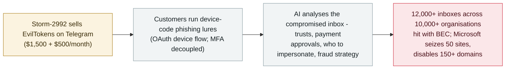

# EvilTokens: Microsoft dismantles an AI-powered PhaaS that compromised 12,000 inboxes

     

## Summary

**Microsoft's Digital Crimes Unit moves against EvilTokens**, a phishing-as-a-service platform that since **February 2026** powered device-code phishing campaigns and, in Microsoft's account, *"used AI at every step of the attack chain."* The platform's centrepiece was an **AI chatbot that analysed a victim's inbox to identify trusted relationships, payment authorisations and sensitive responsibilities, recommended fraud strategies and drafted impersonation messages** — Microsoft's framing: *"[AI] helped them decide who to target, who to impersonate, and how to most effectively exploit the relationship to extract as much money as possible."* The service (sold by the actor tracked **Storm-2992** at **$1,500 plus $500/month**) was used to compromise **more than 12,000 inboxes across 10,000+ organisations** in the US, Canada, the UK, Australia, India and France, mostly for business email compromise. Microsoft **seized 50 websites and disabled 150+ domains**; the UK-registered company behind it is named in pleadings, and TRM Labs supported the disruption. The AI here assists the operator — it analyses and advises rather than acting autonomously — and the platform is now dismantled; recorded `incident` / `WEAPON` / `high` / `real_harm: true` as the archive's first AI-driven PhaaS takedown

## Attack chain

## Details

**What EvilTokens was.** Microsoft describes it as *"one of the most widely used phishing-as-a-service (PhaaS) platforms"* within seven months of its February 2026 emergence, providing *"cybercriminals with AI capabilities for tailoring phishing lures and analyzing compromised inboxes to identify high-value targets"* — *"This AI-powered cybercrime platform facilitated sophisticated business email compromise (BEC) campaigns that compromised more than 12,000 inboxes in over 10,000 organizations worldwide."* Its primary capability is **device code phishing**: abusing the legitimate OAuth device-code flow (designed for TVs, printers, conferencing devices) in which a user enters a short code in a browser on a second device. Threat actors initiate the flow, deliver the code in a phishing lure, and the entered session *"grant[s] access to the account without exposing credentials"* — which *"circumvent[s] traditional MFA protections by decoupling authentication from the originating session."* Stolen tokens enable email exfiltration and persistence through malicious inbox rules; Microsoft also tracked an April 2026 campaign aligned with EvilTokens that spun up thousands of short-lived polling nodes on automation platforms to evade signature-based detection.

**Where the AI sits.** Microsoft's account is specific about the role, and it is more than copywriting. Its security blog: *"providing cybercriminals with AI capabilities for tailoring phishing lures and analyzing compromised inboxes to identify high-value targets"*; the toolkit offered prebuilt templates *"and landing pages with an AI-powered assistant to aid in structuring target-specific emails"*. Post-compromise, *"EvilTokens enabled threat actors to utilize AI assistants to sift through victim mailbox[es]"*. The On the Issues blog, from Microsoft's Digital Crimes Unit, puts the chatbot at the service's centre: it *"could analyze a victim's inbox and help criminals identify trusted relationships, payment authorizations, and sensitive responsibilities, as well as other circumstances where fraud was most likely to succeed"* and *"could even recommend fraud strategies, including drafting messages that impersonated trusted contacts."* Microsoft believes the platform itself was also coded with AI. Its summary verdict: *"AI was not simply helping attackers write more convincing messages. It helped them decide who to target, who to impersonate, and how to most effectively exploit the relationship to extract as much money as possible."*

**Scale, price, and the takedown.** The actor tracked as **Storm-2992** advertised the service on Telegram at **$1,500 for initial purchase plus $500/month**; victim organisations are reported across the **US, Canada, the UK, Australia, India and France**, and the service offered **44 different themes** for lure emails and phishing pages. Microsoft's Digital Crimes Unit filed pleadings naming a UK-registered company behind the operation, **seized 50 websites used to run the service and disabled more than 150 further domains** linked to its infrastructure. SecurityWeek reported the disruption the next day, with TRM Labs publicly supporting the action.

**How this archive reads it — and where the line is.** EvilTokens qualifies for the `WEAPON` category in the strict sense the archive uses: a human (here, paying cybercriminals) deliberately uses AI as part of an attack tool, with confirmed harm — 12,000-plus compromised mailboxes. It sits at the assisted end of the spectrum, though: the chatbot analyses and advises a human operator; it does not run the intrusion itself, and Microsoft's own phrase is *"AI-style chatbot"*. The record therefore keeps Microsoft's claims and limits side by side: `incident` / `WEAPON` / `high` / `real_harm: true`, with the AI's promotional-and-analytical role stated exactly as documented — the archive's first entry for the AI-driven PhaaS product category.

## Sources

| # | Source | Link |
|---|---|---|
| 1 | Microsoft Security Blog | <https://www.microsoft.com/en-us/security/blog/2026/09/22/unmasking-eviltokens-getting-to-the-root-of-device-code-phishing/> |
| 2 | Microsoft On the Issues | <https://blogs.microsoft.com/on-the-issues/2026/09/22/disrupting-eviltokens-the-ai-chatbot-built-for-cybercrime/> |
| 3 | SecurityWeek | <https://www.securityweek.com/ai-powered-phishing-platform-eviltokens-disrupted-by-microsoft/> |

## Metadata

| Field | Value |
|---|---|
| Date | `2026-09-22` (raw: 2026-09-22, precision `day`) |
| Kind | Incident `incident` |
| Type | [`WEAPON`](../../taxonomy/types.md#weapon) Agent used as a weapon |
| Severity | **High** `high` |
| Confidence | **A** — two first-party Microsoft posts (security blog and Digital Crimes Unit), plus independent press coverage |
| Real harm | Yes |
| AI involvement | Confirmed `confirmed` |
| Region | [Global](../../regions/global.md) |
| Archive ID | `2026-09-22-eviltokens-disrupted` |

**Why this classification:** A cybercrime service whose AI component was central — inbox analysis, target and impersonation decisions, fraud-strategy recommendation — used by paying operators against real organisations, with 12,000+ confirmed compromised inboxes: `incident` / `real_harm: true`. Rated `high` rather than `critical`: the harm is large and confirmed, but the AI assists human operators rather than executing autonomously, and the platform itself has been dismantled. Dated to Microsoft's disruption announcement (22 September 2026). Grading criteria: see [taxonomy/severity.md](../../taxonomy/severity.md) and [taxonomy/confidence.md](../../taxonomy/confidence.md).

## Related

**Topic:** [Offensive AI capability evolution](../../topics/offensive-ai.md)

**Related records:**

- `2026-09-08` [GTIG AI threat tracker: from prompting to autonomy](2026-09-08-gtig-prompting-to-autonomy.md)   The ecosystem view of AI moving through the attack lifecycle
- `2026-09-16` [RatHat: AI-driven Android malware walks operators through infected devices](2026-09-16-rathat-ai-android-malware.md)   Another September case of AI baked into a criminal tool
- `2026-07-01` [JADEPUFFER: first ransomware driven end-to-end by an LLM](../2026-07/2026-07-01-jadepuffer-first-llm-driven-ransomware.md)   The autonomous end of the same spectrum

---
