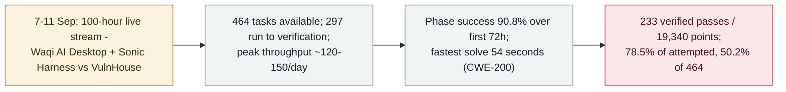

# 100 hours, one agent: what the VulnHouse autonomous-pentest marathon produced

     

## Summary

**The first publicly streamed 100-hour unattended agent pentest marathon concludes: 464 tasks, 233 verified passes, 19,340 points — a 78.5% pass rate on the 297 tasks the agent actually ran to verification (50.2% of the full 464).** Running 7–11 September and live-streamed by the Chinese bug-bounty platform **VulnBox (Douxiang Technology)** as the "Cyber Driver Plan", the challenge put **Waqi AI Desktop with its Sonic Harness** — a Manager/Executor/Auditor loop built for long-horizon tasks — against **VulnHouse**, a benchmark lab of hundreds of web tasks, real-CVE reproductions, source-audit and memory-safety PoCs, with an independent verification engine scoring each submission. The numbers: **90.8% phase success over the first 72 hours** (197/217), throughput of 5–6.25 tasks/hour (≈120–150/day at peak), a **54-second** fastest solve (a CWE-200 leak, one-shot), and a "comeback" case — a JBoss deserialisation task where the agent, lacking Java and unable to download a JDK, located a bundled JRE in an unrelated application, rebuilt its payload and finished the RCE in **33 minutes 11 seconds across 104 tool calls, six strategy shifts and three self-corrections**. The organisers are candid about the limits: stability still depends on harness, tool-chain and verification infrastructure, and complex or tool-poor environments still cause thrashing. Recorded `research` / `WEAPON` / `high` / `real_harm: false`

## What the run produced

## Details

**The setup.** "Cyber Driver Plan" launched on **7 September** at 10:00 and streamed for 100 hours; the harness was **Waqi AI Desktop** — a white-hat client from the bug-bounty platform — carrying **Sonic Harness**, an architecture built for long-horizon work: it breaks the task chain into hand-off-able, auditable, resumable rounds, with a **Manager / Executor / Auditor** three-role loop (plan, execute, audit) and checkpoint recovery after crashes. The target was **VulnHouse**, a lab with hundreds of tasks across difficulty tiers: black-box web (SQLi, SSRF chains, JWT tampering, deserialisation, SSTI), white-box memory-safety audits drawn from real projects (libxml2, Wireshark, ImageMagick, cURL, llama.cpp and more), and CVE reproductions (Struts2, WebLogic, Shiro, JBoss). Judging was independent of the agent: four verification strategies — flag capture, effect proof, PoC crash (with ASan and differential "vuln crashes, fixed doesn't" container checks), and oracle scripts — run by a verification engine that hash-seals every evidence trail and de-sensitises responses so the agent cannot reverse-extract answers from the judge.

**The numbers, with the organisers' own caveats.** Of **464** tasks, **233 passed verification** for **19,340 points**. The organisers warn against a single pass-rate reading: 167 tasks never entered effective execution inside the 100-hour window, so the fair denominators are **78.5% for the 297 actually completed** and **50.2% across all 464**. The first 72 hours ran at **90.8% phase success** (197/217), then difficulty climbed — complex attack chains, source audit, memory safety — and the organisers explicitly note the later hit-rate decline mirrors what CyberGym-class evaluations show as "information about the target decreases": performance drops as tasks approach real-world zero-information discovery. Two cases carry the qualitative story: the **54-second** CWE-200 solve (a one-shot when target, entry and flag all aligned), and the **33-minute, 104-tool-call** JBoss deserialisation where, with no Java and timed-out JDK downloads, the agent abandoned the standard path, found a bundled JRE inside Adobe Animate on the box, and rebuilt its payload — *"no longer template-answering, but adjusting strategy dynamically against environment feedback."*

**Why it sits in the archive.** The archive already tracks agent-pentest capability from the attacker side (HexStrike-class tooling, the GTIG tracker's autonomous exploitation pipelines) and the defensive-demonstration side (X-BOW-style agentic pentesting). This record is the first **long-duration, publicly streamed, independently judged** run in this archive: 100 hours is exactly the regime where human operators fatigue — and the notable result is not the headline 78.5%, but the shape of the curve: high, stable throughput on standard paths; real difficulty under tool-poor, information-sparse conditions; and a harness — not the model alone — doing the work of keeping it recoverable. The organisations say the Sonic Harness will go to public white-hat use in October, which is itself the finding: autonomous exploitation capability is being packaged for general availability, with the verification stack as the control.

## Sources

| # | Source | Link |
|---|---|---|
| 1 | FreeBuf (full battle report) | <https://www.freebuf.com/articles/502543.html> |
| 2 | CN-SEC (independent republication) | <https://cn-sec.com/archives/5452134.html> |
| 3 | Sohu (pre-event announcement) | <https://www.sohu.com/a/1068905442_120747399> |

## Metadata

| Field | Value |
|---|---|
| Date | `2026-09-22` (raw: 2026-09-22, precision `day`) |
| Kind | Research demo `research` |
| Type | [`WEAPON`](../../taxonomy/types.md#weapon) Agent used as a weapon |
| Severity | **High** `high` |
| Confidence | **A** — the organiser's own full battle report with independent verification-engine methodology, plus independent republication and a pre-event announcement |
| Real harm | No |
| AI involvement | Confirmed `confirmed` |
| Region | [CN](../../regions/cn.md) |
| Archive ID | `2026-09-22-vulnhouse-100h-agent-pentest` |

**Why this classification:** A deliberate, sandboxed demonstration of agent offensive capability by its developers — the `WEAPON` pattern in the archive's sense (an operator using agents as the executing tool), with a lab target and an independent judge, hence `research` / `real_harm: false`. Rated `high` as a significant capability demonstration: first public 100-hour unattended run, quantified throughput and limits, and an October public release of the harness. Dated to the battle report (22 September 2026); the run itself took place 7–11 September. Grading criteria: [severity.md](../../taxonomy/severity.md) and [confidence.md](../../taxonomy/confidence.md).

## Related

**Topic:** [Offensive AI capability evolution](../../topics/offensive-ai.md)

**Related records:**

- `2026-09-08` [GTIG AI threat tracker: from prompting to autonomy](2026-09-08-gtig-prompting-to-autonomy.md)   The ecosystem view of the same capability, from the defender's threat side
- `2025-09-01` [Villager (Cyberspike) AI pentest tool](../2025-09/2025-09-01-villager-cyberspike-shen-tou-gong.md)   An earlier AI-pentest tooling entry in this archive

---

[← 2026-09 index](README.md) · [← All records](../../README.md) · [Chinese](../i18n/zh/2026-09/2026-09-22-vulnhouse-100h-agent-pentest.md)

This record is part of the **Orca AI Incident Archive**, licensed [CC BY 4.0](../../LICENSE). Found a factual error or a missing source? [Open an issue or PR](../../CONTRIBUTING.md) — corrections are recorded in the record's revision history, never silently overwritten.
