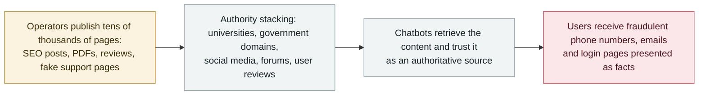

# Dark Sourcery: attackers poison chatbot answers across 374 companies

     

## Summary

**Vigilance Security documents "Dark Sourcery": a content-poisoning campaign that floods the web with SEO-optimised posts, PDFs, reviews and fake support pages so that ChatGPT, Gemini and Google AI Overviews serve attackers' fraudulent phone numbers, email addresses and login pages to users as trusted facts.** At least **374 companies have been swept up** — including Fortune 100 firms, major airlines, banks, travel companies and software providers; named brands include **Delta, Lufthansa, Qatar Airways, Chase, Bank of America, Airbnb and TripAdvisor**. Tens of thousands of malicious pages are involved; the operators use *"high authority domains (universities, government) combined with public opinion sources (social media, forums, user reviews)"* to maximise retrieval success, because *"the AI looks at the source and trusts the content more if it's coming from an authoritative entity."* This is the archive's first record of **answer-poisoning at campaign scale**: the AI systems are not compromised — they are fed, and they pass the fraud on with their own credibility attached. No exploitation method beyond content publishing is claimed; the campaign is described as ongoing. Recorded `incident` / `IPI` / `high` / `B`

## Attack chain

## Details

**What the campaign does.** Rather than attacking the models, Dark Sourcery attacks **what the models read**. Per Vigilance Security's research, as reported by Dark Reading on 23 September, the operators *"flood the web with carefully optimized posts, PDFs, reviews, and fake support pages, to trick AI into presenting fraudulent phone numbers, email addresses, and login pages"* — a content-distribution operation using SEO and authority signals rather than exploits. Ariel Simon, Vigilance's VP of research: *"We suspect that high authority domains (universities, government) combined with public opinion sources (social media, forums, user reviews) achieved high success in poisoning AI answers… Depending on the model, the AI looks at the source and trusts the content more if it's coming from an authoritative entity."* The researchers identified **tens of thousands of malicious pages** carrying fake support numbers, email addresses, login pages and software-update information.

**Scale.** At least **374 companies** have been swept up — the research names Fortune 100 organisations, major airlines, banks, travel companies and software providers, with brands including **Delta, Lufthansa, Qatar Airways, Chase, Bank of America, Airbnb and TripAdvisor**. The damage pattern is reputational and consumer-facing: users who ask a chatbot for a company's support line are served an attacker's number; the harm lands on both the user (fraud exposure) and the brand (impersonation at scale).

**Why this is `IPI` and why it matters here.** The archive's `IPI` class covers external content that steers an AI system's behaviour — so far mostly *instructions* (hidden text telling an agent to exfiltrate or pay). Dark Sourcery is the **content-truth variant**: the poisoned pages are not commands, they are fabricated *facts*, and the exploit consists of the models' retrieval-and-trust pipeline working exactly as designed. It slots next to the archive's **IBM FTM RAG-poisoning** record from this same week: one writes falsehood into a vector store, the other into the open web; both convert retrieval trust into attacker leverage. The record keeps the research's own boundaries: the evidence base is content analysis and brand enumeration, Vigilance's report is the single primary account, and this archive grades it `B` accordingly.

## Sources

| # | Source | Link |
|---|---|---|
| 1 | Dark Reading | <https://www.darkreading.com/threat-intelligence/attackers-manipulate-ai-chatbots-mass-disinformation-phishing-campaign> |
| 2 | BestSec daily digest (independent mention) | <https://bestsec.net/> |

## Metadata

| Field | Value |
|---|---|
| Date | `2026-09-23` (raw: 2026-09-23, precision `day`) |
| Kind | Incident `incident` |
| Type | [`IPI`](../../taxonomy/types.md#ipi) Indirect prompt injection |
| Severity | **High** `high` |
| Confidence | **B** — a well-known security outlet reporting a research firm's campaign analysis; the original report is not publicly indexed beyond the coverage |
| Real harm | Yes |
| AI involvement | Confirmed `confirmed` |
| Region | [Global](../../regions/global.md) |
| Archive ID | `2026-09-23-dark-sourcery-chatbot-poisoning` |

**Why this classification:** Attacker-controlled external content steering what AI systems tell users — the content-delivery branch of the archive's `IPI` family, at campaign scale (374+ companies, tens of thousands of pages). Graded `incident` / `real_harm: true` because the campaign is live and its purpose is consumer fraud, with named corporate victims. Severity `high`: large-scale, ongoing, brand-and-consumer impact — but no confirmed monetary loss figures and no exploitation beyond content publishing, so not `critical`. Dated to the reporting of the research (23 September 2026). Grading criteria: [severity.md](../../taxonomy/severity.md) and [confidence.md](../../taxonomy/confidence.md).

## Related

**Topic:** [Zero-click data exfiltration chain](../../topics/zero-click-exfil.md)

**Related records:**

- `2026-09-23` [IBM FTM: unauthenticated RAG poisoning could steer the payment agent's MCP tools](2026-09-23-ibm-ftm-rag-poisoning.md)   The closed-corpus variant: poisoned knowledge written into a vector store
- `2026-07-02` [Hidden web instructions make AI agents pay attackers](../2026-07/2026-07-02-hidden-web-instructions-payment-fraud.md)   The instruction variant: hidden text made agents act, not just answer

---

[← 2026-09 index](README.md) · [← All records](../../README.md) · [Chinese](../i18n/zh/2026-09/2026-09-23-dark-sourcery-chatbot-poisoning.md)

This record is part of the **Orca AI Incident Archive**, licensed [CC BY 4.0](../../LICENSE). Found a factual error or a missing source? [Open an issue or PR](../../CONTRIBUTING.md) — corrections are recorded in the record's revision history, never silently overwritten.
