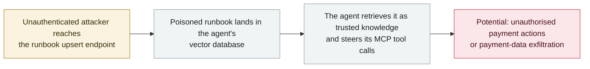

# IBM FTM: unauthenticated RAG poisoning could steer the payment agent's MCP tools

      

## Summary

**IBM discloses a flaw in the AI agent server of Financial Transaction Manager (FTM): an unauthenticated attacker can insert malicious runbook content into the agent's vector database and thereby steer its MCP tool calls** — *"potentially triggering unauthorized payment actions or exfiltrating payment data."* The advisory (CVE-2026-18875, CVSS 3.1 **7.3**, `AV:N/AC:L/PR:N/UI:N`; CWE-74) locates the issue in `api.vectordb.runbooks.js:51` — an **unauthenticated runbook upsert**. It is the archive's first **RAG-poisoning** case: instead of injecting instructions through a page or document the agent fetches, the attacker writes the poisoned "knowledge" straight into the retrieval store the agent trusts, so the agent's own tools execute what the poisoned entry suggests. No exploitation in the wild is known. Recorded `vulnerability` / `IPI` + `INFRA` / `medium` / `real_harm: false`, following the archive's treatment of un-exploited agent-infrastructure CVEs

## Attack chain

## Details

**The advisory, in its own words.** IBM's support note lists **CVE-2026-18875**: *"IBM Financial Transaction Manager (FTM) 4.x is vulnerable to RAG poisoning via unauthenticated runbook upsert (CWE-74) in the FTM AI agent server (api.vectordb.runbooks.js:51). An unauthenticated attacker can insert malicious runbook content into the agent's vector database to steer AI-driven MCP tool calls, potentially triggering unauthorized payment actions or exfiltrating payment data."* CVSS 3.1 base score **7.3** (`AV:N/AC:L/PR:N/UI:N/S:U/C:L/I:L/A:L`), weakness CWE-74 (injection). The NVD entry mirrors the advisory; no exploitation in the wild is recorded, and no public PoC is referenced.

**Why this is a distinct pattern.** The archive's injection records so far are **indirect prompt injection** in the classical sense: the payload rides in content the agent fetches — a web page, an email, a repository file, a dataset. This case is a **direct write into the retrieval store itself**: the runbook upsert endpoint accepts unauthenticated writes, so the attacker skips the delivery problem entirely and plants the poisoned instructions where the agent's retrieval step is *designed* to trust them. It is, for the archive, the first entry where the vector database is both the injection point and — under the `INFRA` lens (exposed vector stores) — the exposed asset, and where the payload's stated goal is steering **MCP tool calls** rather than text output. The combination is exactly the failure mode defenders have been warned about for RAG-based agent stacks, now with a CVE number on an enterprise payments product.

**Context and grading.** FTM is an enterprise payments product (4.x, on Red Hat OpenShift); the affected AI agent server sits in that stack, and the vendor's own impact statement ties the poisoned tool calls to payment actions — so the *potential* blast radius is financial, even though the severity here is bounded by what actually happened: **no exploitation, no confirmed harm**. The archive therefore records it as `vulnerability` / `medium` / `real_harm: false`, the same treatment given to other un-exploited agent-infrastructure CVEs (Bifrost, WSP-type plugin flaws and the MCP tool CVEs of 2025). It is dated to the NVD publication (23 September 2026), matching IBM's advisory release window.

## Sources

| # | Source | Link |
|---|---|---|
| 1 | IBM Support | <https://www.ibm.com/support/pages/node/7288641> |
| 2 | NVD | <https://nvd.nist.gov/vuln/detail/CVE-2026-18875> |

## Metadata

| Field | Value |
|---|---|
| Date | `2026-09-23` (raw: 2026-09-23, precision `day`) |
| Kind | Vulnerability disclosure `vulnerability` |
| Type | [`IPI`](../../taxonomy/types.md#ipi) [`INFRA`](../../taxonomy/types.md#infra) |
| Severity | **Medium** `medium` |
| Confidence | **A** — vendor advisory (IBM) plus the NVD record |
| Real harm | No |
| AI involvement | Confirmed `confirmed` |
| Region | [Global](../../regions/global.md) |
| Archive ID | `2026-09-23-ibm-ftm-rag-poisoning` |

**Why this classification:** A disclosed flaw in an enterprise vendor's AI agent server — the poisoned retrieval store is both the injection vector (`IPI`, dataset-class source) and the exposed runtime asset (`INFRA`) — with no known exploitation, hence `vulnerability` / `real_harm: false`. Rated `medium` per the archive's severity ladder: a moderate flaw (CVSS 7.3, unauthenticated) without evidence of use; `high` would require CVSS 9+ or confirmed damage. Dated to NVD publication (23 September 2026). Grading criteria: [severity.md](../../taxonomy/severity.md) and [confidence.md](../../taxonomy/confidence.md).

## Related

**Topic:** [Zero-click data exfiltration chain](../../topics/zero-click-exfil.md)

**Related records:**

- `2026-09-14` [Bifrost AI gateway: CVE-2026-90898](2026-09-14-bifrost-ai-gateway-cve-2026-90898.md)   The other September AI-infrastructure CVE - unauthenticated, agent-facing
- `2026-09-02` [Langflow exploited in the wild](2026-09-02-langflow-jin-di-ye-li.md)   When agent-platform flaws do get used
- `2025-06-04` [Asana MCP server flaw](../2025-06/2025-06-04-asana-mcp-server.md)   Earlier MCP-tool exposure in the same lineage

---

[← 2026-09 index](README.md) · [← All records](../../README.md) · [Chinese](../i18n/zh/2026-09/2026-09-23-ibm-ftm-rag-poisoning.md)

This record is part of the **Orca AI Incident Archive**, licensed [CC BY 4.0](../../LICENSE). Found a factual error or a missing source? [Open an issue or PR](../../CONTRIBUTING.md) — corrections are recorded in the record's revision history, never silently overwritten.
