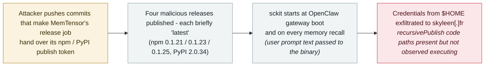

# sckit: MemTensor's AI memory packages were backdoored to steal agent credentials and prompts

      

## Summary

**Four teams — Socket, StepSecurity, SafeDep and Aikido — independently document a compromise of MemTensor's MemOS, an open-source memory framework for LLMs and agents (~11,500 GitHub stars) whose plugin powers OpenClaw agents.** On 23 September attackers published four malicious releases — npm `@memtensor/memos-cloud-openclaw-plugin` **0.1.21, 0.1.23 and 0.1.25** plus PyPI **MemoryOS 2.0.34** — each shipping the same cross-platform Go implant, **sckit**, and each briefly the registry's **latest** version, so a plain `npm install` or `pip install` pulled the backdoor. The payload starts **when the OpenClaw gateway boots and again on every memory recall — passing the user's prompt text to the executable** — and hunts `$HOME` for npm, PyPI, GitHub, GitLab, AWS, Vault and SSH secrets, exfiltrating to `skyleen[.]fr`. Initial access came through **MemTensor's own GitHub Actions release pipelines**: the attacker pushed commits that made the release job hand over the npm or PyPI publish token before publishing, then built malicious versions through affected CI. The binaries contain functions named `recursivePublish`, `prepareRemoteNode` and `prepareRemotePython` plus a GitHub Actions template — a **worm design built to republish itself using stolen tokens**, though StepSecurity notes the code paths were not observed executing. No compromise of downstream users has been reported; recorded `incident` / `SUPPLY` + `CRED` / `high` / `real_harm: false` pending evidence of installed-and-executed victims

## Attack chain

## Details

**A memory plugin becomes the entry point.** MemOS is MemTensor's open-source memory layer for LLMs and agents: the npm package is the **OpenClaw lifecycle plugin** that adds memory recall and storage to OpenClaw agents, and the PyPI package is the framework's Python library. Socket's reconstruction: on **23 September 2026** the attacker published malicious versions on both registries, "each currently the latest version on its registry", so *"a default install from either registry therefore pulls a compromised build."* The npm plugin's launcher is wired into the plugin's **existing registration and recall logic** — no install hooks, which means `--ignore-scripts` does not help — and calls `launchStageZero()` **at gateway startup and again on every memory recall, passing the stripped user prompt text into the child process** (StepSecurity's static review shows the prompt is captured *before* the empty-prompt check). The PyPI package starts the same binary as soon as the `memos` module is imported. StepSecurity summarises the exposure plainly: *"The evidence points to a credential-harvesting design with potential consequences beyond the memory service."*

**What sckit takes.** Six statically-linked, stripped Go binaries (~7.4 MB each for linux/darwin/windows on amd64 and arm64) live in a hidden `.sckit/` directory. String and configuration analysis shows they walk the home directory for **npm, PyPI, GitHub, GitLab, AWS, Vault and SSH secrets** — credential files like `.npmrc`, `.vault-token`, `id_ecdsa`, `credentials.db`, `access_tokens.json`, and environment variables such as `NPM_TOKEN` and `PYPI_API_TOKEN` — and report to C2 under **`skyleen[.]fr`**. Socket lists Hugging Face, HashiCorp Vault, Slack and Stripe among the token targets. The embedded configuration names a campaign id, **`cloud-openclaw-semi-nuclear`**, and the Go module is `supplychain.local/campaign`.

**Initial access: the project's own release pipeline.** SafeDep traces the entry: *"The attacker got the publish tokens from MemTensor's own GitHub Actions release pipelines. To do this, they pushed commits that made the release job hand its npm or PyPI token to the attacker before the job published anything."* Socket found the same commits in both repositories (signed `Memtensor-AI` and `MemTensor CI Review`), each adding the sckit binaries plus launch code **and altering the project's release tooling to target its registry publish token**; neither is referenced by any branch or tag. The npm releases came from the same account as legitimate releases but **without a `gitHead`** — i.e. not from the project's CI workflow. Discovery came from the community: **issue #173** on the plugin repository flagged that 0.1.21 and 0.1.23 matched no commit; the four tracking teams then pulled every version published that day and compared against the last clean release.

**A worm in design, unproven in execution.** The payload includes functions named **`recursivePublish`**, `prepareRemoteNode` and `prepareRemotePython`, and a GitHub Actions workflow template that runs `sckit stage0` on push — code whose evident purpose is to **copy itself into repositories and packages reachable with the stolen credentials, republishing as it spreads**. StepSecurity is careful: the findings *"support intended credential collection and propagation across repositories and ecosystems"* but *"do not establish which functions are reached… or that additional packages were published."* The record keeps that boundary.

**Timeline and cleanup.** Last known-good versions: npm **0.1.20** (3 August) and PyPI **2.0.33** (3 September). The malicious sequence ran on **23 September**: 00:48 UTC the plugin commit; 02:23 npm 0.1.21; 03:17 the MemOS commit; 03:45 npm 0.1.22 (clean — differs from 0.1.20 only by version string); 03:49 npm 0.1.23; 04:33 npm 0.1.24 (clean); 04:36 npm 0.1.25 tagged latest; 05:25 the 19.2 MB MemoryOS 2.0.34 wheel (vs 951 KB for 2.0.33). The interleaving of clean and malicious versions — and the size jump — are themselves detection signals. No malicious install hook existed at any point.

**Why it lands in this archive.** The target profile is exactly the `SUPPLY` category: a package whose reason to exist is serving **agent runtimes**, whose malicious payload triggers on **agent lifecycle events** (gateway boot, memory recall), and which treats **the prompt itself as an exfiltration target** alongside classic developer credentials. It is the third such case in September, after the **Deadbugz** MCP server and the **GemStuffer** RubyGems campaign — and the first seen wiring its exfiltration into OpenClaw's memory loop.

## Sources

| # | Source | Link |
|---|---|---|
| 1 | Socket | <https://socket.dev/blog/memtensor-compromise> |
| 2 | StepSecurity | <https://www.stepsecurity.io/blog/sckit-supply-chain-worm-hits-memtensor-npm-pypi-scopes> |
| 3 | SafeDep | <https://safedep.io/memtensor-sckit-worm-npm-pypi/> |
| 4 | The Hacker News | <https://thehackernews.com/2026/09/compromised-memtensor-packages-deliver.html> |

## Metadata

| Field | Value |
|---|---|
| Date | `2026-09-23` (raw: 2026-09-23, precision `day`) |
| Kind | Incident `incident` |
| Type | [`SUPPLY`](../../taxonomy/types.md#supply) [`CRED`](../../taxonomy/types.md#cred) |
| Severity | **High** `high` |
| Confidence | **A** — four independent security firms with byte-level and static analysis of the same artifacts, plus registry timeline |
| Real harm | No |
| AI involvement | Confirmed `confirmed` |
| Region | [Global](../../regions/global.md) |
| Archive ID | `2026-09-23-memtensor-sckit-supply-chain` |

**Why this classification:** A supply-chain compromise of packages that serve agent runtimes, with the payload deliberately wired into agent lifecycle events and aimed at credentials and prompts — `SUPPLY` + `CRED` as an intentional intrusion, not a demonstration, hence `incident`. Rated `high`: worm-design propagation code, publish-token theft through CI, and payloads that were briefly the default install — but no confirmed downstream victim, no observed propagation execution, and rapid coordinated removal, so `real_harm: false` (the same treatment as Deadbugz, which was also caught before confirmed impact). Dated to the day of the malicious releases and the first public analyses (23 September 2026). Grading criteria: see [taxonomy/severity.md](../../taxonomy/severity.md) and [taxonomy/confidence.md](../../taxonomy/confidence.md).

## Related

**Topic:** [Agent supply chain](../../topics/agent-supply-chain.md)

**Related records:**

- `2026-08-10` [Deadbugz: an MCP server that turns hostile on the third tool call](../2026-08/2026-08-10-deadbugz-mcp-supply-chain.md)   The MCP-side precedent: a package built to strike mid-session
- `2026-08-04` [CHAINDROP npm worm](../2026-08/2026-08-04-chaindrop-npm-ru-chong.md)   Registry-worm economics before this case
- `2026-09-11` [Researchers link OpenAI agents to the RubyGems "GemStuffer" campaign](2026-09-11-rubygems-gemstuffer.md)   The package-registry thread earlier in September

---
