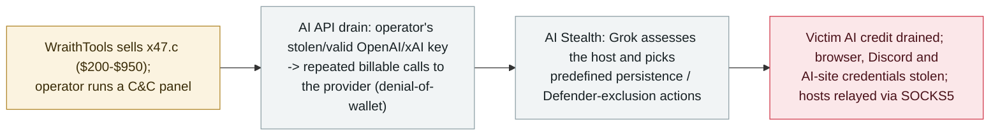

# x47.c: a Windows botnet-for-sale that drains AI API credit and uses Grok to choose how it hides

      

## Summary

**Qrator Research Labs documents x47.c, a Windows botnet advertised for sale (base $200, full package $950) by a threat actor called WraithTools, whose command panel offers 18 DDoS methods, credential theft, SOCKS5 proxying — and two AI-driven features.** The first is an *"AI API drain"* (a denial-of-wallet attack): the operator supplies a valid OpenAI, xAI or compatible API key and the botnet sends *"repeated billable requests straight to the provider,"* so — as Qrator notes — *"the victim's website can stay up while the AI features behind it run out of credit,"* and filtering the site's own traffic does not stop it. The second is an *"AI Stealth"* module that *"uses xAI's Grok to assess the infected host and choose from predefined persistence and concealment actions,"* reporting Defender exclusions and persistence repair, with local fallbacks when the model call fails. The stealer also lifts browser passwords, cookies, Discord and AI-site tokens. Qrator's findings are drawn from the seller's **advertisement, technical documentation and panel screenshots** (an ad dated 3 August), not from an observed deployment. Recorded `incident` / `WEAPON` + `CRED` / `medium` / `real_harm: false` — unlike [ClosedQuorum](2026-09-22-closedquorum-ai-c2-implant.md), where an LLM panel is the autonomous command-and-control brain, here the model is an *optional* module (action selection and wallet-draining), so the AI role is assistive rather than the core.

## Attack chain

## Details

**What it is.** In a report published on **23 September 2026**, Qrator Research Labs describes **x47.c**, a Windows botnet offered for sale by an actor using the handle **WraithTools**. The command-and-control panel bundles bot management, fast-flux configuration, infostealer logs, proxies and DDoS. Qrator's analysis is *"drawn from the seller's advertisement, technical documentation, panel screenshots and follow-up messages"* — an August 3 advertisement priced it from **$200 to $950**, the top package adding credential theft, proxying and AI-assisted persistence.

**The AI API drain (denial-of-wallet).** The panel's *"AI API drain"* mode takes a valid API key for **OpenAI, xAI or a compatible chat API** and *"sends repeated billable requests straight to the provider,"* which OWASP calls **denial of wallet (DoW)**. Because the requests bypass the victim's own application, *"the victim's website can stay up while the AI features behind it run out of credit,"* and filtering traffic at the website will not stop them. The seller pitched it against chatbots, AI-connected CMSes, trading bots and scanners — *"including as a service to use against competitors"* — and pointed to automatic top-ups as a way to keep charges accruing. Qrator notes the botnet's stealer lists AI-site tokens among its targets, though the documentation does not show them being converted into keys for the drain command.

**The Grok-driven stealth module.** An *"AI Stealth"* module *"uses xAI's Grok to assess the infected host and choose from predefined persistence and concealment actions,"* with seller-provided status messages describing persistence repair and Windows Defender exclusions and *"local fallbacks when model calls fail."* Beyond the AI features, the stealer targets browser passwords, cookies and Discord tokens, a SOCKS5 module turns hosts into relays, and an advertised rootkit removes rival malware. Qrator *"found no test results supporting the advertised protection-bypass modes."*

**Why it is here, and where the line is.** The archive records this on the offensive-AI-evolution thread: it is another commodity-crime datapoint where a large language model is wired into malware, and where **AI systems are themselves the target** (draining a victim's provider credit, stealing AI-site tokens). But the AI role is deliberately bounded in the grading: unlike **ClosedQuorum** (`2026-09-22`), in which a panel of LLMs *is* the autonomous command-and-control decision loop, x47.c uses a model as an **optional module** — Grok picks from a *predefined* list of persistence actions, and the drain mode is scripted request-spamming that *"anyone holding a valid key could"* run. `real_harm: false` and `medium`: Qrator documented the tool from seller materials, not from an observed deployment, so there is no confirmed victim; the grade reflects a real, in-market capability rather than a demonstrated intrusion.

## Sources

| # | Source | Link |
|---|---|---|
| 1 | Qrator Research Labs — "x47.c botnet" (23 Sep 2026) | <https://qrator.net/blog/details/x47.c-botnet> |
| 2 | SecurityWeek | <https://www.securityweek.com/new-x47-c-windows-botnet-weaponizes-xai-grok-ai-api-draining/> |
| 3 | Infosecurity Magazine | <https://www.infosecurity-magazine.com/news/x47c-botnet-ai-api-draining-18/> |

## Metadata

| Field | Value |
|---|---|
| Date | `2026-09-23` (raw: Qrator 2026-09-23, precision `day`) |
| Kind | Incident `incident` |
| Type | [`WEAPON`](../../taxonomy/types.md#weapon) [`CRED`](../../taxonomy/types.md#cred) |
| Severity | **Medium** `medium` |
| Confidence | **A** — Qrator's research report plus two independent outlets |
| Real harm | No — documented from seller materials; no confirmed victim |
| AI involvement | Confirmed `confirmed` |
| Region | [Global](../../regions/global.md) |
| Archive ID | `2026-09-23-x47c-botnet-grok-ai-api-drain` |

**Why this classification:** a criminal wires an LLM into a for-sale botnet (`WEAPON`) that steals browser, Discord and AI-site credentials and drains victims' AI API credit (`CRED`). `real_harm: false` because Qrator documented it from the seller's advertisement and documentation, not an observed deployment with a confirmed victim; `medium` because the AI is an optional module (Grok picking predefined persistence actions; scripted wallet-draining) rather than the autonomous core — which is the line against [ClosedQuorum](2026-09-22-closedquorum-ai-c2-implant.md), graded `high` as the first LLM-panel autonomous C2. Dated to Qrator's report (23 September 2026). Grading criteria: [severity.md](../../taxonomy/severity.md) and [confidence.md](../../taxonomy/confidence.md).

## Related

**Topic:** [Offensive AI capability evolution (WEAPON)](../../topics/offensive-ai.md)

**Related records:**

- `2026-09-22` [ClosedQuorum: the first autonomous AI C2 implant](2026-09-22-closedquorum-ai-c2-implant.md)   The contrast — there the LLM panel is the autonomous C2 brain; here the model is an optional module
- `2026-09-22` [CARBONATO: a Docker botnet installs Hermes Agent and loots AI API keys](2026-09-22-carbonato-docker-hermes-agent-botnet.md)   Another commodity botnet whose priority loot is AI API keys
- `2026-09-22` [Gambit: three AI harnesses stole 600,000 card records from online retailers](2026-09-22-gambit-ai-agent-retail-card-theft.md)   The higher-autonomy end of the same offensive-AI commodity-crime thread

---

[← 2026-09 index](README.md) · [← All records](../../README.md) · [Chinese](../i18n/zh/2026-09/2026-09-23-x47c-botnet-grok-ai-api-drain.md)

This record is part of the **Orca AI Incident Archive**, licensed [CC BY 4.0](../../LICENSE). Found a factual error or a missing source? [Open an issue or PR](../../CONTRIBUTING.md) — corrections are recorded in the record's revision history, never silently overwritten.
