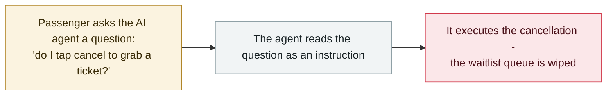

# An AI support agent read "should I cancel?" as an order - and cancelled the ticket

     

## Summary

**A passenger asks Zhixing Train Tickets' AI customer-service agent how to cancel a proxy-booking — the agent reads the question as an instruction and cancels the order itself.** On 23 September a passenger reported that while asking the AI support agent *"how do I cancel the proxy grab"* and then *"do I tap cancel to grab a ticket?"*, the agent *"understood the question as a command"* and completed the refund — **wiping a waitlist queue she had queued for a long time, forcing her to re-queue**. A reporter reproduced it: using the same wording on the Zhixing app, the order was cancelled again. The company's customer service said only that it would pass it on for optimisation — *"in this respect we really did not do well enough."* No attacker, no injection: an ordinary task, an irreversible action, the archive's `ROGUE` pattern — recorded `incident` / `ROGUE` / `medium` / `B` as a single-user scoped harm

## Attack chain

## Details

**What happened.** On **23 September** a passenger posted screenshots of a chat with the AI customer-service agent of **Zhixing Train Tickets**, a popular third-party ticketing app in China. She had asked how to cancel a *proxy grab* booking — *"how do I cancel the proxy grab"* — and then asked the follow-up *"do I tap cancel to grab a ticket?"*. Per the report, **the agent took the question as a command and completed the refund**, zeroing out a waitlist position she had spent a long time queuing for; she would have to re-queue. A reporter from *Zhengzai News* then tested the same wording on the app — **the order was cancelled again**. The company's customer service told the reporter it would relay the issue for optimisation, admitting: *"in this respect we really did not do well enough."*

**Why it sits in the archive.** This is a textbook `ROGUE` record: **no attacker, no injection, no jailbreak** — just an ordinary user asking a question, and an agent with *write access to an irreversible action* deciding to take it. The archive's closest precedent is the **Meta AI support bot** case (June 2026), where a support bot's willingness to act on user text handed over Instagram accounts — that one was graded `critical` because the harm was external account takeover; here the harm is scoped to a single user's booking, which the severity ladder places at `medium` (*"an incident scoped to a single user"*). The lesson recorded is the least glamorous and most common one: consumer agents get *action* tools (cancel, refund, book) without a confirmation step calibrated for ambiguous phrasing, and a question mark is not a safety boundary.

**Caveats kept.** The report rests on the passenger's screenshots, the reporter's reproduction and the company's tepid acknowledgement — mainstream media coverage rather than a vendor post-mortem, hence `confidence: B`. The company has not published a technical explanation of how the intent classification failed. The record states what is known and no more.

## Sources

| # | Source | Link |
|---|---|---|
| 1 | Security Inside (republished from Zhengzai News) | <https://www.secrss.com/articles/94260> |
| 2 | Zhengzai News | <https://baijiahao.baidu.com/s?id=1877097087157468477> |

## Metadata

| Field | Value |
|---|---|
| Date | `2026-09-23` (raw: 2026-09-23, precision `day`) |
| Kind | Incident `incident` |
| Type | [`ROGUE`](../../taxonomy/types.md#rogue) Rogue agent action |
| Severity | **Medium** `medium` |
| Confidence | **B** — mainstream media reporting with screenshots and a reproduction; no vendor post-mortem |
| Real harm | Yes |
| AI involvement | Confirmed `confirmed` |
| Region | [CN](../../regions/cn.md) |
| Archive ID | `2026-09-23-zhixing-ai-agent-cancelled-ticket` |

**Why this classification:** No hostile operator and no external injection — a consumer agent took an irreversible action on its own while handling a routine question, which is the `ROGUE` definition. Rated `medium` per the severity ladder: harm scoped to a single user (a lost waitlist position). Dated to the day of the report and the company response (23 September 2026). Grading criteria: [severity.md](../../taxonomy/severity.md) and [confidence.md](../../taxonomy/confidence.md).

## Related

**Related records:**

- `2026-06-01` [Attackers simply ask Meta's AI support bot for Instagram accounts](../2026-06/2026-06-01-meta-ai-support-bot-hands-over-instagram.md)   A support agent acting on user text, at a much larger scale
- `2026-07-02` [Hidden web instructions make AI agents pay attackers](../2026-07/2026-07-02-hidden-web-instructions-payment-fraud.md)   The other side: when the instruction is hostile rather than merely ambiguous

---

[← 2026-09 index](README.md) · [← All records](../../README.md) · [Chinese](../i18n/zh/2026-09/2026-09-23-zhixing-ai-agent-cancelled-ticket.md)

This record is part of the **Orca AI Incident Archive**, licensed [CC BY 4.0](../../LICENSE). Found a factual error or a missing source? [Open an issue or PR](../../CONTRIBUTING.md) — corrections are recorded in the record's revision history, never silently overwritten.
