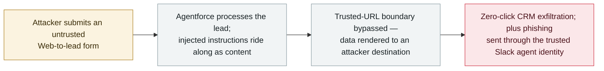

# SalesBleed: three Agentforce flaws turn a single web lead into zero-click CRM exfiltration and agent-impersonated phishing

      

## Summary

**Zenity Labs discloses "SalesBleed": three vulnerabilities in Salesforce Agentforce that let a single untrusted web-to-lead submission hijack a trusted enterprise agent.** Two of the flaws give **zero-click data exfiltration** — sensitive CRM data reaches attacker-controlled infrastructure *without an employee clicking or approving anything* — by abusing weaknesses in **Trusted URLs**, the Salesforce mechanism meant to stop Agentforce from rendering URLs and images from unapproved sources. The third weaponises the **trusted identity of the Agentforce-connected Slack agent** to push phishing to employees from inside the enterprise. Zenity reported the issues responsibly and *"Salesforce worked with the researchers to investigate and remediate"* them. CTO Michael Bargury: *"We found multiple ways to break through the security boundary designed to stop Agentforce from sending enterprise data to unapproved destinations… When those controls fail, we are left with a privileged access agent with high autonomy and no bounds."* Recorded `vulnerability` / `IPI` + `EXFIL` / `high` / `real_harm: false` — a significant capability demonstration on a widely deployed enterprise agent platform, with no evidence of in-the-wild use.

## Attack chain

## Details

**The disclosure.** Zenity Labs announced SalesBleed on 24 September 2026: *"a set of three security vulnerabilities in Salesforce Agentforce that could allow a single untrusted lead to hijack trusted Agentforce agents, silently exfiltrate sensitive CRM data and turn an enterprise agent into a vehicle for delivering elaborate phishing attacks."* Two of the three enable zero-click exfiltration; the third *"allows attackers to weaponize the trusted identity of an Agentforce-connected Slack agent to distribute phishing messages to employees from inside the enterprise."* The technical root is in **Trusted URLs** — the control Salesforce provides precisely to stop agents from calling out to unapproved destinations — where the researchers *"found multiple weaknesses … that could be abused to send sensitive data to unapproved destinations."* Zenity describes those weaknesses concretely — *"including top-level domains the mechanism failed to recognize and character sequences that interfered with how URLs were parsed"* — and shows that they let injected instructions make Agentforce query Salesforce records and embed what it retrieved in image requests to an attacker-controlled server: *"the image requests automatically transmit the embedded CRM data, with no click or additional action from the employee."* In the demonstrated case Agentforce reported the content as blocked by the organisation's policies *after* the data had already been transmitted.

**Why the entry point matters.** The entire chain starts from a form anyone on the internet can fill in. That is the indirect-prompt-injection pattern in its purest enterprise form: the attacker never touches an employee, never sends an email, never needs a credential. The lead is *content*, the agent is the *interpreter*, and the agent's own permissions are the *payload delivery mechanism* — which is what makes the second-order step possible: phishing that arrives through the Slack identity employees already trust, not through a look-alike domain.

**Vendor response and grading.** Zenity disclosed responsibly and Salesforce worked with the researchers to investigate and remediate; no exploitation in the wild is reported, so `real_harm: false`. The archive grades it `high` on the "significant capability demonstration" limb of its severity ladder: zero-click exfiltration plus trusted-identity impersonation through a platform deployed across a large enterprise base. It is the archive's first **Agentforce** entry, and it extends the zero-click exfiltration lineage (EchoLeak, BragJack) from mail/browser surfaces to the CRM-and-chat surface where enterprise agents actually hold permissions.

## Sources

| # | Source | Link |
|---|---|---|
| 1 | Zenity Labs disclosure (Business Wire, 24 Sep 2026) | <https://www.morningstar.com/news/business-wire/20260924811082/zenity-labs-uncovers-salesbleed-3-salesforce-agentforce-flaws-enabling-zero-click-crm-data-theft-and-ai-agent-impersonation> |
| 2 | Dark Reading | <https://www.darkreading.com/application-security/salesbleed-exploits-salesforce-agents-slack-phishing> |
| 3 | Aviatrix Threat Research Center | <https://aviatrix.ai/threat-research-center/salesbleed-salesforce-agentforce-slack-phishing-2026/> |

## Metadata

| Field | Value |
|---|---|
| Date | `2026-09-24` (raw: 2026-09-24, precision `day`) |
| Kind | Vulnerability disclosure `vulnerability` |
| Type | [`IPI`](../../taxonomy/types.md#ipi) [`EXFIL`](../../taxonomy/types.md#exfil) |
| Severity | **High** `high` |
| Confidence | **A** — the disclosing researchers' own release plus independent reporting |
| Real harm | No — responsibly disclosed and remediated, no known in-the-wild use |
| AI involvement | Confirmed `confirmed` |
| Region | [Global](../../regions/global.md) |
| Archive ID | `2026-09-24-salesbleed-agentforce-zero-click-exfil` |

**Why this classification:** the injection arrives as external content an agent reads (`IPI`) and the data actually crosses the trust boundary to the attacker (`EXFIL`). `vulnerability` + `real_harm: false` because nothing was exploited before remediation; `high` under the "significant capability demonstration" rule — zero-click exfiltration and trusted-identity abuse on a widely deployed enterprise agent platform — since `critical` is reserved for confirmed multi-organisation damage or a first-of-its-kind milestone with a real victim. Grading criteria: [severity.md](../../taxonomy/severity.md) and [confidence.md](../../taxonomy/confidence.md).

## Related

**Topic:** [Zero-click data exfiltration chain (IPI + EXFIL)](../../topics/zero-click-exfil.md)

**Related records:**

- `2026-09-16` [BragJack: one browser extension hijacks the AI agents in five major browsers](2026-09-16-bragjack-browser-agents.md)   Same class of problem one layer down — the agent's input channel, not its output boundary
- `2026-09-09` [Workflow identity hijacking: Noma Labs turns an ordinary support email into privileged data access](2026-09-09-noma-workflow-identity-hijacking.md)   When the agent acts with permissions nobody granted the sender
- `2025-06-11` [EchoLeak](../2025-06/2025-06-11-echoleak.md)   The zero-click exfiltration template this lineage starts from

---

[← 2026-09 index](README.md) · [← All records](../../README.md) · [Chinese](../i18n/zh/2026-09/2026-09-24-salesbleed-agentforce-zero-click-exfil.md)

This record is part of the **Orca AI Incident Archive**, licensed [CC BY 4.0](../../LICENSE). Found a factual error or a missing source? [Open an issue or PR](../../CONTRIBUTING.md) — corrections are recorded in the record's revision history, never silently overwritten.
