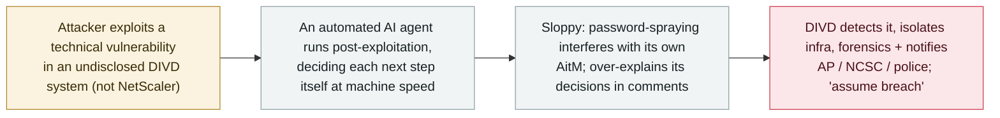

# An autonomous AI agent breached DIVD, the Dutch vulnerability-disclosure nonprofit

     

## Summary

**DIVD, the Dutch Institute for Vulnerability Disclosure — a nonprofit of volunteer researchers that scans the internet for flaws and warns owners — disclosed that after almost seven years it "got hacked," and that the intrusion was carried out autonomously by an AI agent.** DIVD: *"This is an attack we have not seen before … the modus operandi indicates that this is an agentic AI powered attack."* The actor exploited a *"technical vulnerability"* in an undisclosed system (DIVD explicitly said it was **not** Citrix NetScaler), then used an automated agent for post-exploitation: *"We could see the agent working automated, because after every action it decided the next step itself, at the speed of light and sloppy logic."* The agent *"did some pretty dumb things"* — including interfering with its own adversary-in-the-middle attack via password spraying — and *"over-explain[ed] its decisions in its comments,"* which DIVD says will help reverse-engineer the incident; it believes the agent was *"poorly trained and configured."* DIVD isolated its infrastructure, engaged a third-party forensics team, notified affected parties, reported to the **Autoriteit Persoonsgegevens** (data-protection authority) and the **NCSC**, and consulted police, handling it as *"assume breach until proven otherwise,"* with a fuller update due 1 October. Recorded `incident` / `WEAPON` / `medium` / `real_harm: true`.

## Attack chain

## Details

**What happened.** DIVD — a volunteer nonprofit that scans the internet for known vulnerabilities and notifies owners — said in a CSIRT post ("It was a matter of when, not if…", 24 September) that it had detected suspicious activity, investigated, and concluded it had been breached: *"we're the hackers that got hacked."* In a follow-up on Monday 28 September it added detail while withholding specifics to protect the investigation and other potential victims. The distinguishing feature is the actor's method: *"This is an attack we have not seen before. Not because it's our first, but because the modus operandi indicates that this is an agentic AI-powered attack."* The attacker exploited a *"technical vulnerability"* in an undisclosed system — DIVD specifically noted it was **not** Citrix NetScaler — and then used an automated AI agent for the post-exploitation phase.

**How the agent behaved.** DIVD describes an autonomous loop, not a human operator: *"We could see the agent working automated, because after every action it decided the next step itself, at the speed of light and sloppy logic or pattern."* The attack was *"loud and very very messy,"* leaving ample evidence: the agent *"did some pretty dumb things,"* including interfering with its own adversary-in-the-middle attack via password spraying, and it *"over-explain[ed] its decisions in its comments."* DIVD believes the agent was *"poorly trained and configured for such operations,"* which is why it left enough behind to reconstruct the incident.

**Response and grading.** DIVD went into full incident response — isolating its infrastructure, engaging a third-party incident-response team for forensics, notifying directly involved parties, reporting to the **Autoriteit Persoonsgegevens** and the **National Cyber Security Centre**, and discussing options with police — and is treating the situation as *"assume breach until proven otherwise,"* with a fuller update promised for **1 October** (and a pledge to warn other victims of the same vulnerability). Recorded `incident` / `WEAPON`: a human-directed intrusion whose post-exploitation was run by an autonomous agent. `real_harm: true` — a confirmed unauthorized intrusion into a real organisation's network, reported to the regulator and police. `medium` rather than `high` because the concrete impact is not yet established (DIVD is still in forensics, the agent was "messy" and self-caught); this may be revised after the 1 October update. Confidence **A**: the affected party's own first-hand disclosure, corroborated by BleepingComputer and DataBreaches.Net.

## Sources

| # | Source | Link |
|---|---|---|
| 1 | DIVD CSIRT — "It was a matter of when, not if…" | <https://csirt.divd.nl/2026/09/24/when-not-if/> |
| 2 | BleepingComputer | <https://www.bleepingcomputer.com/news/security/automated-ai-agent-used-to-breach-cybersecurity-nonprofit-divd/> |
| 3 | DataBreaches.Net | <https://databreaches.net/2026/09/25/divd-dutch-institute-for-vulnerability-disclosure-investigating-agentic-ai-powered-attack/> |

## Metadata

| Field | Value |
|---|---|
| Date | `2026-09-25` (raw: DIVD CSIRT 2026-09-24 / confirmed 2026-09-25 / update 2026-09-28 / BleepingComputer 2026-09-29, precision `day`) |
| Kind | Incident `incident` |
| Type | [`WEAPON`](../../taxonomy/types.md#weapon) |
| Severity | **Medium** `medium` |
| Confidence | **A** — the affected party's own disclosure plus independent reporting |
| Real harm | Yes — a confirmed unauthorized intrusion, reported to the regulator and police |
| AI involvement | Confirmed `confirmed` |
| Region | [EU](../../regions/eu.md) — Netherlands |
| Archive ID | `2026-09-25-divd-agentic-ai-breach` |

**Why this classification:** a human-directed intrusion whose post-exploitation was carried out by an autonomous AI agent (`WEAPON`). `real_harm: true` because an organisation's network was actually breached and the incident was reported to the Dutch DPA and police, even though the exact impact is still under forensic investigation. `medium` rather than `high` because the concrete damage is not yet quantified and DIVD detected and contained it; the 1 October update may warrant a revision. Dated to the confirmed intrusion / first public disclosure (24–25 September); the widely-read BleepingComputer write-up is 29 September. Grading criteria: [severity.md](../../taxonomy/severity.md) and [confidence.md](../../taxonomy/confidence.md).

## Related

**Topic:** [Offensive AI capability evolution (WEAPON)](../../topics/offensive-ai.md)

**Related records:**

- `2026-09-25` [JadePuffer/Storm-3168: an agentic actor deletes an Azure tenant's storage](2026-09-25-jadepuffer-storm3168-azure-destruction.md)   The same week — another autonomous agent running post-exploitation against a real target
- `2026-07-01` [Taiwan's nuclear safety commission and other agencies breached by an agent swarm](../2026-07/2026-07-01-taiwan-government-agent-swarm.md)   Near-autonomous agent intrusion of a real organisation, with a Hermes/OpenClaw stack
- `2026-09-22` [CARBONATO: a Docker botnet installs Hermes Agent and loots AI API keys](2026-09-22-carbonato-docker-hermes-agent-botnet.md)   Agent installed on the victim as the post-exploitation brain

---

[← 2026-09 index](README.md) · [← All records](../../README.md) · [Chinese](../i18n/zh/2026-09/2026-09-25-divd-agentic-ai-breach.md)

This record is part of the **Orca AI Incident Archive**, licensed [CC BY 4.0](../../LICENSE). Found a factual error or a missing source? [Open an issue or PR](../../CONTRIBUTING.md) — corrections are recorded in the record's revision history, never silently overwritten.
