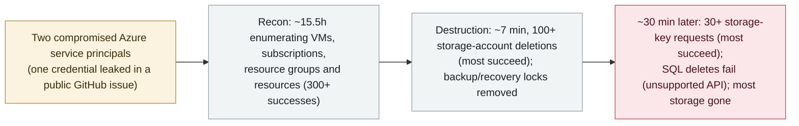

# JadePuffer/Storm-3168: an agentic actor deletes an Azure tenant's storage in a 7-minute destructive burst

      

## Summary

**Microsoft Security Research links the JADEPUFFER agentic-ransomware actor (tracked as Storm-3168) to extensive Azure-focused resource destruction: using two compromised service principals, it enumerated a tenant's cloud for ~15.5 hours, then in about 7 minutes made 100+ storage-account deletion attempts, most of which succeeded.** One service principal did reconnaissance; the other *"performed discovery, destructive operations, and credential collection."* It removed backup/recovery protections (Azure Site Recovery locks) *"to make restoration more difficult,"* and about half an hour after the wipe returned for 30+ storage-account-key requests, most successful. Some deletions were blocked — Azure resource locks and storage-account deletion protection saved a few accounts, and attempts to delete Azure SQL databases failed because the actor used an unsupported API version. Microsoft could not confirm initial access but notes one service principal's credentials *"appeared in a public GitHub issue before the attacks."* JADEPUFFER is the actor Sysdig documented in July 2026 as the first fully agentic ransomware operation; this is a distinct, cloud-destruction campaign by the same actor. Recorded `incident` / `WEAPON` + `CRED` / `high` / `real_harm: true`.

## Attack chain

## Details

**What Microsoft found.** In a report published **25 September 2026**, *"Storm-3168: Agentic-driven cloud attacks using compromised service principals,"* Microsoft Security Research ties the activity to **JADEPUFFER**, *"a threat actor discovered by Sysdig in July 2026 and reported to be the first documented agentic ransomware operation."* Microsoft observed the Azure activity in **early June 2026**. Two compromised service principals in the same tenant were used: one for reconnaissance, the other for *"discovery, destructive operations, and credential collection."* Reconnaissance ran about **15 hours 30 minutes** with 300+ successful enumeration calls across VMs, subscriptions, resource groups and resources.

**The destruction.** The destructive phase lasted about **7 minutes** and involved **100+ storage-account deletion attempts**; *"most Azure Storage accounts targeted by the threat actor were successfully deleted,"* though *"Azure resource locks and storage account-level deletion protection blocked deletion attempts for a few."* The actor also removed **Azure Site Recovery locks**, *"indicating an effort to make restoration more difficult"* — a pattern Microsoft says *"could further support ransomware extortion,"* although it did not report financial demands or confirm data theft in the observed cases. Attempts to delete **Azure SQL databases failed** because the actor used an unsupported API version, and *"the parallel targeting of Azure SQL databases and storage accounts suggests an effort to broaden the destructive impact."* Roughly half an hour after the wipe, Storm-3168 returned for **30+ storage-account-key requests, most of which succeeded**.

**Access and why the archive records it.** Microsoft *"could not determine exactly how the initial access occurred,"* but notes credentials for one service principal *"appeared in a public GitHub issue before the attacks."* This is a distinct campaign from the archive's existing JADEPUFFER entry (`2026-07-01`, Sysdig's first-agentic-ransomware disclosure against a Langflow instance): same actor, a different, cloud-native destruction operation attributed by Microsoft. It is `WEAPON` (a human operator using agentic automation to run the intrusion) and `CRED` (harvesting storage-account keys and collecting credentials); `real_harm: true` because a tenant's Azure storage accounts were actually deleted. Graded `high` — confirmed destructive damage of limited (single-tenant) scope — rather than `critical`, which the archive reserves for multi-organisation, government, critical-infrastructure or worm-level damage.

## Sources

| # | Source | Link |
|---|---|---|
| 1 | Microsoft Security Blog — "Storm-3168: Agentic-driven cloud attacks…" | <https://www.microsoft.com/en-us/security/blog/2026/09/25/storm-3168-agentic-driven-cloud-attacks-using-compromised-service-principals/> |
| 2 | BleepingComputer | <https://www.bleepingcomputer.com/news/security/jadepuffer-agentic-ai-attacks-target-azure-destroy-cloud-resources/> |
| 3 | Dark Reading | <https://www.darkreading.com/cloud-security/jadepuffer-ai-actor-compromises-azure-tenant-destructive-cloud-attack> |

## Metadata

| Field | Value |
|---|---|
| Date | `2026-09-25` (raw: Microsoft disclosure 2026-09-25; activity early June 2026, precision `day`) |
| Kind | Incident `incident` |
| Type | [`WEAPON`](../../taxonomy/types.md#weapon) [`CRED`](../../taxonomy/types.md#cred) |
| Severity | **High** `high` |
| Confidence | **A** — Microsoft Security Research's own report plus independent reporting |
| Real harm | Yes — a tenant's Azure storage accounts were deleted |
| AI involvement | Confirmed `confirmed` |
| Region | [Global](../../regions/global.md) |
| Archive ID | `2026-09-25-jadepuffer-storm3168-azure-destruction` |

**Why this classification:** a human operator ran an agentic-driven intrusion (`WEAPON`) that collected credentials and storage-account keys (`CRED`) and destroyed a tenant's Azure storage. `real_harm: true` because the deletion was real and largely succeeded; `high` rather than `critical` — confirmed destructive damage scoped to a single tenant, with no multi-organisation / government / worm-level trigger and no reported extortion or data theft. Dated to Microsoft's 25 September disclosure; the observed activity is from early June 2026 (kept in `date_raw`). Distinct from `2026-07-01` (the same actor's first-agentic-ransomware disclosure). Grading criteria: [severity.md](../../taxonomy/severity.md) and [confidence.md](../../taxonomy/confidence.md).

## Related

**Topic:** [Offensive AI capability evolution (WEAPON)](../../topics/offensive-ai.md)

**Related records:**

- `2026-07-01` [JADEPUFFER: first ransomware driven end-to-end by an LLM](../2026-07/2026-07-01-jadepuffer-first-llm-driven-ransomware.md)   The same actor's first disclosure — agentic ransomware against a Langflow instance
- `2026-09-22` [CARBONATO: a Docker botnet installs Hermes Agent and loots AI API keys](2026-09-22-carbonato-docker-hermes-agent-botnet.md)   Another agent-driven commodity intrusion disclosed the same month
- `2026-09-23` [x47.c: a Windows botnet-for-sale that drains AI API credit and uses Grok to hide](2026-09-23-x47c-botnet-grok-ai-api-drain.md)   The same offensive-AI thread, at the commodity-tooling end

---

[← 2026-09 index](README.md) · [← All records](../../README.md) · [Chinese](../i18n/zh/2026-09/2026-09-25-jadepuffer-storm3168-azure-destruction.md)

This record is part of the **Orca AI Incident Archive**, licensed [CC BY 4.0](../../LICENSE). Found a factual error or a missing source? [Open an issue or PR](../../CONTRIBUTING.md) — corrections are recorded in the record's revision history, never silently overwritten.
