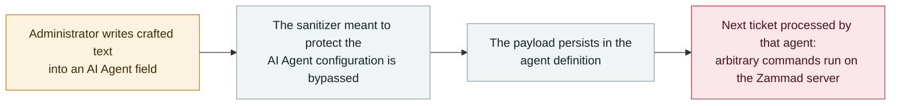

# Zammad: crafted text in an AI Agent field bypasses the sanitizer and runs commands on the server

      

## Summary

**CVE-2026-84462: in Zammad before 7.1.2, *"a security filter that protects Zammad's AI Agent configuration can be bypassed by entering specially crafted text into one of an AI Agent's fields,"* letting an administrator who can create or edit AI Agents *"run arbitrary commands on the server that hosts Zammad."*** The GitHub advisory calls it *"AI Agent template sanitizer bypass leads to remote code execution"*; NVD adds that *"no interaction from other users is needed; the malicious code runs automatically the next time the affected AI Agent processes a ticket."* CVSS 4.0 **8.6** (`AV:N/AC:L/AT:N/PR:H/UI:N/VC:H/VI:H/VA:H`), weaknesses CWE-20 / CWE-94 / CWE-1336; fixed in **7.1.2**. The pattern matters more than the score: the **agent definition itself** — the instructions, templates and filters a helpdesk admin writes for an AI Agent — is a remote code execution surface. No exploitation in the wild is recorded. Recorded `vulnerability` / `IPI` + `INFRA` / `medium` / `real_harm: false`.

## Attack chain

## Details

**The advisory.** Zammad's GitHub security advisory **GHSA-gp3x-9xm8-rcj6**, *"AI Agent template sanitizer bypass leads to remote code execution,"* covers Zammad before 7.1.2. NVD's synchronised text: *"a security filter that protects Zammad's AI Agent configuration can be bypassed by entering specially crafted text into one of an AI Agent's fields. An administrator with permission to create or edit AI Agents could exploit this to run arbitrary commands on the server that hosts Zammad, potentially reading, modifying, or destroying all data stored on that server. No interaction from other users is needed; the malicious code runs automatically the next time the affected AI Agent processes a ticket. This issue is fixed in version 7.1.2."* CVSS 4.0 base **8.6** with `PR:H` (high privileges required) and full confidentiality/integrity/availability impact; weaknesses **CWE-20** (improper input validation), **CWE-94** (code injection) and **CWE-1336** (template engine injection).

**On the dates.** The GitHub advisory was published on **4 August 2026**; NVD synchronised it on **25 September 2026**, which is how this sweep picked it up. The record is dated to the NVD publication, following the archive's practice of dating CVE entries to the point they enter the CVE record.

**Why the archive records it.** Two CVEs published the same week (25 September) target the same new surface from opposite ends — CVE-2026-84462 in Zammad's helpdesk AI Agent and CVE-2026-94111 in a browser agent's daemon. In both, the thing being attacked is not the model but the **plumbing that defines what the agent is**: its fields, templates, filters and transports. Zammad is the sharper case, because the store is persistent and self-triggering: the payload sits in the agent definition and fires on the next ticket, with no user interaction — an agent-configuration injection that behaves like stored XSS but lands as server command execution.

**Grading.** `vulnerability` / `real_harm: false` — disclosed by the maintainer, fixed in 7.1.2, no known exploitation. Severity `medium` under the archive's ladder despite CVSS 8.6: the flaw requires an administrator who can already create or edit AI Agents, and the archive reserves `high` for CVSS 9+ or confirmed damage. Confidence **A**: the maintainer's advisory plus the NVD record.

## Sources

| # | Source | Link |
|---|---|---|
| 1 | Zammad security advisory GHSA-gp3x-9xm8-rcj6 | <https://github.com/zammad/zammad/security/advisories/GHSA-gp3x-9xm8-rcj6> |
| 2 | NVD — CVE-2026-84462 | <https://nvd.nist.gov/vuln/detail/CVE-2026-84462> |

## Metadata

| Field | Value |
|---|---|
| Date | `2026-09-25` (raw: GHSA 2026-08-04 / NVD 2026-09-25, precision `day`) |
| Kind | Vulnerability disclosure `vulnerability` |
| Type | [`IPI`](../../taxonomy/types.md#ipi) [`INFRA`](../../taxonomy/types.md#infra) |
| Severity | **Medium** `medium` |
| Confidence | **A** — maintainer advisory (GHSA) plus the NVD record |
| Real harm | No — fixed in 7.1.2, no known exploitation |
| AI involvement | Confirmed `confirmed` |
| Region | [Global](../../regions/global.md) |
| Archive ID | `2026-09-25-zammad-ai-agent-template-rce` |

**Why this classification:** what is attacked is the agent's own configuration store (`INFRA`) and the payload reaches execution as content the agent processes (`IPI`, template-injection class). `real_harm: false` because it was disclosed and patched with no known exploitation. `medium` rather than `high` under the archive's ladder — CVSS 8.6 is below the 9+ band and the flaw needs an administrator who can already author agents; `high` would also require confirmed damage. Grading criteria: [severity.md](../../taxonomy/severity.md) and [confidence.md](../../taxonomy/confidence.md).

## Related

**Topic:** [Agent infrastructure exposure (INFRA)](../../topics/agent-infra.md)

**Related records:**

- `2026-09-20` [Tencent BrowserSkill: any 32-character extension origin can pose as the browser client](2026-09-20-tencent-browserskill-origin-bypass.md)   The same week, the same idea one layer down — the agent's transport, not its definition
- `2026-09-23` [IBM FTM: unauthenticated RAG poisoning could steer the payment agent's MCP tools](2026-09-23-ibm-ftm-rag-poisoning.md)   Injection into what the agent trusts, reaching its tools
- `2026-09-14` [Bifrost AI gateway: one unauthenticated MCP registration runs commands as the gateway user](2026-09-14-bifrost-ai-gateway-cve-2026-90898.md)   The September pattern: agent plumbing as an RCE surface

---

[← 2026-09 index](README.md) · [← All records](../../README.md) · [Chinese](../i18n/zh/2026-09/2026-09-25-zammad-ai-agent-template-rce.md)

This record is part of the **Orca AI Incident Archive**, licensed [CC BY 4.0](../../LICENSE). Found a factual error or a missing source? [Open an issue or PR](../../CONTRIBUTING.md) — corrections are recorded in the record's revision history, never silently overwritten.
