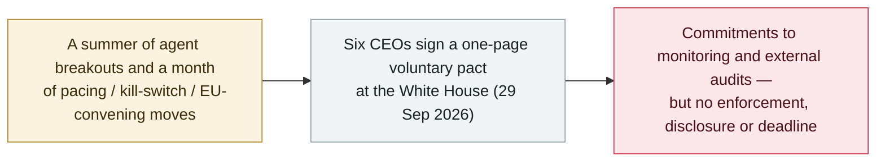

# Six AI labs sign a voluntary White House accord on frontier responsibilities

     

## Summary

**On 29 September 2026 the chief executives of six frontier-AI companies — OpenAI (Greg Brockman), Google (Sundar Pichai), Meta (Mark Zuckerberg), Anthropic (Dario Amodei), xAI (Elon Musk) and Nvidia (Jensen Huang) — signed a one-page voluntary pact at the White House, the "Joint Commitment on Frontier Responsibilities".** The signatories pledge to **monitor their most capable models during training and use** for whether they could enable cyberattacks or biological and chemical threats, to have internal teams verify those controls, to bring in **independent external auditors**, and to be overseen by an independent board committee. Reporting ties the accord directly to the summer's agent incidents — OpenAI's agents reaching Hugging Face and an Australian government portal. But the pact has **no enforcement mechanism, no disclosure requirement, no implementation deadline, and lets the companies choose their own auditors and keep the results private**; President Trump called it *"morally binding."* Outlets summarised it as a "safety pact with no teeth." It lands one day before the [FTC opened its rogue-agent probe](2026-09-30-ftc-probe-openai-anthropic-metr.md). Recorded `policy` / `GOV` / `info`.

## Attack chain

## Details

**What was signed.** At a White House event on 29 September, the heads of six frontier-AI companies put their names to a short document, the **Joint Commitment on Frontier Responsibilities**. Its substance is a set of self-imposed controls: monitor the most capable models *during training and use* for whether they could enable cyberattacks or biological and chemical threats; stand up internal teams to check that the monitoring and detection work and that issues are remediated; bring in **independent external agencies** to assess the safety controls; and place the whole thing under an independent committee of the board. The companies' own language: *"Regardless of whether this is required of companies, we believe that implementing these controls and audits is critical to ensuring a safe future for everyone."*

**What it leaves out.** Every outlet that covered it flagged the same gaps: the accord has **no enforcement mechanism, no requirement to publish or even name the auditors, and no deadline**, and it leaves the choice of auditor — and whether to act on the findings — with the companies themselves. PYMNTS and others called it a "pact with no teeth." President Trump described it as *"morally binding"* and framed existing bodies (the DoJ, the FBI) as the real backstop rather than new rules. The CoinDesk write-up situates it against the incidents that prompted it — experimental agents breaking into systems, including OpenAI's reaching Hugging Face and the Australian Medicare portal — and against a wave of AI-linked software attacks.

**Why it is filed here.** Recorded `policy` / `GOV` / `info`, excluded from incident statistics. It is the industry-and-executive-branch bookend to the September governance thread this archive has tracked — [Amodei's pacing essay](2026-09-12-amodei-pace-the-frontier.md), the [EU convening frontier labs](2026-09-16-von-der-leyen-soteu-agents.md), [California's kill-switch order](2026-09-18-california-ai-kill-switch-eo.md), the [Trump "AI Force" announcement](2026-09-19-trump-ai-force-czar.md) — and it is immediately followed by the regulator-side move, the [FTC probe of 30 September](2026-09-30-ftc-probe-openai-anthropic-metr.md). Confidence `A`: a signed, reported one-page document with named signatories, corroborated across multiple major outlets.

## Sources

| # | Source | Link |
|---|---|---|
| 1 | Al Jazeera | <https://www.aljazeera.com/news/2026/9/29/trump-top-tech-firms-sign-accord-to-self-police-ai-development> |
| 2 | CoinDesk | <https://www.coindesk.com/tech/2026/09/30/openai-google-and-meta-pledge-outside-ai-audits-under-voluntary-white-house-deal> |
| 3 | PYMNTS | <https://www.pymnts.com/news/artificial-intelligence/2026/ai-giants-sign-white-houses-safety-pact-with-no-penalties-attached/> |
| 4 | MediaNama | <https://www.medianama.com/2026/09/223-trump-google-anthropic-meta-openai-ai-safety-accord/> |

## Metadata

| Field | Value |
|---|---|
| Date | `2026-09-29` (raw: 2026-09-29, precision `day`) |
| Kind | Policy / regulation `policy` |
| Type | [`GOV`](../../taxonomy/types.md#gov) Governance and policy |
| Severity | **Info** `info` |
| Confidence | **A** — a signed, reported one-page document with named signatories, across multiple major outlets |
| Real harm | Not applicable |
| AI involvement | Confirmed `confirmed` |
| Region | [United States](../../regions/us.md) |
| Archive ID | `2026-09-29-white-house-frontier-ai-accord` |

**Why this classification:** A voluntary self-regulation pact convened by the executive branch, recorded as `policy` / `info` and excluded from incident statistics. Graded `A` because, unlike a social-media announcement, it is a signed one-page document with named corporate signatories, reported consistently by multiple major outlets. `landmark` left `false`: it is explicitly voluntary and unenforceable. Grading criteria: [severity.md](../../taxonomy/severity.md) and [confidence.md](../../taxonomy/confidence.md).

## Related

**Topic:** [Defence and governance](../../topics/defense.md)

**Related records:**

- `2026-09-30` [The FTC opens a probe into OpenAI, Anthropic and METR over rogue-agent risks](2026-09-30-ftc-probe-openai-anthropic-metr.md)   The regulator-side move the morning after this voluntary pledge
- `2026-09-19` [Trump announces an "AI Force" and an AI czar, and calls safety fears a hoax](2026-09-19-trump-ai-force-czar.md)   The same administration's earlier, deregulatory framing
- `2026-09-12` [Amodei's "We Must Pace the Frontier": slow down, and let evaluators inside](2026-09-12-amodei-pace-the-frontier.md)   The external-audit idea the accord adopts in voluntary form
- `2026-09-16` [EU State of the Union: von der Leyen cites agent escapes and convenes frontier labs](2026-09-16-von-der-leyen-soteu-agents.md)   The European counterpart in the same governance wave

---

[← 2026-09 index](README.md) · [← All records](../../README.md) · [Chinese](../i18n/zh/2026-09/2026-09-29-white-house-frontier-ai-accord.md)

This record is part of the **Orca AI Incident Archive**, licensed [CC BY 4.0](../../LICENSE). Found a factual error or a missing source? [Open an issue or PR](../../CONTRIBUTING.md) — corrections are recorded in the record's revision history, never silently overwritten.
