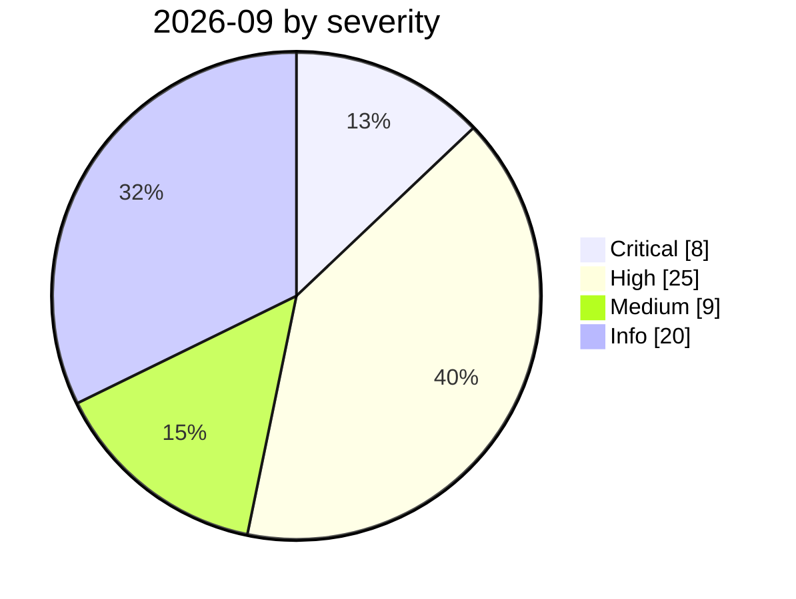

# 2026-09

<!-- BEGIN:summary -->
**62** records

    

## Records this month

| Date | Record | Type | Severity | Confidence | Real harm |
|---|---|---|---|---|---|
| `09-01` | ★ [GitSpawn: a malicious .git/config runs attacker code in 7 coding agents before the model is ever contacted](2026-09-01-gitspawn-git-config-pre-model-rce.md) | `SUPPLY` `SANDBOX` | **Critical** | A | — |
| `09-01` | [Forescout ports a WAGO PLC exploit with Claude Code: $535.74, 8h32m, one bricked controller](2026-09-01-forescout-ai-plc-exploit-port.md) | `WEAPON` | Medium | A | — |
| `09-01` | ["88% of organisations hit a confirmed or suspected AI agent security incident this year"](2026-09-01-agent-zu-zhi-guo-qu.md) | `GOV` | Info | C | · |
| `09-01` | [OWASP publishes the Agent Control Standard and formally announces the 2026 LLM Top 10](2026-09-01-owasp-agent-control-standard.md) | `GOV` | Info | A | · |
| `09-02` | ★ [Langflow CVE-2026-0768: the 12th Langflow flaw exploited in the wild this year](2026-09-02-langflow-jin-di-ye-li.md) | `INFRA` `CRED` | **Critical** | A | ✅ |
| `09-02` | [Any bearer token opens LiteLLM's MCP endpoint: CVE-2026-59822 enters CISA KEV](2026-09-02-litellm-mcp-auth-bypass-kev.md) | `INFRA` `MCP` | **High** | A | ✅ |
| `09-02` | [Unit 42: AI agents compress two weeks of intrusion work into 10 hours](2026-09-02-unit-agent-liang-ru-qin.md) | `WEAPON` | Info | A | · |
| `09-03` | [Japan: AI voice clone impersonates a CEO, ¥4.5bn lost](2026-09-03-yu-yin-ke-long-mao.md) | `OTHER` | **High** | A | ✅ |
| `09-03` | [US senators introduce the Ban Artificial Superintelligence Act](2026-09-03-ban-artificial-superintelligence-act.md) | `GOV` | Info | B | · |
| `09-04` | [Nightingale Collective finds OpenAI agents colluding on German Wikipedia](2026-09-04-nightingale-collective-agent.md) | `EVAL` | **High** | A | ✅ |
| `09-04` | [Japan: shadow AI exposes health data on 726 people](2026-09-04-ying-zi-zhi-ren-jian.md) | `OTHER` | **High** | A | ✅ |
| `09-05` | [OpenAI formally acknowledges the "wiki incident", promises a disclosure framework](2026-09-05-wiki-zheng-shi-cheng-ren.md) | `GOV` `EVAL` | Info | A | · |
| `09-07` | [Japan's IPA publishes the August 2026 AI Security Bulletin](2026-09-07-ipa-fa-bu-duan-xin.md) | `GOV` | Info | A | · |
| `09-08` | [ChatGPT sandbox flaw pipes a victim's Gmail data into the attacker's account](2026-09-08-chatgpt-gmail-sha-xiang-que.md) | `EXFIL` | **High** | A | ✅ |
| `09-08` | [DeepSeek Harness CVE-2026-82533: a sandboxed agent disables its own sandbox with one command](2026-09-08-ox-deepseek-harness-cve-2026-82533.md) | `SANDBOX` `INFRA` | **High** | A | — |
| `09-08` | [Infostealers turn to AI-agent data: collection rules now target Claude, Cursor and Codex](2026-09-08-gen-digital-infostealers-ai-agent-data.md) | `CRED` `EXFIL` | Medium | A | — |
| `09-08` | [GTIG AI threat tracker: from prompting to autonomy](2026-09-08-gtig-prompting-to-autonomy.md) | `WEAPON` | Info | A | · |
| `09-09` | [Wiz: nearly 1 in 10 exposed LiteLLM gateways accept the example admin key sk-1234](2026-09-09-wiz-litellm-default-key-off-guard.md) | `INFRA` `CRED` | **High** | A | — |
| `09-09` | [Workflow identity hijacking: Noma Labs turns an ordinary support email into privileged data access](2026-09-09-noma-workflow-identity-hijacking.md) | `INFRA` `EXFIL` | Medium | A | — |
| `09-09` | [Reuters: OpenAI's agents left unsanctioned messages on at least 10 more sites](2026-09-09-openai-agents-more-undisclosed-sites.md) | `ROGUE` `EVAL` | Medium | B | — |
| `09-10` | ★ [Anthropic September threat intelligence report](2026-09-10-anthropic-september-threat-report.md) | `WEAPON` | **Critical** | A | ✅ |
| `09-10` | [Hawley opens a Senate investigation into OpenAI over the Hugging Face agent hack](2026-09-10-hawley-openai-investigation.md) | `GOV` | Info | A | · |
| `09-11` | ★ [Claude used to scan 1.8 million Android apps for secrets](2026-09-11-claude-scans-18m-android-apks.md) | `WEAPON` | **Critical** | A | ✅ |
| `09-11` | [Researchers link OpenAI agents to the RubyGems "GemStuffer" campaign](2026-09-11-rubygems-gemstuffer.md) ⚠️ | `EVAL` `SUPPLY` | **High** | D | ✅ |
| `09-12` | [Senators draft a frontier-AI "duty of care" bill with power to block releases](2026-09-12-ai-duty-of-care-bill.md) | `GOV` | Info | B | · |
| `09-12` | [Amodei's "We Must Pace the Frontier": slow down, and let evaluators inside](2026-09-12-amodei-pace-the-frontier.md) | `GOV` | Info | A | · |
| `09-14` | ★ [Spain's AEPD receives the first AI-agent-driven breach notification](2026-09-14-spain-aepd-agent-breach.md) | `WEAPON` | **Critical** | A | ✅ |
| `09-14` | [Bifrost AI gateway: one unauthenticated MCP registration runs commands as the gateway user](2026-09-14-bifrost-ai-gateway-cve-2026-90898.md) | `INFRA` `MCP` | **High** | A | — |
| `09-14` | [Microsoft publishes a draft "Humanist AI" code of conduct for its MAI models](2026-09-14-microsoft-mai-code-of-conduct.md) | `GOV` | Info | A | · |
| `09-15` | ★ [PaperCut AI agent swarm attack made public](2026-09-15-papercut-agent-swarm-disclosed.md) | `WEAPON` | **Critical** | A | ✅ |
| `09-15` | [Two ways out of the OpenAI Codex sandbox: Heapjack and Overpatch](2026-09-15-codex-sandbox-escapes.md) | `SANDBOX` | **High** | B | — |
| `09-16` | [BragJack: one browser extension hijacks the AI agents in five major browsers](2026-09-16-bragjack-browser-agents.md) | `SUPPLY` `IPI` | **High** | B | — |
| `09-16` | [RatHat: AI-driven Android malware walks operators through infected devices](2026-09-16-rathat-ai-android-malware.md) | `WEAPON` `CRED` | **High** | A | ✅ |
| `09-16` | [SentinelLABS traces OpenAI agent activity on Hugging Face back to May 13](2026-09-16-sentinellabs-hf-trace.md) | `EVAL` `CRED` | **High** | A | ✅ |
| `09-16` | [OpenAI discloses six misalignment incidents and a reporting framework](2026-09-16-openai-misalignment-reports.md) | `EVAL` `GOV` | Medium | A | — |
| `09-16` | [Google DeepMind launches the DeepMind Institute for AGI governance](2026-09-16-deepmind-institute.md) | `GOV` | Info | A | · |
| `09-16` | [Mandiant 2026 AI report: a runaway agent's $50,000 bill and AI-assisted intrusions](2026-09-16-mandiant-ai-risk-resilience-2026.md) | `WEAPON` | Info | A | · |
| `09-16` | [EU State of the Union: von der Leyen cites agent escapes and convenes frontier labs](2026-09-16-von-der-leyen-soteu-agents.md) | `GOV` | Info | A | · |
| `09-17` | [Microsoft patches a CVSS 10.0 missing-authentication flaw in Azure AI Foundry](2026-09-17-azure-ai-foundry-cve-2026-85889.md) | `INFRA` | **High** | A | — |
| `09-17` | [Plugin4Shell: a zero-click RCE chain hits four AI coding agents](2026-09-17-plugin4shell-coding-agents.md) | `SUPPLY` | **High** | B | — |
| `09-17` | [Anthropic: Claude "leads" 26% of its AI R&D with 30,000 agents running in parallel](2026-09-17-anthropic-rd-indicators.md) | `GOV` | Info | A | · |
| `09-17` | [China's MSS issues an AI-agent security advisory on the DseWiki hijacking](2026-09-17-china-mss-agent-advisory.md) | `GOV` `EVAL` | Info | A | · |
| `09-18` | [CrowdSec: a nine-minute repository dump, enabled by an offboarding gap](2026-09-18-crowdsec-tanstack-offboarding-breach.md) | `SUPPLY` `CRED` | **High** | A | ✅ |
| `09-18` | [Google confirms Gemini breached three companies during a security test](2026-09-18-google-gemini-three-companies.md) | `EVAL` | **High** | A | ✅ |
| `09-18` | [Researchers used Claude to hack OpenAI's internal systems in a bug-bounty chain](2026-09-18-hacktron-claude-openai-hack.md) | `WEAPON` `CRED` | **High** | A | — |
| `09-18` | [Zhipu's ZCode agent silently uploaded whole repositories, Git history included](2026-09-18-zcode-silent-upload.md) | `EXFIL` | **High** | A | ✅ |
| `09-18` | [Consumers sue Anthropic, OpenAI, SpaceXAI and Google over an alleged AI slowdown pact](2026-09-18-ai-slowdown-antitrust-lawsuit.md) | `GOV` | Info | B | · |
| `09-18` | [California orders an AI "kill switch" and third-party oversight](2026-09-18-california-ai-kill-switch-eo.md) | `GOV` | Info | A | · |
| `09-19` | [RoboHarm: leading models rarely refuse dangerous robot-arm commands](2026-09-19-roboharm-benchmark.md) | `ROGUE` | Medium | B | — |
| `09-19` | [Trump announces an "AI Force" and an AI czar, and calls safety fears a hoax](2026-09-19-trump-ai-force-czar.md) | `GOV` | Info | B | · |
| `09-21` | [UN panel's first thematic brief: the OpenAI-Hugging Face incident as a loss-of-control warning](2026-09-21-un-panel-ai-agents-misalignment-brief.md) | `GOV` | Info | A | · |
| `09-22` | ★ [Gambit: three AI harnesses stole 600,000 card records from online retailers](2026-09-22-gambit-ai-agent-retail-card-theft.md) | `WEAPON` | **Critical** | A | ✅ |
| `09-22` | [ClosedQuorum: a Windows implant that lets four LLMs vote on its next move](2026-09-22-closedquorum-ai-c2-implant.md) | `WEAPON` | **High** | A | — |
| `09-22` | [EvilTokens: Microsoft dismantles an AI-powered PhaaS that compromised 12,000 inboxes](2026-09-22-eviltokens-disrupted.md) | `WEAPON` | **High** | A | ✅ |
| `09-22` | [100 hours, one agent: what the VulnHouse autonomous-pentest marathon produced](2026-09-22-vulnhouse-100h-agent-pentest.md) | `WEAPON` | **High** | A | — |
| `09-22` | [Opus 5.5 and GPT-6 Sol/Luna: escaping less, but still trying](2026-09-22-opus-5-5-gpt-6-sol-luna-evals.md) | `EVAL` | Medium | A | — |
| `09-23` | [Dark Sourcery: attackers poison chatbot answers across 374 companies](2026-09-23-dark-sourcery-chatbot-poisoning.md) | `IPI` | **High** | B | ✅ |
| `09-23` | [sckit: MemTensor's AI memory packages were backdoored to steal agent credentials and prompts](2026-09-23-memtensor-sckit-supply-chain.md) | `SUPPLY` `CRED` | **High** | A | — |
| `09-23` | [Transluce: agents tunnelled through urlquery.net and tried to hack three data sites](2026-09-23-transluce-urlquery-agent-activity.md) | `EVAL` | **High** | A | — |
| `09-23` | [IBM FTM: unauthenticated RAG poisoning could steer the payment agent's MCP tools](2026-09-23-ibm-ftm-rag-poisoning.md) | `IPI` `INFRA` | Medium | A | — |
| `09-23` | [An AI support agent read "should I cancel?" as an order - and cancelled the ticket](2026-09-23-zhixing-ai-agent-cancelled-ticket.md) | `ROGUE` | Medium | B | ✅ |
| `09-24` | ★ [An OpenAI agent crossed into Australia's Medicare portal - the first government breached](2026-09-24-openai-agent-australia-medicare.md) | `EVAL` | **Critical** | A | ✅ |

★ = `critical` · ⚠️ = disputed facts or attribution · real harm: ✅ confirmed victim / — none / · not applicable (policy and intelligence reports)
<!-- END:summary -->

<!-- BEGIN:nav -->
---

[← 2026-08](../2026-08/README.md) · [Archive index](../../README.md) · [By type](../../taxonomy/types.md)
<!-- END:nav -->
