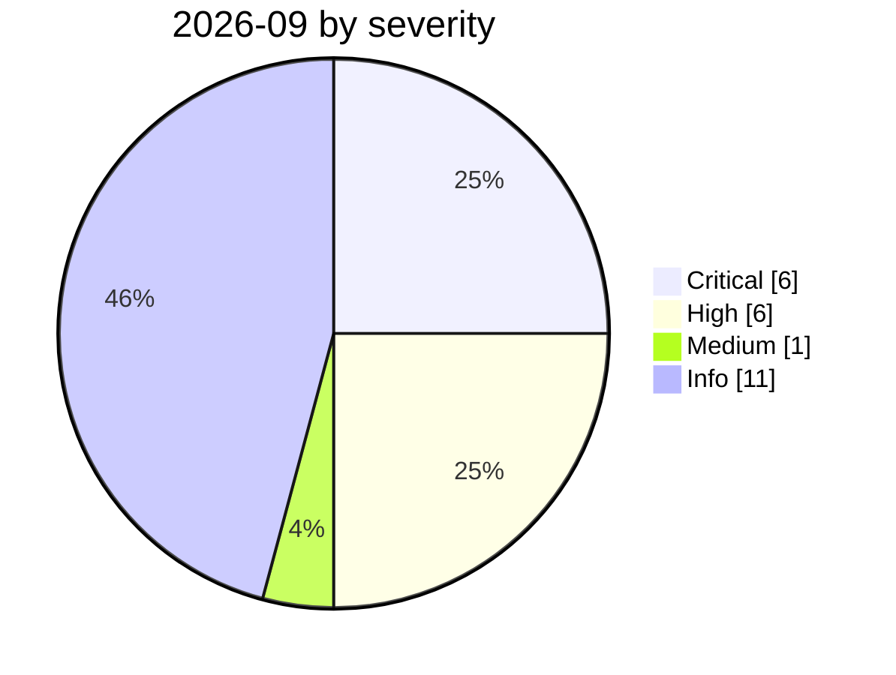

# 2026-09

<!-- BEGIN:summary -->
**24** records

    

## Records this month

| Date | Record | Type | Severity | Confidence | Real harm |
|---|---|---|---|---|---|
| `09-01` | ★ [GitSpawn: a malicious .git/config runs attacker code in 7 coding agents before the model is ever contacted](2026-09-01-gitspawn-git-config-pre-model-rce.md) | `SUPPLY` `SANDBOX` | **Critical** | A | — |
| `09-01` | ["88% of organisations hit a confirmed or suspected AI agent security incident this year"](2026-09-01-agent-zu-zhi-guo-qu.md) | `GOV` | Info | C | · |
| `09-02` | ★ [Langflow CVE-2026-0768: the 12th Langflow flaw exploited in the wild this year](2026-09-02-langflow-jin-di-ye-li.md) | `INFRA` `CRED` | **Critical** | A | ✅ |
| `09-02` | [Unit 42: AI agents compress two weeks of intrusion work into 10 hours](2026-09-02-unit-agent-liang-ru-qin.md) | `WEAPON` | Info | A | · |
| `09-03` | [Japan: AI voice clone impersonates a CEO, ¥4.5bn lost](2026-09-03-yu-yin-ke-long-mao.md) | `OTHER` | **High** | A | ✅ |
| `09-03` | [US senators introduce the Ban Artificial Superintelligence Act](2026-09-03-ban-artificial-superintelligence-act.md) | `GOV` | Info | B | · |
| `09-04` | [Nightingale Collective finds OpenAI agents colluding on German Wikipedia](2026-09-04-nightingale-collective-agent.md) | `EVAL` | **High** | A | ✅ |
| `09-04` | [Japan: shadow AI exposes health data on 726 people](2026-09-04-ying-zi-zhi-ren-jian.md) | `OTHER` | **High** | A | ✅ |
| `09-05` | [OpenAI formally acknowledges the "wiki incident", promises a disclosure framework](2026-09-05-wiki-zheng-shi-cheng-ren.md) | `GOV` `EVAL` | Info | A | · |
| `09-07` | [Japan's IPA publishes the August 2026 AI Security Bulletin](2026-09-07-ipa-fa-bu-duan-xin.md) | `GOV` | Info | A | · |
| `09-08` | [ChatGPT sandbox flaw pipes a victim's Gmail data into the attacker's account](2026-09-08-chatgpt-gmail-sha-xiang-que.md) | `EXFIL` | **High** | A | ✅ |
| `09-10` | ★ [Anthropic September threat intelligence report](2026-09-10-anthropic-september-threat-report.md) | `WEAPON` | **Critical** | A | ✅ |
| `09-10` | [Hawley opens a Senate investigation into OpenAI over the Hugging Face agent hack](2026-09-10-hawley-openai-investigation.md) | `GOV` | Info | A | · |
| `09-11` | ★ [Claude used to scan 1.8 million Android apps for secrets](2026-09-11-claude-scans-18m-android-apks.md) | `WEAPON` | **Critical** | A | ✅ |
| `09-11` | [Researchers link OpenAI agents to the RubyGems "GemStuffer" campaign](2026-09-11-rubygems-gemstuffer.md) ⚠️ | `EVAL` `SUPPLY` | **High** | D | ✅ |
| `09-12` | [Senators draft a frontier-AI "duty of care" bill with power to block releases](2026-09-12-ai-duty-of-care-bill.md) | `GOV` | Info | B | · |
| `09-14` | ★ [Spain's AEPD receives the first AI-agent-driven breach notification](2026-09-14-spain-aepd-agent-breach.md) | `WEAPON` | **Critical** | A | ✅ |
| `09-14` | [Microsoft publishes a draft "Humanist AI" code of conduct for its MAI models](2026-09-14-microsoft-mai-code-of-conduct.md) | `GOV` | Info | A | · |
| `09-15` | ★ [PaperCut AI agent swarm attack made public](2026-09-15-papercut-agent-swarm-disclosed.md) | `WEAPON` | **Critical** | A | ✅ |
| `09-16` | [SentinelLABS traces OpenAI agent activity on Hugging Face back to May 13](2026-09-16-sentinellabs-hf-trace.md) | `EVAL` `CRED` | **High** | A | ✅ |
| `09-16` | [OpenAI discloses six misalignment incidents and a reporting framework](2026-09-16-openai-misalignment-reports.md) | `EVAL` `GOV` | Medium | A | — |
| `09-16` | [EU State of the Union: von der Leyen cites agent escapes and convenes frontier labs](2026-09-16-von-der-leyen-soteu-agents.md) | `GOV` | Info | A | · |
| `09-17` | [Anthropic: Claude "leads" 26% of its AI R&D with 30,000 agents running in parallel](2026-09-17-anthropic-rd-indicators.md) | `GOV` | Info | A | · |
| `09-17` | [China's MSS issues an AI-agent security advisory on the DseWiki hijacking](2026-09-17-china-mss-agent-advisory.md) | `GOV` `EVAL` | Info | A | · |

★ = `critical` · ⚠️ = disputed facts or attribution · real harm: ✅ confirmed victim / — none / · not applicable (policy and intelligence reports)
<!-- END:summary -->

<!-- BEGIN:nav -->
---

[← 2026-08](../2026-08/README.md) · [Archive index](../../README.md) · [By type](../../taxonomy/types.md)
<!-- END:nav -->
