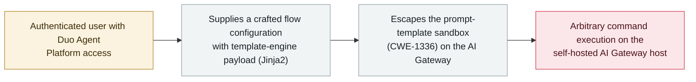

# GitLab Duo AI Gateway: a prompt-template sandbox escape runs commands on the host (CVE-2026-90970)

      

## Summary

**GitLab disclosed CVE-2026-90970 (CVSS 9.9, critical) on 2 October 2026: an authenticated user with access to the Duo Agent Platform can supply a crafted *flow configuration* that escapes the AI Gateway's Jinja2-style prompt-template sandbox and executes arbitrary commands on the AI Gateway host.** The AI Gateway is the middleware that connects a GitLab instance to its AI models; a successful escape means full compromise of a self-hosted gateway. The flaw is classified CWE-1336 (improper neutralisation of special elements in a template engine). **Only self-hosted AI Gateways need to act** — GitLab had already patched its own hosted gateways, so GitLab.com / Dedicated / self-managed instances connected to a GitLab-hosted gateway are not affected. Fixed in AI Gateway 19.2.4, 19.3.2 and 19.4.1. It was reported by HackerOne researcher invisiblemeerkat, and GitLab's advisory does **not** report any in-the-wild exploitation. Recorded `vulnerability` / `INFRA` + `SANDBOX` / `high` / `real_harm: false` — a CVSS-9+ flaw in agent infrastructure with no known exploitation.

## Attack chain

## Details

**The flaw.** GitLab's 2 October advisory describes an **improper-neutralisation** bug in how the Duo Agent Platform's AI Gateway builds prompts. The gateway uses a Jinja2-style template engine to insert user-controlled data into prompts; because the sandbox around that templating is insufficient, an authenticated user with Duo Agent Platform access can supply a **crafted flow configuration** whose payload escapes the template sandbox and runs arbitrary commands on the gateway host. GitLab rated it **CVSS 9.9** and NVD files it under **CWE-1336** (improper neutralisation of special elements used in a template engine). A successful attack yields full system compromise of the self-hosted AI Gateway.

**Who must act.** The AI Gateway is the service that connects a GitLab instance to AI models. GitLab says it had **already patched its own GitLab-hosted gateways**, so customers on GitLab.com, GitLab Dedicated, or a self-managed instance connected to a GitLab-hosted gateway do not need to take action. **Only organisations running their own (self-hosted) AI Gateway are affected**, and they should upgrade to **19.2.4, 19.3.2 or 19.4.1**. The issue was reported through HackerOne by a researcher using the handle **invisiblemeerkat**.

**How it is graded.** Recorded `vulnerability` — a disclosed flaw, not a used-in-anger incident. `INFRA` (the agent's runtime middleware, the AI Gateway) and `SANDBOX` (escape of the prompt-template execution boundary). `real_harm: false`: GitLab's advisory reports no known in-the-wild exploitation and the fix shipped with the disclosure. Severity `high` rather than `critical` despite the CVSS 9.9 — this archive's severity reflects **what has already happened**, and a severe flaw with no known exploitation is `high` here (the same basis as [EchoLeak](../2025-06/2025-06-11-echoleak.md), CVSS 9.3, no in-the-wild use). Confidence `A`: GitLab's own advisory and the NVD record, with independent reporting.

## Sources

| # | Source | Link |
|---|---|---|
| 1 | NVD — CVE-2026-90970 | <https://nvd.nist.gov/vuln/detail/CVE-2026-90970> |
| 2 | The Hacker News | <https://thehackernews.com/2026/10/gitlab-patches-critical-self-hosted-ai.html> |
| 3 | Security Affairs | <https://securityaffairs.com/200283/hacking/cve-2026-90970-critical-gitlab-ai-gateway-flaw-fixed.html> |

## Metadata

| Field | Value |
|---|---|
| Date | `2026-10-02` (raw: 2026-10-02 GitLab advisory, precision `day`) |
| Kind | Vulnerability disclosure `vulnerability` |
| Type | [`INFRA`](../../taxonomy/types.md#infra) [`SANDBOX`](../../taxonomy/types.md#sandbox) |
| Severity | **High** `high` |
| Confidence | **A** — GitLab advisory + NVD, with independent reporting |
| Real harm | No — fix shipped with disclosure; no known in-the-wild exploitation |
| AI involvement | Confirmed `confirmed` |
| Region | [Global](../../regions/global.md) |
| Archive ID | `2026-10-02-gitlab-duo-ai-gateway-rce` |

**Why this classification:** A disclosed flaw in the GitLab Duo AI Gateway's prompt-templating (`INFRA` — agent runtime middleware; `SANDBOX` — escape of the template execution boundary). `vulnerability`, not an incident. `real_harm: false` because GitLab reports no known exploitation and patched it on disclosure. `high` not `critical`: severity here records what has happened, and a CVSS-9+ flaw with no in-the-wild use is `high` (as with EchoLeak). Dated to the GitLab advisory (2 October 2026). Grading criteria: [severity.md](../../taxonomy/severity.md) and [confidence.md](../../taxonomy/confidence.md).

## Related

**Topic:** [Agent infrastructure exposure (INFRA)](../../topics/agent-infra.md)

**Related records:**

- `2026-08-26` [GitLab Duo's Claude agent can be steered into exfiltration](../2026-08/2026-08-26-gitlab-duo-claude-agent.md)   An earlier GitLab Duo weakness — a different mechanism
- `2025-05-01` [GitLab Duo remote prompt injection](../2025-05/2025-05-01-gitlab-duo-yuan-cheng-ti.md)   The first GitLab Duo issue in the archive
- `2026-08-06` [Langflow RCE added to CISA KEV](../2026-08/2026-08-06-langflow-rce-cisa-kev.md)   Another agent-infrastructure RCE — that one exploited in the wild

---

[← 2026-10 index](README.md) · [← All records](../../README.md) · [Chinese](../i18n/zh/2026-10/2026-10-02-gitlab-duo-ai-gateway-rce.md)

This record is part of the **Orca AI Incident Archive**, licensed [CC BY 4.0](../../LICENSE). Found a factual error or a missing source? [Open an issue or PR](../../CONTRIBUTING.md) — corrections are recorded in the record's revision history, never silently overwritten.
