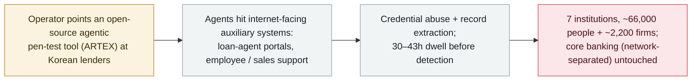

# An open-source agentic pen-test tool (ARTEX) is tied to breaches at seven South Korean banks

      

## Summary

**Between about 28 September and early October 2026, attackers breached at least seven South Korean financial institutions — Shinhan, KB Kookmin, Hana, BNK Busan, Yegaram Savings, Welcome Savings and Hyundai Capital — exposing roughly 66,000 individuals' records (reports range 65,000–68,000) plus ~2,200 corporate records; investigators tracing the attack logs attribute the activity to ARTEX, an open-source "autonomous penetration-testing" tool driven by multiple AI agents running on commercial models.** South Korea's president publicly acknowledged on **6 October** that "signs have emerged of AI being used." The intruders hit **internet-facing auxiliary systems** — loan-agent lookup portals, employee mobile work-support and sales-support apps — and did **not** reach core banking, which stays physically network-separated under Korean regulation. The worst single losses: Shinhan ~25,000 customers (including 66 national ID numbers) and Yegaram Savings ~40,000 people. The Financial Security Institute's assessment is that the **AI "did not act independently without human involvement"** — a human-directed operation using an agentic tool. Attribution of the operator is uncertain (the tool is public and the IPs globally distributed), and **no regulator has formally confirmed the ARTEX link**, which rests on attack-log analysis. Regulators responded by **suspending a planned round of network-separation deregulation**. Recorded `incident` / `WEAPON` + `EXFIL` / `critical` / `real_harm: true`.

## Attack chain

## Details

**What happened.** Over roughly a week beginning **28 September 2026**, at least **seven South Korean financial institutions** were breached: Shinhan, KB Kookmin, Hana, BNK Busan, Yegaram Savings Bank, Welcome Savings Bank and Hyundai Capital. Reported totals cluster around **66,000 individuals (65,000–68,000 across outlets) and about 2,200 corporate records**. The heaviest single hits were **Shinhan (~25,000 customers, including 66 resident-registration/national ID numbers)** and **Yegaram Savings Bank (~40,000 people)**; other banks lost far smaller sets (tens to low hundreds of records). The attackers reached **internet-facing auxiliary systems** — a loan-recruiter lookup service, an employee mobile work-support system, and sales-support applications — and, critically, did **not** breach the banks' **core banking systems, which remain physically network-separated** under Korean regulation. Dwell times before detection ran to roughly **30–43 hours**.

**The AI angle, stated carefully.** Investigators tracing attack IPs and server logs — Shinhan was the first to report — found evidence pointing to **ARTEX**, an **open-source "autonomous penetration-testing" tool that describes itself as driven by multiple AI agents running on commercial models (Anthropic or OpenAI)**. Two cautions belong on this record: (1) **the ARTEX link is suspected from log analysis, not formally confirmed by any regulator** — American Banker notes "no regulator has publicly confirmed" it; and (2) the operator is **unattributed**, precisely because the tool is public and the source IPs are globally distributed. South Korea's **Financial Security Institute** said the **AI "did not act independently without human involvement"** — i.e. a human-directed operation using an agentic tool, which is why this is `WEAPON` rather than `ROGUE`. South Korea's president acknowledged on **6 October** that "signs have emerged of AI being used."

**Why it is recorded, and how graded.** This is a **confirmed real-world breach of seven financial institutions** with tens of thousands of customers' personal data (including national ID numbers) taken — `real_harm: true`, and `critical` under the archive's multi-organisation-damage trigger. `WEAPON` (a human wielding an agentic pen-test tool as an attack weapon) + `EXFIL` (customer records extracted). Confidence `A` for the incident itself — acknowledged by the president and the Financial Security Institute and reported across major outlets — while the **ARTEX attribution is held as "traced/suspected, not formally confirmed"** in the text. The regulatory aftermath is notable: authorities **suspended a planned round of network-separation deregulation**, crediting the physical separation of core banking for limiting the damage.

**Update (9 October 2026) — CrowdStrike analyses the operator's own working files.** CrowdStrike published a follow-up built on **open directories left exposed on attacker-controlled servers**, which it says provide *"direct insight into the threat actor's operational methodology and tooling."* Exposed on those servers were **Claude Code session histories, ARTEX configuration files and Claude memory files**; one directory held a `CLAUDE.md` at `38.244.50[.]120:18899/.claude/CLAUDE.md` containing *"a Chinese-language pentesting prompt that specified how the LLM should conduct pentesting activities."* The sessions show a **two-server setup** (a Hong Kong address as the operator's main infrastructure; `38.244.50[.]120` running the ARTEX instance behind the Korean attacks), with **DeepSeek v4.1-flash as the main model and GLM-5.3 (Zhipu AI) and Grok 4.6 used for additional sessions**, likely reached through a reseller (`xcai[.]pro`), plus nine proxy IPs listed in the report. CrowdStrike **does not link the activity to a specific group** and assesses with moderate confidence that the operator is **Chinese-speaking and financially motivated**; industry reporting still has not confirmed how many organisations were hit. The operator also queried the model about where stolen Korean data is typically sold and how to find Korean data-sale channels on Telegram; the session dumps surfaced what may be operator personal details, which are omitted here per Security Affairs' own caution. Separately, ARTEX's developer (Autumn-27) has **closed the source code and stopped updates**, saying the tool was built for learning and research and that these attacks are unrelated to the project. This update enriches the record with the same incident's follow-up primary analysis; the attribution stance is unchanged — tool use traced/suspected, operator assessed (not formally attributed).

## Sources

| # | Source | Link |
|---|---|---|
| 1 | American Banker | <https://www.americanbanker.com/news/ai-linked-hacks-hit-korean-banks-through-loan-agent-sites> |
| 2 | The Herald Business (exclusive) | <https://mbiz.heraldcorp.com/article/10892497> |
| 3 | Tech Times | <https://www.techtimes.com/articles/328541/20261005/open-source-ai-agent-hacked-seven-south-korean-banks-exposing-65000-records.htm> |
| 4 | CrowdStrike — "Unknown threat actor uses ARTEX to target South Korean finance" (9 October follow-up) | <https://www.crowdstrike.com/en-us/blog/unknown-threat-actor-uses-artex-to-target-south-korean-finance/> |
| 5 | Security Affairs | <https://securityaffairs.com/200661/hacking/ai-driven-tool-artex-used-in-attacks-against-south-korean-banks.html> |
| 6 | The Hacker News — ARTEX developer response | <https://thehackernews.com/2026/10/artex-ai-pentesting-tool-used-in-data.html> |

## Metadata

| Field | Value |
|---|---|
| Date | `2026-10-06` (raw: campaign from 2026-09-28; public disclosure 2026-10-06, precision `day`) |
| Kind | Incident `incident` |
| Type | [`WEAPON`](../../taxonomy/types.md#weapon) [`EXFIL`](../../taxonomy/types.md#exfil) |
| Severity | **Critical** `critical` |
| Confidence | **A** — the breach is acknowledged by the president and the Financial Security Institute and widely reported; the ARTEX attribution is traced, not formally confirmed |
| Real harm | Yes — ~66,000 people's records (incl. national IDs) taken from seven financial institutions |
| AI involvement | Confirmed `confirmed` |
| Region | [South Korea](../../regions/kr.md) |
| Archive ID | `2026-10-06-artex-ai-south-korea-banks` |

**Why this classification:** A human-directed operation that used an open-source agentic pen-test tool against seven banks (`WEAPON`) and extracted customer records (`EXFIL`). `critical` under the multi-organisation confirmed-damage trigger — seven financial institutions, ~66,000 people's data including national IDs. `real_harm: true`. Confidence `A` for the breach (presidential and Financial Security Institute acknowledgement plus major-outlet reporting); the **ARTEX tool attribution is explicitly held as log-traced/suspected rather than formally confirmed**, and the operator is unattributed. Dated to the 6 October public disclosure; the campaign ran from ~28 September (kept in `date_raw`). Grading criteria: [severity.md](../../taxonomy/severity.md) and [confidence.md](../../taxonomy/confidence.md). Enriched on 10 October 2026 with CrowdStrike's 9 October follow-up analysis of the operator's exposed working files (see Details).

## Related

**Topic:** [Offensive AI capability evolution (WEAPON)](../../topics/offensive-ai.md)

**Related records:**

- `2025-11-13` [GTG-1002: the first AI-orchestrated espionage campaign](../2025-11/2025-11-13-gtg-1002-first-ai-orchestrated-espionage.md)   The reference point for a human operator driving an agent through most of an intrusion
- `2025-09-01` [Villager / CyberSpike: a weaponised autonomous pen-test framework](../2025-09/2025-09-01-villager-cyberspike-shen-tou-gong.md)   An offensive pen-test agent turned attack tool — the same tool class as ARTEX
- `2026-09-22` [Gambit: an AI agent steals retail payment-card data](../2026-09/2026-09-22-gambit-ai-agent-retail-card-theft.md)   Another financially-motivated agent-driven data theft, weeks earlier

---

[← 2026-10 index](README.md) · [← All records](../../README.md) · [Chinese](../i18n/zh/2026-10/2026-10-06-artex-ai-south-korea-banks.md)

This record is part of the **Orca AI Incident Archive**, licensed [CC BY 4.0](../../LICENSE). Found a factual error or a missing source? [Open an issue or PR](../../CONTRIBUTING.md) — corrections are recorded in the record's revision history, never silently overwritten.
