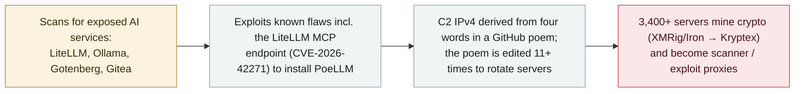

# PoeLLM: a botnet hides its C2 in a GitHub poem and turns exposed AI servers into mining proxies

      

## Summary

**Lumen's Black Lotus Labs disclosed on 7 October 2026 a financially motivated botnet campaign — tracked as Canto Incognito, malware dubbed PoeLLM — that has compromised more than 3,400 internet-facing servers since at least April 2026, concentrated in the US and Western Europe, by exploiting exposed AI and developer services: LiteLLM, Ollama, Gotenberg and Gitea, plus an Ivanti Sentry entry point (CVE-2026-10520).** Exploitation includes **CVE-2026-42271 — command injection in LiteLLM's MCP testing endpoint (`/mcp-rest/test/connection`)** — the flaw this archive already recorded in June. Victims are mined for cryptocurrency (XMRig and Iron, connected to Kryptex) and repurposed as internet scanners and exploit servers — *"a private army of AI-enabled proxies"* — with remote-shell capability observed. The campaign's signature is its C2: there is **no hardcoded domain — four words extracted from a poem hosted on GitHub ("On the Nature of Connection", edited 11+ times and possibly AI-written) are mapped through a hard-coded dictionary into the current C2 IPv4 address**, so editing the poem moves the whole botnet. Peak activity reached **~2,200 affected servers in mid-June, with nearly 800 active per day**; recent SSH brute-force traffic suggests further experimentation. Lumen attributes the operation to an **Italian-speaking threat actor** with moderate confidence. The poem's GitHub repository has since been taken down, disrupting the campaign. Recorded `incident` / `INFRA` + `WEAPON` / `high` / `real_harm: true`.

## Attack chain

## Details

**The campaign.** Since at least **April 2026**, a financially motivated operation — **"Canto Incognito"**, delivering the **PoeLLM** malware — has been compromising internet-exposed AI and adjacent services for cryptocurrency mining and botnet expansion. Lumen counted **more than 3,400 victim servers**, with peak activity in **mid-June at ~2,200 affected hosts and nearly 800 active per day**; victims are concentrated in **the United States and Western Europe**. Targets are enterprise, internet-facing deployments of **LiteLLM** (primary port 4000), **Ollama**, **Gotenberg** (port 3000) and **Gitea**; the investigation began from an **Ivanti Sentry** compromise (CVE-2026-10520). One of the exploits used is **CVE-2026-42271, a command-injection in LiteLLM's MCP testing endpoint (`/mcp-rest/test/connection`)** — this archive [recorded that flaw on 2026-06-08](../2026-06/2026-06-08-litellm-mcp-duan-dian-jie.md); it is cross-linked rather than re-recorded here.

**C2 by poem.** The distinguishing technique: PoeLLM derives its C2 address from a poem, *"On the Nature of Connection"*, hosted in a GitHub repository (a fork of nodejs.org sources). Four words or phrases, extracted between fixed text anchors, are converted through a **hard-coded dictionary** (e.g. `driver` → 92, `diode` → 119) into the four octets of the current C2 IPv4 address; the poem was updated **11 times**, each time pointing infected hosts at a new server, and *"to anyone who comes across it, this is simply a poem on GitHub. It has no links, no files to download, no encrypted text."* Lumen notes the poem contains no Italian yet the actor's prose elsewhere is Italian — and assesses it "likely written by AI" precisely because it would have worked in any language. The GitHub repository has since been taken down, which Lumen describes as fully disrupting that C2 layer.

**Impact and grading.** Infected hosts are turned into **scanners and exploit servers** — *"the actor has effectively created a private army of AI-enabled proxies, which will continue to multiply and provide additional vectors for attack, credential theft, token abuse and more"* — and run **XMRig and Iron** miners paying into **Kryptex**. The malware can deploy remote-shells and further exploits from the C2; recent traffic toward SSH and other login portals suggests **distributed brute-force experimentation** whose maturity is unclear. Lumen assesses an **Italian-speaking actor** with moderate confidence (Italian code comments, Italian-hosted admin infrastructure). Recorded `INFRA` — in-the-wild exploitation of exposed LLM-serving services (including an MCP endpoint flaw) — **+** `WEAPON` — compromised AI servers repurposed as attack infrastructure. `real_harm: true` (3,400+ confirmed victims with mining and re-attack capability); `high` matches the archive's grading for the September CARBONATO botnet rather than `critical`. Confidence `A`: Lumen's primary report plus independent coverage from CyberScoop and The Hacker News.

## Sources

| # | Source | Link |
|---|---|---|
| 1 | Lumen Black Lotus Labs — "Canto incognito: tracking the PoeLLM malware" | <https://www.lumen.com/blog/en-us/canto-incognito-tracking-the-poellm-malware> |
| 2 | CyberScoop | <https://cyberscoop.com/poellm-malware-botnet-poem-lumen-black-lotus-labs/> |
| 3 | The Hacker News | <https://thehackernews.com/2026/10/poellm-malware-infects-3400-servers-to.html> |

## Metadata

| Field | Value |
|---|---|
| Date | `2026-10-07` (raw: active since April 2026; disclosed 2026-10-07, precision `day`) |
| Kind | Incident `incident` |
| Type | [`INFRA`](../../taxonomy/types.md#infra) [`WEAPON`](../../taxonomy/types.md#weapon) |
| Severity | **High** `high` |
| Confidence | **A** — Lumen Black Lotus Labs primary report plus CyberScoop and The Hacker News |
| Real harm | Yes — 3,400+ servers compromised, mined and repurposed as attack proxies |
| AI involvement | Confirmed `confirmed` |
| Region | [Global](../../regions/global.md) |
| Archive ID | `2026-10-07-poellm-canto-incognito-botnet` |

**Why this classification:** In-the-wild exploitation of exposed LLM-serving infrastructure (`INFRA`, including the MCP-endpoint flaw CVE-2026-42271 already recorded on 2026-06-08) combined with the mass weaponization of compromised AI servers as scanners/exploit proxies (`WEAPON`). `real_harm: true` — more than 3,400 confirmed victims. `high` under the confirmed-limited-scope-damage band, matched to the September CARBONATO botnet grading; the campaign is financially motivated and disruptive rather than a multi-organisation / critical-infrastructure event. Grading criteria: [severity.md](../../taxonomy/severity.md) and [confidence.md](../../taxonomy/confidence.md).

## Related

**Topic:** [Agent infrastructure exposure (INFRA)](../../topics/agent-infra.md)

**Related records:**

- `2026-06-08` [LiteLLM CVE-2026-42271 MCP endpoint takeover](../2026-06/2026-06-08-litellm-mcp-duan-dian-jie.md)   The exact flaw PoeLLM exploits — recorded in June, now mass-exploited
- `2026-09-22` [CARBONATO: a Docker botnet installs Hermes Agent and loots AI API keys](../2026-09/2026-09-22-carbonato-docker-hermes-agent-botnet.md)   The closest precedent: a botnet monetizing and weaponizing AI-adjacent infrastructure
- `2025-02-01` [Ollama servers exposed at scale](../2025-02/2025-02-01-ollama-fu-wu-qi-gui.md)   The oldest exposure in the same target class: unauthenticated, internet-facing LLM services

---

[← 2026-10 index](README.md) · [← All records](../../README.md) · [Chinese](../i18n/zh/2026-10/2026-10-07-poellm-canto-incognito-botnet.md)

This record is part of the **Orca AI Incident Archive**, licensed [CC BY 4.0](../../LICENSE). Found a factual error or a missing source? [Open an issue or PR](../../CONTRIBUTING.md) — corrections are recorded in the record's revision history, never silently overwritten.
