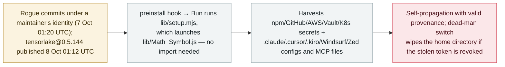

# Tensorlake's npm SDK is compromised in a ChainDrop/Shai-Hulud wave that harvests AI-agent credentials and configs

      

## Summary

**On 8 October 2026 a poisoned release of `tensorlake` — the npm SDK of Tensorlake, a platform that provides isolated sandboxes for running untrusted, LLM-generated code — reached the registry: version 0.5.144, published at 01:12 UTC, was flagged by Socket about 11 minutes later and has since been removed from the npm registry.** The rogue code entered via commits made under a maintainer's identity on 7 October (commit `41b38f0`); the repository was compromised for roughly 20 hours before the publish fired. It is the **ChainDrop / Shai-Hulud** worm lineage behind August's `keyv`/`cacheable` poisoning: a `preinstall` hook runs an obfuscated loader (`lib/setup.mjs`) that executes a credential-stealing, self-propagating payload (`lib/Math_Symbol.js`) via Bun — no import or agent start required. Beyond npm/GitHub/AWS/Vault/Kubernetes/SSH/`.env`/wallet/messaging data, it specifically targets **AI development tooling — configuration and MCP files associated with Claude Code (`.claude`), Cursor, Kiro, Windsurf and Zed** — and writes `.claude/settings.json` and `.vscode/tasks.json` into reachable repositories, so it runs again when someone opens the project in Claude Code or VS Code. It republishes poisoned versions under a victim maintainer's identity (with valid Sigstore provenance), resolves C2 through an Ethereum contract with a GitHub fallback, and carries a "hostage token" dead-man switch: a PowerShell monitor wipes the home directory if the stolen GitHub token is revoked. No installs of 0.5.144 or downstream infections have been confirmed. Recorded `incident` / `SUPPLY` + `CRED` / `high` / `real_harm: false`.

## Attack chain

## Details

**What happened.** On **7 October 2026 at 01:20 UTC** a threat actor made verified commits to `tensorlakeai/tensorlake` under a maintainer's identity, introducing the malware via direct file upload (commit `41b38f0`) and then working to bump versions and trigger publishing. The repository remained compromised for roughly **20 hours** until the release workflow published **`tensorlake@0.5.144` to npm on 8 October at 01:12:07 UTC**; Socket flagged it at 01:23:10 UTC — about **11 minutes** later — and the version is no longer downloadable. Tensorlake's own platform provides *"isolated sandboxes for running untrusted, LLM-generated code"*; its TypeScript SDK is what developers install to create and manage those environments, so the compromise lands **on the machine installing the SDK**, before any generated code reaches a sandbox. The package sees ~12K weekly downloads and has 100,000+ lifetime installs; there is no sign the attacker reached the PyPI or Cargo distributions, and no official Tensorlake advisory has been published — the only public trace so far is [GitHub issue #1014](https://github.com/tensorlakeai/tensorlake/issues/1014), opened by StepSecurity.

**What the worm does.** The release carries a `preinstall` hook (`node lib/setup.mjs`). Socket flagged two files: an obfuscated loader (`lib/setup.mjs`, SHA-256 `25a0735d…c3bcb5ef`) that drops Bun and executes the second file, and the worm payload itself (`lib/Math_Symbol.js`, SHA-256 `b50a0090…a0ad6fec`). Aikido's analysis finds a `WORMTAG` marker indicating a **novel compromise rather than reinfection** from an earlier Shai-Hulud wave, and notes the operator's added focus on quickly monetizing infected developer endpoints. Collection targets include npm/GitHub tokens; AWS, Vault and Kubernetes credentials; SSH keys, `.env` files, cryptocurrency wallets and messaging data — and, from **AI development tools, the configuration and MCP files associated with Claude Code (`.claude`), Cursor, `.kiro`, Windsurf and Zed**. The worm also writes **`.claude/settings.json` and `.vscode/tasks.json`** into repositories it can reach, "so it runs again when someone opens the project in Claude Code or VS Code." It propagates by enumerating the victim's publishable packages and republishing compromised versions **with valid Sigstore provenance**; strings referencing a fake Copilot/Dependabot workflow suggest it also plants GitHub Actions workflows. The C2 has no hardcoded domain dependency: it resolves `iseekaigogo[.]com` first, then falls back to an **Ethereum contract** read through ~30 public RPC endpoints, and stows encrypted data in GitHub repositories described as *"Shai-Hulud: Here We Go Again."* The **dead-man switch** — a scheduled PowerShell monitor polling `api.github.com/user` with the stolen token — runs an attacker handler through `Invoke-Expression` if the token is revoked, wiping the home directory; the string `IfYouRevokeThisTokenItWillWipeTheComputerOfTheOwner` has appeared in earlier waves. Socket's remediation order matters: **stop and delete the token monitor before revoking any credential.**

**Why it is recorded, and how graded.** This is a supply-chain poisoning aimed at **agent infrastructure tooling**, whose credential harvest is **specifically extended to agent configs and MCP files** — core scope under the archive's supply-chain category. It is a **new wave** of the same family recorded on [2026-08-04](../2026-08/2026-08-04-chaindrop-npm-ru-chong.md), not a new detail of that record: a different package, a different compromise and a different release pipeline (the archive keeps Shai-Hulud waves as separate records). `real_harm: false` — the malicious version was flagged about 11 minutes after publication, and **no confirmed installs or downstream infections** have been reported (Socket explicitly cautions its 12K weekly figure describes the package overall, not the malicious release). `high`: a worm-grade compromise with agent-credential targeting but no confirmed victim damage, consistent with the grading of the September MemTensor package poisoning. Confidence `A`: Socket's primary technical write-up, plus independent analyses from StepSecurity and Aikido and mainstream coverage.

## Sources

| # | Source | Link |
|---|---|---|
| 1 | Socket — "TensorLake npm SDK Compromised…" | <https://socket.dev/blog/tensorlake-compromise> |
| 2 | StepSecurity — "tensorlake-npm-compromised-hostage-token-worm" | <https://www.stepsecurity.io/blog/tensorlake-npm-compromised-hostage-token-worm> |
| 3 | Aikido Security | <https://www.aikido.dev/blog/tensorlake-npm-package-compromised> |
| 4 | The Hacker News | <https://thehackernews.com/2026/10/tensorlake-npm-package-compromised-to.html> |
| 5 | tensorlakeai/tensorlake issue #1014 | <https://github.com/tensorlakeai/tensorlake/issues/1014> |

## Metadata

| Field | Value |
|---|---|
| Date | `2026-10-08` (raw: first rogue commit 2026-10-07 01:20 UTC; malicious 0.5.144 published 2026-10-08 01:12 UTC, precision `day`) |
| Kind | Incident `incident` |
| Type | [`SUPPLY`](../../taxonomy/types.md#supply) [`CRED`](../../taxonomy/types.md#cred) |
| Severity | **High** `high` |
| Confidence | **A** — Socket's primary analysis plus StepSecurity and Aikido write-ups and mainstream coverage |
| Real harm | No — the malicious release was live for ~11 minutes; no confirmed installs or downstream infections |
| AI involvement | Confirmed `confirmed` |
| Region | [Global](../../regions/global.md) |
| Archive ID | `2026-10-08-tensorlake-npm-sdk-compromise` |

**Why this classification:** A supply-chain poisoning (`SUPPLY`) of an SDK for AI-agent sandboxes whose credential theft explicitly targets agent configs and MCP files (`CRED`). `high` and `real_harm: false`: worm-grade capability aimed at agent tooling, but the malicious version was flagged within minutes and no victim installs are confirmed — matched to the September MemTensor package-poisoning grading. Recorded as a new wave of the ChainDrop/Shai-Hulud family rather than an update to the August record (different package, compromise and pipeline). Grading criteria: [severity.md](../../taxonomy/severity.md) and [confidence.md](../../taxonomy/confidence.md).

## Related

**Topic:** [Agent supply-chain poisoning](../../topics/agent-supply-chain.md)

**Related records:**

- `2026-08-04` [CHAINDROP npm worm](../2026-08/2026-08-04-chaindrop-npm-ru-chong.md)   The same family's first agent-infrastructure wave — 400+ packages, provenance-signed
- `2026-09-23` [sckit: MemTensor's AI memory packages were backdoored](../2026-09/2026-09-23-memtensor-sckit-supply-chain.md)   Another package poisoning that went straight for agent credentials and prompts
- `2025-11-21` [Shai-Hulud, second wave](../2025-11/2025-11-21-shai-hulud.md)   The wave whose dead-man switch and Ethereum-C2 traits this one reuses

---

[← 2026-10 index](README.md) · [← All records](../../README.md) · [Chinese](../i18n/zh/2026-10/2026-10-08-tensorlake-npm-sdk-compromise.md)

This record is part of the **Orca AI Incident Archive**, licensed [CC BY 4.0](../../LICENSE). Found a factual error or a missing source? [Open an issue or PR](../../CONTRIBUTING.md) — corrections are recorded in the record's revision history, never silently overwritten.
