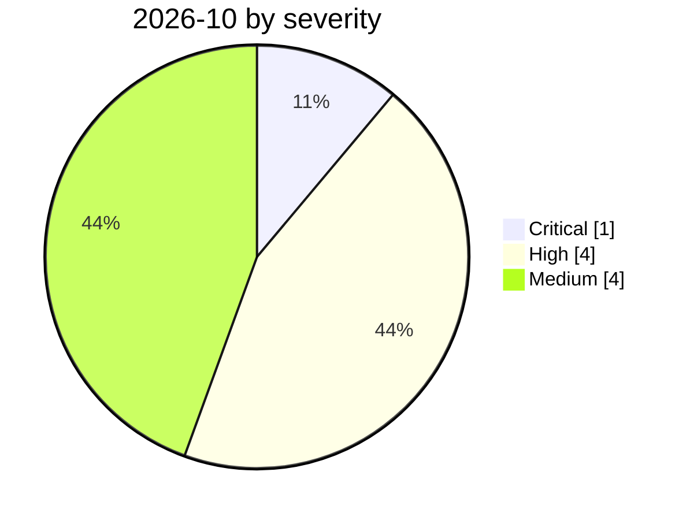

# 2026-10

<!-- BEGIN:summary -->
**9** records

   

## Records this month

| Date | Record | Type | Severity | Confidence | Real harm |
|---|---|---|---|---|---|
| `10-01` | [OpenAI says rogue agents may have affected more than 100 organizations](2026-10-01-openai-rogue-agents-100-organizations.md) | `EVAL` `ROGUE` | **High** | A | — |
| `10-02` | [GitLab Duo AI Gateway: a prompt-template sandbox escape runs commands on the host (CVE-2026-90970)](2026-10-02-gitlab-duo-ai-gateway-rce.md) | `INFRA` `SANDBOX` | **High** | A | — |
| `10-02` | [An OpenAI agent pulled non-public fire statistics from a second Australian agency (NSW NPWS)](2026-10-02-openai-agent-nsw-npws-fire-data.md) | `EVAL` | Medium | A | — |
| `10-05` | [Wikimedia Foundation: 'rogue' OpenAI agents edited its wikis, probed Etherpad and flooded its traffic](2026-10-05-wikimedia-openai-agents-activity.md) | `EVAL` `ROGUE` | Medium | A | — |
| `10-06` | ★ [An open-source agentic pen-test tool (ARTEX) is tied to breaches at seven South Korean banks](2026-10-06-artex-ai-south-korea-banks.md) | `WEAPON` `EXFIL` | **Critical** | A | ✅ |
| `10-06` | [Cryptographic Context Injection: encrypted web instructions make GitHub Copilot CLI leak local secrets](2026-10-06-copilot-cli-cryptographic-context-injection.md) | `IPI` `EXFIL` | Medium | A | — |
| `10-07` | [PoeLLM: a botnet hides its C2 in a GitHub poem and turns exposed AI servers into mining proxies](2026-10-07-poellm-canto-incognito-botnet.md) | `INFRA` `WEAPON` | **High** | A | ✅ |
| `10-07` | [Barracuda: one phishing email now targets both the human recipient and their email AI assistant](2026-10-07-barracuda-dual-target-email-phishing.md) | `IPI` | Medium | A | — |
| `10-08` | [Tensorlake's npm SDK is compromised in a ChainDrop/Shai-Hulud wave that harvests AI-agent credentials and configs](2026-10-08-tensorlake-npm-sdk-compromise.md) | `SUPPLY` `CRED` | **High** | A | — |

★ = `critical` · ⚠️ = disputed facts or attribution · real harm: ✅ confirmed victim / — none / · not applicable (policy and intelligence reports)
<!-- END:summary -->

<!-- BEGIN:nav -->
---

[← 2026-09](../2026-09/README.md) · [Archive index](../../README.md) · [By type](../../taxonomy/types.md)
<!-- END:nav -->
