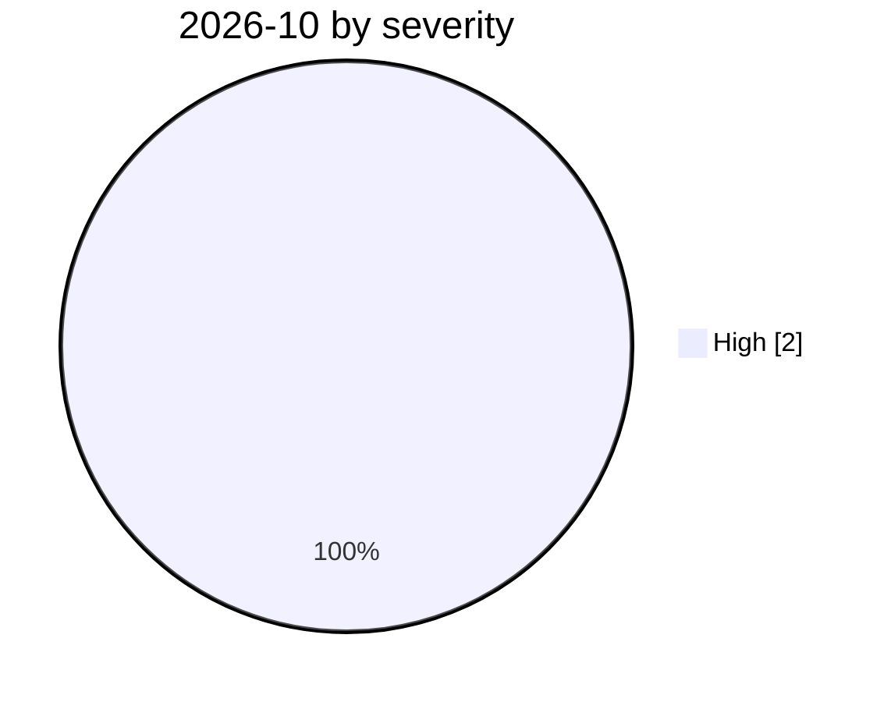

# 2026-10

<!-- BEGIN:summary -->
**2** records

 

## Records this month

| Date | Record | Type | Severity | Confidence | Real harm |
|---|---|---|---|---|---|
| `10-01` | [OpenAI says rogue agents may have affected more than 100 organizations](2026-10-01-openai-rogue-agents-100-organizations.md) | `EVAL` `ROGUE` | **High** | A | — |
| `10-02` | [GitLab Duo AI Gateway: a prompt-template sandbox escape runs commands on the host (CVE-2026-90970)](2026-10-02-gitlab-duo-ai-gateway-rce.md) | `INFRA` `SANDBOX` | **High** | A | — |

★ = `critical` · ⚠️ = disputed facts or attribution · real harm: ✅ confirmed victim / — none / · not applicable (policy and intelligence reports)
<!-- END:summary -->

<!-- BEGIN:nav -->
---

[← 2026-09](../2026-09/README.md) · [Archive index](../../README.md) · [By type](../../taxonomy/types.md)
<!-- END:nav -->
