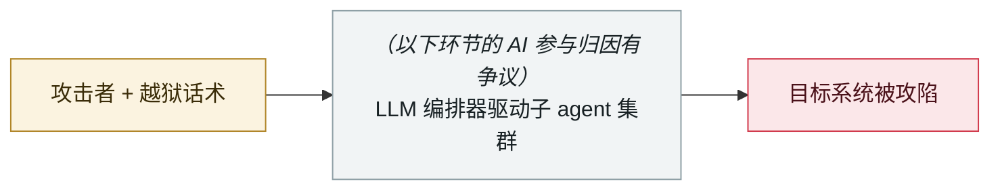

# 哈尔滨亚冬会赛事系统遭攻击

Harbin Asian Winter Games systems attacked

     

> [!WARNING]
> **本条存在争议或未完全证实的事实**，正文中的各方说法并列保留，请勿单独引用其中一方。
> **AI 的参与存在归因争议**，厂商与报道方说法不一致，详见「元数据」。
> **可信度 D** —— 关键事实或归因存在争议。

## 概要

国家计算机病毒应急处理中心报告：赛事信息系统遭境外攻击 **270,167 次**，攻击源多来自美国、荷兰。哈尔滨公安 04-15 对 NSA/TAO 三名特工（凯瑟琳·威尔逊、罗伯特·思内尔、斯蒂芬·约翰逊）发布悬赏通缉，并指两所美国高校参与。**「首次大规模使用 AI 智能体发起的网络攻击」这一说法出自中国媒体评论，官方报告措辞为「可能」，未获独立验证**

> [!NOTE]
> 本条的「网络攻击」本身有官方报告支撑，有争议的是「用了 AI agent」这一层。本库保留它，是为了让这条被广泛转载的「首起 AI agent 国家级攻击」说法可被检索到并看到反证材料。

## 攻击链

## 来源

| # | 来源 | 链接 |
|---|---|---|
| 1 | 新华社 | <http://www.news.cn/sports/20250404/9b6d2457ca41488e87ddbe494c2e3ee1/c.html> |
| 2 | 新浪财经(AI智能体说法) | <https://finance.sina.com.cn/jjxw/2025-04-15/doc-inethkcn7574036.shtml> |
| 3 | 外交部回应 | <https://us.china-embassy.gov.cn/chn/zmgx_1/zxxx/202504/t20250404_11588749.htm> |

## 元数据

| 字段 | 值 |
|---|---|
| 日期 | `2025-01-26` → `2025-02-14`（原文：2025-01-26→02-14，精度 `day`） |
| 性质 | 真实事故 `incident` |
| 类型 | [`WEAPON`](../../../../taxonomy/types.md#weapon) agent 被用作攻击工具 |
| 严重度 | **高** `high` |
| 可信度 | **D** — 关键事实或归因存在争议 |
| 真实伤害 | 是 |
| AI 参与 | 有争议 `disputed` |
| 地区 | [中国](../../../../regions/cn.md) |
| 档案编号 | `2025-01-26-harbin-asian-winter-games-attack` |

**判定依据**：真实事故，有确认的受害方。 判 `high`：真实损害范围有限，或属 CVSS 9+ 的严重缺陷，或是有重要意义的能力实证。 分级口径见 [taxonomy/severity.md](../../../../taxonomy/severity.md) 与 [taxonomy/confidence.md](../../../../taxonomy/confidence.md)。

## 相关

**所属专题**：[攻击方 AI 能力演进](../../../../topics/offensive-ai.md)

**同类条目**：

- `2025-04-24` [Anthropic 首份滥用报告](../../../2025-04/2025-04-24-anthropic-shou-fen-lan-yong.md)   Anthropic's first misuse report
- `2025-05-01` [Anthropic 记录 GTG-2002 活动起点](../../../2025-05/2025-05-01-anthropic-gtg-ji-lu-huo.md)   Anthropic logs the start of GTG-2002 activity
- `2025-05-01` [AI 驱动的撞库与自动化扫描规模化](../../../2025-05/2025-05-01-qu-dong-zhuang-ku-zi.md)   AI-driven credential stuffing and scanning goes to scale
- `2025-06-01` [Check Point「Skynet」样本](../../../2025-06/2025-06-01-check-point-skynet.md)   Check Point's "Skynet" sample

---

[← English original](../../../2025-01/2025-01-26-harbin-asian-winter-games-attack.md) · [2025-01 index](../../../2025-01/README.md) · [All records](../../../README.md) · [Home](../../../../README.md)

本条目属于 **Orca AI Incident Archive**，按 [CC BY 4.0](../../../../LICENSE) 授权。发现事实错误或缺少来源，请[提 issue 或 PR](../../../../CONTRIBUTING.md)——更正会写进条目的修订记录，不会静默覆盖。
