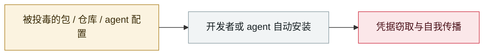

# Hugging Face "nullifAI" 恶意模型

Hugging Face "nullifAI" malicious models

     

## 概要

ReversingLabs 发现 2 个恶意 pickle 模型。手法：PyTorch 格式但用 **7z 而非默认 ZIP 压缩**，使 `torch.load()` 无法加载，从而**绕过 Hugging Face 的 Picklescan 检测**；内含连向硬编码 IP 的反弹 shell

## 攻击链

## 来源

| # | 来源 | 链接 |
|---|---|---|
| 1 | ReversingLabs | <https://www.reversinglabs.com/press-releases/reversinglabs-identifies-novel-ml-malware-hosted-on-leading-hugging-face-ai-model-platform> |
| 2 | THN | <https://thehackernews.com/2025/02/malicious-ml-models-found-on-hugging.html> |

## 元数据

| 字段 | 值 |
|---|---|
| 日期 | `2025-02-06`（原文：2025-02-06，精度 `day`） |
| 性质 | 真实事故 `incident` |
| 类型 | [`SUPPLY`](../../../../taxonomy/types.md#supply) 供应链投毒 |
| 严重度 | **高** `high` |
| 可信度 | **A** — 一手来源（厂商 / 受害方 / 执法 / 官方报告） |
| 真实伤害 | 否 |
| AI 参与 | 已确认 `confirmed` |
| 地区 | [全球](../../../../regions/global.md) |
| 档案编号 | `2025-02-06-hugging-face-nullifai` |

**判定依据**：真实事故，未见确认的具体受害方。 判 `high`：真实损害范围有限，或属 CVSS 9+ 的严重缺陷，或是有重要意义的能力实证。 分级口径见 [taxonomy/severity.md](../../../../taxonomy/severity.md) 与 [taxonomy/confidence.md](../../../../taxonomy/confidence.md)。

## 相关

**所属专题**：[agent 供应链投毒](../../../../topics/agent-supply-chain.md)

**同类条目**：

- `2025-03-18` [Cursor / Copilot「Rules File Backdoor」](../../../2025-03/2025-03-18-cursor-copilot-rules-file.md)   Cursor / Copilot "Rules File Backdoor"
- `2025-04-01` ["Slopsquatting" 概念成型](../../../2025-04/2025-04-01-slopsquatting-gai-nian-cheng-xing.md)   "Slopsquatting" gets its name
- `2025-07-13` [Amazon Q Developer 扩展被投毒](../../../2025-07/2025-07-13-amazon-q-extension-poisoned.md)   Amazon Q Developer extension poisoned
- `2025-08-08` [Salesloft Drift OAuth 令牌窃取](../../../2025-08/2025-08-08-salesloft-drift-oauth-theft.md)   Salesloft Drift OAuth token theft

---

[← English original](../../../2025-02/2025-02-06-hugging-face-nullifai.md) · [2025-02 index](../../../2025-02/README.md) · [All records](../../../README.md) · [Home](../../../../README.md)

本条目属于 **Orca AI Incident Archive**，按 [CC BY 4.0](../../../../LICENSE) 授权。发现事实错误或缺少来源，请[提 issue 或 PR](../../../../CONTRIBUTING.md)——更正会写进条目的修订记录，不会静默覆盖。
