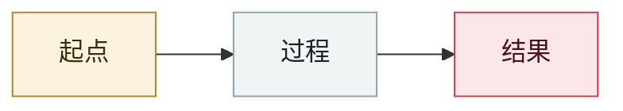

# 港/新银行深伪语音绕过声纹

Deepfake voice defeats bank voiceprint auth in HK and Singapore

     

## 概要

约 US$2,500 万未授权交易

## 攻击链

## 来源

| # | 来源 | 链接 |
|---|---|---|
| 1 | OWASP Q2'25 | <https://genai.owasp.org/2025/07/14/owasp-gen-ai-incident-exploit-round-up-q225/> |

## 元数据

| 字段 | 值 |
|---|---|
| 日期 | `2025-03-01`（原文：2025-03，精度 `month`） |
| 性质 | 真实事故 `incident` |
| 类型 | [`OTHER`](../../../../taxonomy/types.md#other) 其他 |
| 严重度 | **高** `high` |
| 可信度 | **A** — 一手来源（厂商 / 受害方 / 执法 / 官方报告） |
| 真实伤害 | 是 |
| AI 参与 | 已确认 `confirmed` |
| 地区 | [东南亚](../../../../regions/sea.md) · [香港](../../../../regions/hk.md) |
| 档案编号 | `2025-03-01-hk-sg-bank-deepfake-voiceprint` |

**判定依据**：真实事故，有确认的受害方。 判 `high`：真实损害范围有限，或属 CVSS 9+ 的严重缺陷，或是有重要意义的能力实证。 分级口径见 [taxonomy/severity.md](../../../../taxonomy/severity.md) 与 [taxonomy/confidence.md](../../../../taxonomy/confidence.md)。

---

[← English original](../../../2025-03/2025-03-01-hk-sg-bank-deepfake-voiceprint.md) · [2025-03 index](../../../2025-03/README.md) · [All records](../../../README.md) · [Home](../../../../README.md)

本条目属于 **Orca AI Incident Archive**，按 [CC BY 4.0](../../../../LICENSE) 授权。发现事实错误或缺少来源，请[提 issue 或 PR](../../../../CONTRIBUTING.md)——更正会写进条目的修订记录，不会静默覆盖。
