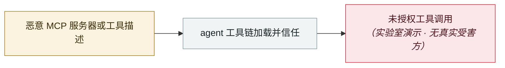

# GPT-4.1 经 MCP 工具投毒被越狱

GPT-4.1 jailbroken through a poisoned MCP tool

     

## 概要

研究者用被投毒的 MCP 工具描述越狱 GPT-4.1，使其在用户无感知的情况下访问并外带未授权数据。

## 攻击链

## 来源

| # | 来源 | 链接 |
|---|---|---|
| 1 | OWASP Q2'25 | <https://genai.owasp.org/2025/07/14/owasp-gen-ai-incident-exploit-round-up-q225/> |

## 元数据

| 字段 | 值 |
|---|---|
| 日期 | `2025-04-01`（原文：2025-04，精度 `month`） |
| 性质 | 研究演示 `research` |
| 类型 | [`MCP`](../../../../taxonomy/types.md#mcp) MCP / 工具链 |
| 严重度 | **中** `medium` |
| 可信度 | **A** — 一手来源（厂商 / 受害方 / 执法 / 官方报告） |
| 真实伤害 | 否 |
| AI 参与 | 已确认 `confirmed` |
| 地区 | [全球](../../../../regions/global.md) |
| 档案编号 | `2025-04-01-gpt-mcp-jing-gong-ju` |

**判定依据**：研究机构或厂商的受控演示，`real_harm: false`；收录是为了标记攻击面何时被公开。 判 `medium`：受控演示、中等缺陷，或单用户 / 单机范围的事故。 分级口径见 [taxonomy/severity.md](../../../../taxonomy/severity.md) 与 [taxonomy/confidence.md](../../../../taxonomy/confidence.md)。

## 相关

**所属专题**：[agent 供应链投毒](../../../../topics/agent-supply-chain.md)

**同类条目**：

- `2025-04-01` [MCP 工具投毒攻击（TPA）首次系统披露](../../../2025-04/2025-04-01-mcp-tpa-gong-ju-tou.md)   First systematic disclosure of MCP tool-poisoning attacks
- `2025-05-26` [GitHub MCP "Toxic Agent Flow"](../../../2025-05/2025-05-26-github-mcp-toxic-agent.md)   GitHub MCP "toxic agent flow"
- `2025-06-13` [MCP Inspector 未认证 RCE](../../../2025-06/2025-06-13-mcp-inspector-rce.md)   MCP Inspector unauthenticated RCE
- `2025-06-04` [Asana MCP server 跨租户数据暴露](../../../2025-06/2025-06-04-asana-mcp-server.md)   Asana MCP server cross-tenant data exposure

---

[← English original](../../../2025-04/2025-04-01-gpt-mcp-jing-gong-ju.md) · [2025-04 index](../../../2025-04/README.md) · [All records](../../../README.md) · [Home](../../../../README.md)

本条目属于 **Orca AI Incident Archive**，按 [CC BY 4.0](../../../../LICENSE) 授权。发现事实错误或缺少来源，请[提 issue 或 PR](../../../../CONTRIBUTING.md)——更正会写进条目的修订记录，不会静默覆盖。
