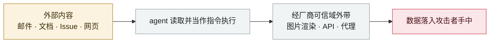

# GitLab Duo 远程提示注入

GitLab Duo remote prompt injection

      

## 概要

Legit Security：merge request 中的隐藏指令可窃取私有项目源码、操纵他人看到的代码建议、外带**未披露的零日**。2025-02-12 报告；GitLab 确认 HTML 注入并承认提示注入为安全问题，补丁禁止 Duo 渲染指向 gitlab.com 以外域的 ``/`<form>`

## 攻击链

## 来源

| # | 来源 | 链接 |
|---|---|---|
| 1 | Legit Security | <https://www.legitsecurity.com/blog/remote-prompt-injection-in-gitlab-duo> |
| 2 | THN | <https://thehackernews.com/2025/05/gitlab-duo-vulnerability-enabled.html> |

## 元数据

| 字段 | 值 |
|---|---|
| 日期 | `2025-05-01`（原文：2025-05，精度 `month`） |
| 性质 | 真实事故 `incident` |
| 类型 | [`IPI`](../../../../taxonomy/types.md#ipi) 间接提示注入 · [`EXFIL`](../../../../taxonomy/types.md#exfil) 数据外泄 |
| 严重度 | **高** `high` |
| 可信度 | **A** — 一手来源（厂商 / 受害方 / 执法 / 官方报告） |
| 真实伤害 | 否 |
| AI 参与 | 已确认 `confirmed` |
| 地区 | [全球](../../../../regions/global.md) |
| 档案编号 | `2025-05-01-gitlab-duo-yuan-cheng-ti` |

**判定依据**：真实事故，未见确认的具体受害方。 判 `high`：真实损害范围有限，或属 CVSS 9+ 的严重缺陷，或是有重要意义的能力实证。 分级口径见 [taxonomy/severity.md](../../../../taxonomy/severity.md) 与 [taxonomy/confidence.md](../../../../taxonomy/confidence.md)。

## 相关

**所属专题**：[零点击数据外泄链](../../../../topics/zero-click-exfil.md)

**同类条目**：

- `2025-05-26` [GitHub MCP "Toxic Agent Flow"](../../../2025-05/2025-05-26-github-mcp-toxic-agent.md)   GitHub MCP "toxic agent flow"
- `2025-06-11` [EchoLeak（CVE-2025-32711）](../../../2025-06/2025-06-11-echoleak.md)   EchoLeak (CVE-2025-32711)
- `2025-08-06` [AgentFlayer 零点击攻击集（Black Hat USA）](../../../2025-08/2025-08-06-agentflayer-black-hat-usa.md)   AgentFlayer zero-click attack set (Black Hat USA)
- `2025-08-06` [SafeBreach "Invitation Is All You Need"](../../../2025-08/2025-08-06-safebreach-invitation-is-all.md)   SafeBreach "Invitation Is All You Need"

---

[← English original](../../../2025-05/2025-05-01-gitlab-duo-yuan-cheng-ti.md) · [2025-05 index](../../../2025-05/README.md) · [All records](../../../README.md) · [Home](../../../../README.md)

本条目属于 **Orca AI Incident Archive**，按 [CC BY 4.0](../../../../LICENSE) 授权。发现事实错误或缺少来源，请[提 issue 或 PR](../../../../CONTRIBUTING.md)——更正会写进条目的修订记录，不会静默覆盖。
