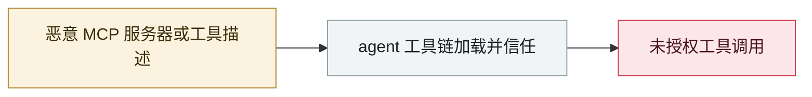

# Asana MCP server 跨租户数据暴露

Asana MCP server cross-tenant data exposure

     

> [!WARNING]
> **本条存在争议或未完全证实的事实**，正文中的各方说法并列保留，请勿单独引用其中一方。

## 概要

功能 2025-05-01 上线，**06-04 发现**访问控制缺陷，约 **1,000 家客户**的任务、项目元数据、评论、文件可被其他租户看到（受各自权限约束），**06-17 恢复访问**

## 攻击链

## 来源

| # | 来源 | 链接 |
|---|---|---|
| 1 | Practical DevSecOps 汇总 | <https://www.practical-devsecops.com/mcp-security-statistics-2026-report/> |

## 元数据

| 字段 | 值 |
|---|---|
| 日期 | `2025-06-04`（原文：2025-06-04，精度 `day`） |
| 性质 | 漏洞披露 `vulnerability` |
| 类型 | [`MCP`](../../../../taxonomy/types.md#mcp) MCP / 工具链 |
| 严重度 | **中** `medium` |
| 可信度 | **B** — 研究机构或主流媒体，有可核查细节 |
| 真实伤害 | 是 |
| AI 参与 | 已确认 `confirmed` |
| 地区 | [全球](../../../../regions/global.md) |
| 档案编号 | `2025-06-04-asana-mcp-server` |

**判定依据**：漏洞披露，已确认在野利用，故 `real_harm: true`。 判 `medium`：受控演示、中等缺陷，或单用户 / 单机范围的事故。 分级口径见 [taxonomy/severity.md](../../../../taxonomy/severity.md) 与 [taxonomy/confidence.md](../../../../taxonomy/confidence.md)。

## 相关

**所属专题**：[agent 供应链投毒](../../../../topics/agent-supply-chain.md)

**同类条目**：

- `2025-06-13` [MCP Inspector 未认证 RCE](../../../2025-06/2025-06-13-mcp-inspector-rce.md)   MCP Inspector unauthenticated RCE
- `2025-06-13` [Smithery.ai 路径穿越](../../../2025-06/2025-06-13-smithery-ai-lu-jing-chuan-yue.md)   Smithery.ai path traversal
- `2025-07-06` [Supabase MCP 提示注入泄库](../../../2025-07/2025-07-06-supabase-mcp-ti-shi-zhu.md)   Supabase MCP prompt injection dumps a private table
- `2025-05-26` [GitHub MCP "Toxic Agent Flow"](../../../2025-05/2025-05-26-github-mcp-toxic-agent.md)   GitHub MCP "toxic agent flow"

---

[← English original](../../../2025-06/2025-06-04-asana-mcp-server.md) · [2025-06 index](../../../2025-06/README.md) · [All records](../../../README.md) · [Home](../../../../README.md)

本条目属于 **Orca AI Incident Archive**，按 [CC BY 4.0](../../../../LICENSE) 授权。发现事实错误或缺少来源，请[提 issue 或 PR](../../../../CONTRIBUTING.md)——更正会写进条目的修订记录，不会静默覆盖。
