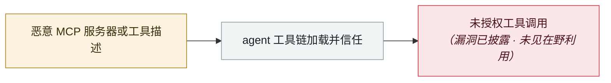

# mcp-remote OAuth 命令注入

mcp-remote OAuth command injection

     

## 概要

CVE-2025-6514，恶意 MCP server 可在客户端执行任意命令

## 攻击链

## 来源

| # | 来源 | 链接 |
|---|---|---|
| 1 | IPA 2025-12 号 | <https://www.ipa.go.jp/digital/ai/security/ai-security-bulletin.html> |

## 元数据

| 字段 | 值 |
|---|---|
| 日期 | `2025-07-01`（原文：2025-07，精度 `month`） |
| 性质 | 漏洞披露 `vulnerability` |
| 类型 | [`MCP`](../../../../taxonomy/types.md#mcp) MCP / 工具链 |
| 严重度 | **中** `medium` |
| 可信度 | **A** — 一手来源（厂商 / 受害方 / 执法 / 官方报告） |
| 真实伤害 | 否 |
| AI 参与 | 已确认 `confirmed` |
| 地区 | [全球](../../../../regions/global.md) |
| 档案编号 | `2025-07-01-mcp-remote-oauth` |

**判定依据**：漏洞披露，截至归档未见在野利用证据，故 `real_harm: false`。 判 `medium`：受控演示、中等缺陷，或单用户 / 单机范围的事故。 分级口径见 [taxonomy/severity.md](../../../../taxonomy/severity.md) 与 [taxonomy/confidence.md](../../../../taxonomy/confidence.md)。

## 相关

**所属专题**：[agent 供应链投毒](../../../../topics/agent-supply-chain.md)

**同类条目**：

- `2025-07-06` [Supabase MCP 提示注入泄库](../../../2025-07/2025-07-06-supabase-mcp-ti-shi-zhu.md)   Supabase MCP prompt injection dumps a private table
- `2025-07-01` [Anthropic Filesystem MCP 沙箱逃逸](../../../2025-07/2025-07-01-anthropic-filesystem-mcp.md)   Anthropic Filesystem MCP sandbox escape
- `2025-06-13` [MCP Inspector 未认证 RCE](../../../2025-06/2025-06-13-mcp-inspector-rce.md)   MCP Inspector unauthenticated RCE
- `2025-08-05` [Cursor MCPoison（CVE-2025-54136）](../../../2025-08/2025-08-05-cursor-mcpoison.md)   Cursor MCPoison (CVE-2025-54136)

---

[← English original](../../../2025-07/2025-07-01-mcp-remote-oauth.md) · [2025-07 index](../../../2025-07/README.md) · [All records](../../../README.md) · [Home](../../../../README.md)

本条目属于 **Orca AI Incident Archive**，按 [CC BY 4.0](../../../../LICENSE) 授权。发现事实错误或缺少来源，请[提 issue 或 PR](../../../../CONTRIBUTING.md)——更正会写进条目的修订记录，不会静默覆盖。
