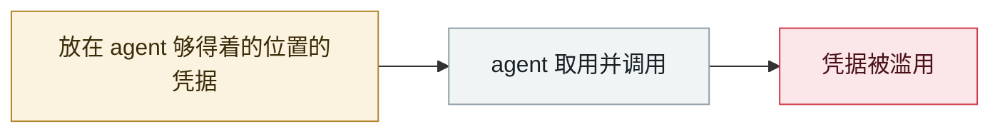

# McHire 漏洞公开

McHire flaw goes public

     

## 概要

见 2025-06-30

## 攻击链

## 来源

| # | 来源 | 链接 |
|---|---|---|
| 1 | AIID #1179 | <https://incidentdatabase.ai/cite/1179/> |

## 元数据

| 字段 | 值 |
|---|---|
| 日期 | `2025-07-09`（原文：2025-07-09，精度 `day`） |
| 性质 | 真实事故 `incident` |
| 类型 | [`CRED`](../../../../taxonomy/types.md#cred) 凭据滥用 |
| 严重度 | **低** `low` |
| 可信度 | **A** — 一手来源（厂商 / 受害方 / 执法 / 官方报告） |
| 真实伤害 | 否 |
| AI 参与 | 已确认 `confirmed` |
| 地区 | [美国](../../../../regions/us.md) |
| 档案编号 | `2025-07-09-mchire-lou-dong-gong-kai` |

**判定依据**：真实事故，未见确认的具体受害方。 判 `low`：背景性条目，保留用于时间线连续性。 分级口径见 [taxonomy/severity.md](../../../../taxonomy/severity.md) 与 [taxonomy/confidence.md](../../../../taxonomy/confidence.md)。

## 相关

**同类条目**：

- `2025-07-01` [RoguePilot](../../../2025-07/2025-07-01-roguepilot.md)   RoguePilot
- `2025-08-08` [Salesloft Drift OAuth 令牌窃取](../../../2025-08/2025-08-08-salesloft-drift-oauth-theft.md)   Salesloft Drift OAuth token theft
- `2025-08-26` [Nx "s1ngularity"](../../../2025-08/2025-08-26-nx-s1ngularity.md)   Nx "s1ngularity"
- `2025-06-30` [McDonald's McHire「Olivia」招聘机器人](../../../2025-06/2025-06-30-mcdonald-mchire-olivia.md)   McDonald's McHire "Olivia" hiring bot

---

[← English original](../../../2025-07/2025-07-09-mchire-lou-dong-gong-kai.md) · [2025-07 index](../../../2025-07/README.md) · [All records](../../../README.md) · [Home](../../../../README.md)

本条目属于 **Orca AI Incident Archive**，按 [CC BY 4.0](../../../../LICENSE) 授权。发现事实错误或缺少来源，请[提 issue 或 PR](../../../../CONTRIBUTING.md)——更正会写进条目的修订记录，不会静默覆盖。
