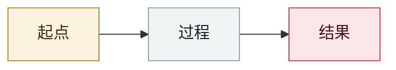

# Grok 37 万条分享对话被索引

370,000 shared Grok conversations indexed

     

## 概要

Grok 的「分享对话」链接未加 noindex，约 37 万条用户对话被搜索引擎收录——与 ChatGPT 同期的同类问题同源。

## 攻击链

## 来源

| # | 来源 | 链接 |
|---|---|---|
| 1 | 安全内参 2025 盘点 | <https://www.secrss.com/articles/86614> |

## 元数据

| 字段 | 值 |
|---|---|
| 日期 | `2025-08-01`（原文：2025-08，精度 `month`） |
| 性质 | 真实事故 `incident` |
| 类型 | [`OTHER`](../../../../taxonomy/types.md#other) 其他 |
| 严重度 | **低** `low` |
| 可信度 | **B** — 研究机构或主流媒体，有可核查细节 |
| 真实伤害 | 是 |
| AI 参与 | 已确认 `confirmed` |
| 地区 | [全球](../../../../regions/global.md) |
| 档案编号 | `2025-08-01-grok-wan-tiao-fen-xiang` |

**判定依据**：真实事故，有确认的受害方。 判 `low`：背景性条目，保留用于时间线连续性。 分级口径见 [taxonomy/severity.md](../../../../taxonomy/severity.md) 与 [taxonomy/confidence.md](../../../../taxonomy/confidence.md)。

---

[← English original](../../../2025-08/2025-08-01-grok-wan-tiao-fen-xiang.md) · [2025-08 index](../../../2025-08/README.md) · [All records](../../../README.md) · [Home](../../../../README.md)

本条目属于 **Orca AI Incident Archive**，按 [CC BY 4.0](../../../../LICENSE) 授权。发现事实错误或缺少来源，请[提 issue 或 PR](../../../../CONTRIBUTING.md)——更正会写进条目的修订记录，不会静默覆盖。
