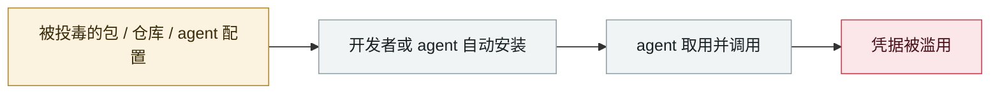

# Salesloft Drift OAuth 令牌窃取

Salesloft Drift OAuth token theft

      

## 概要

UNC6395 盗取 Drift AI 聊天代理的 OAuth token，冒充可信应用，10 天内系统性导出 **700+ 组织**的 Salesforce / Google Workspace / Slack 数据。受害者含 Cloudflare、Google、PagerDuty、Palo Alto Networks、Proofpoint、SpyCloud、Tanium、Zscaler。**无 exploit、无钓鱼 —— AI 集成的信任链本身被打穿**。GTIG 08-26 发报告

## 攻击链

## 详情

这起事件在很多通用安全报告里被归为「OAuth 泄露」，但本质是 **AI 聊天代理为了工作需要，被授予了跨 SaaS 的高权限长期令牌**。一旦这个 AI 供应商被拿下，它连着的 700 多家企业一起沦陷。
这是 agent 时代最典型的结构性风险：**agent 的价值来自权限广度，而权限广度就是爆炸半径。**

## 来源

| # | 来源 | 链接 |
|---|---|---|
| 1 | Google Cloud/Mandiant | <https://cloud.google.com/blog/topics/threat-intelligence/data-theft-salesforce-instances-via-salesloft-drift> |
| 2 | THN | <https://thehackernews.com/2025/08/salesloft-oauth-breach-via-drift-ai.html> |
| 3 | FINRA | <https://www.finra.org/rules-guidance/guidance/salesloft-drift-AI-supply-chain-attack> |

## 元数据

| 字段 | 值 |
|---|---|
| 日期 | `2025-08-08` → `2025-08-18`（原文：2025-08-08→18，精度 `day`） |
| 性质 | 真实事故 `incident` |
| 类型 | [`SUPPLY`](../../../../taxonomy/types.md#supply) 供应链投毒 · [`CRED`](../../../../taxonomy/types.md#cred) 凭据滥用 |
| 严重度 | **严重** `critical` |
| 可信度 | **A** — 一手来源（厂商 / 受害方 / 执法 / 官方报告） |
| 真实伤害 | 是 |
| AI 参与 | 已确认 `confirmed` |
| 地区 | [全球](../../../../regions/global.md) |
| 档案编号 | `2025-08-08-salesloft-drift-oauth-theft` |

**判定依据**：真实事故，有确认的受害方。 判 `critical`：确认的真实损害达到多组织 / 政府 / 关键基础设施 / 供应链蠕虫级别，或属首次出现且有真实受害方的能力里程碑。 分级口径见 [taxonomy/severity.md](../../../../taxonomy/severity.md) 与 [taxonomy/confidence.md](../../../../taxonomy/confidence.md)。

## 相关

**所属专题**：[agent 供应链投毒](../../../../topics/agent-supply-chain.md)

**同类条目**：

- `2025-08-26` [Nx "s1ngularity"](../../../2025-08/2025-08-26-nx-s1ngularity.md)   Nx "s1ngularity"
- `2025-08-28` [TransUnion 经第三方应用泄露 440–450 万人数据](../../../2025-08/2025-08-28-transunion-jing-di-san-fang.md)   TransUnion leaks 4.4-4.5M people via a third-party app
- `2025-07-13` [Amazon Q Developer 扩展被投毒](../../../2025-07/2025-07-13-amazon-q-extension-poisoned.md)   Amazon Q Developer extension poisoned
- `2025-09-15` [Shai-Hulud npm 蠕虫 v1](../../../2025-09/2025-09-15-shai-hulud-npm.md)   Shai-Hulud npm worm v1

---

[← English original](../../../2025-08/2025-08-08-salesloft-drift-oauth-theft.md) · [2025-08 index](../../../2025-08/README.md) · [All records](../../../README.md) · [Home](../../../../README.md)

本条目属于 **Orca AI Incident Archive**，按 [CC BY 4.0](../../../../LICENSE) 授权。发现事实错误或缺少来源，请[提 issue 或 PR](../../../../CONTRIBUTING.md)——更正会写进条目的修订记录，不会静默覆盖。
