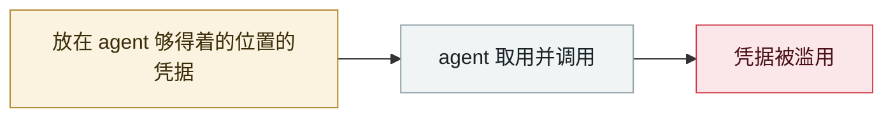

# TransUnion 经第三方应用泄露 440–450 万人数据

TransUnion leaks 4.4-4.5M people via a third-party app

     

> [!WARNING]
> **本条存在争议或未完全证实的事实**，正文中的各方说法并列保留，请勿单独引用其中一方。

## 概要

数据从其 **Salesforce 账户**被窃，含姓名、账单地址、电话、邮箱、生日与**未脱敏社保号**。

⚠️ **v1 误记为「Drift 事件后续」**：入侵实际发生在 **2025-07-28**（两天后发现），**早于 Drift/UNC6395 战役（08-08→18）**，属另一条 Salesforce 社工链。**与 AI agent 无直接关系，列此仅供区分，建议不入库**

## 攻击链

## 来源

| # | 来源 | 链接 |
|---|---|---|
| 1 | BleepingComputer | <https://www.bleepingcomputer.com/news/security/transunion-suffers-data-breach-impacting-over-44-million-people/> |
| 2 | The Register | <https://www.theregister.com/2025/08/28/transunion_support_app_breach/> |

## 元数据

| 字段 | 值 |
|---|---|
| 日期 | `2025-08-28`（原文：2025-08-28，精度 `day`） |
| 性质 | 真实事故 `incident` |
| 类型 | [`CRED`](../../../../taxonomy/types.md#cred) 凭据滥用 |
| 严重度 | **高** `high` |
| 可信度 | **B** — 研究机构或主流媒体，有可核查细节 |
| 真实伤害 | 是 |
| AI 参与 | 不适用 `not-applicable` |
| 地区 | [美国](../../../../regions/us.md) |
| 档案编号 | `2025-08-28-transunion-jing-di-san-fang` |

**判定依据**：真实事故，有确认的受害方。 判 `high`：真实损害范围有限，或属 CVSS 9+ 的严重缺陷，或是有重要意义的能力实证。 分级口径见 [taxonomy/severity.md](../../../../taxonomy/severity.md) 与 [taxonomy/confidence.md](../../../../taxonomy/confidence.md)。

## 相关

**同类条目**：

- `2025-08-08` [Salesloft Drift OAuth 令牌窃取](../../../2025-08/2025-08-08-salesloft-drift-oauth-theft.md)   Salesloft Drift OAuth token theft
- `2025-08-26` [Nx "s1ngularity"](../../../2025-08/2025-08-26-nx-s1ngularity.md)   Nx "s1ngularity"
- `2025-09-15` [Shai-Hulud npm 蠕虫 v1](../../../2025-09/2025-09-15-shai-hulud-npm.md)   Shai-Hulud npm worm v1
- `2025-07-01` [RoguePilot](../../../2025-07/2025-07-01-roguepilot.md)   RoguePilot

---

[← English original](../../../2025-08/2025-08-28-transunion-jing-di-san-fang.md) · [2025-08 index](../../../2025-08/README.md) · [All records](../../../README.md) · [Home](../../../../README.md)

本条目属于 **Orca AI Incident Archive**，按 [CC BY 4.0](../../../../LICENSE) 授权。发现事实错误或缺少来源，请[提 issue 或 PR](../../../../CONTRIBUTING.md)——更正会写进条目的修订记录，不会静默覆盖。
