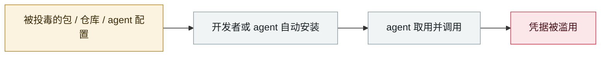

# Shai-Hulud npm 蠕虫 v1

Shai-Hulud npm worm v1

      

## 概要

**npm 生态首个成功自我传播的攻击**。postinstall 脚本收割密钥并外带到攻击者建的公开 GitHub 仓库（名为 Shai-Hulud）。CISA 09-23 发警报，**500+ 包**受影响。窃取目标明确包含 GitHub PAT、AWS/GCP/Azure 密钥、`ANTHROPIC_API_KEY`、Claude Code 配置与 `.mcp.json`。Wiz 评估与 s1ngularity 同源

## 攻击链

## 来源

| # | 来源 | 链接 |
|---|---|---|
| 1 | Wiz | <https://www.wiz.io/blog/shai-hulud-npm-supply-chain-attack> |
| 2 | CISA | <https://www.cisa.gov/news-events/alerts/2025/09/23/widespread-supply-chain-compromise-impacting-npm-ecosystem> |

## 元数据

| 字段 | 值 |
|---|---|
| 日期 | `2025-09-15`（原文：2025-09-15，精度 `day`） |
| 性质 | 真实事故 `incident` |
| 类型 | [`SUPPLY`](../../../../taxonomy/types.md#supply) 供应链投毒 · [`CRED`](../../../../taxonomy/types.md#cred) 凭据滥用 |
| 严重度 | **严重** `critical` |
| 可信度 | **A** — 一手来源（厂商 / 受害方 / 执法 / 官方报告） |
| 真实伤害 | 是 |
| AI 参与 | 已确认 `confirmed` |
| 地区 | [全球](../../../../regions/global.md) |
| 档案编号 | `2025-09-15-shai-hulud-npm` |

**判定依据**：真实事故，有确认的受害方。 判 `critical`：确认的真实损害达到多组织 / 政府 / 关键基础设施 / 供应链蠕虫级别，或属首次出现且有真实受害方的能力里程碑。 分级口径见 [taxonomy/severity.md](../../../../taxonomy/severity.md) 与 [taxonomy/confidence.md](../../../../taxonomy/confidence.md)。

## 相关

**所属专题**：[agent 供应链投毒](../../../../topics/agent-supply-chain.md)

**同类条目**：

- `2025-09-25` [postmark-mcp 恶意 npm 包](../../../2025-09/2025-09-25-postmark-mcp-npm.md)   postmark-mcp malicious npm package
- `2025-08-08` [Salesloft Drift OAuth 令牌窃取](../../../2025-08/2025-08-08-salesloft-drift-oauth-theft.md)   Salesloft Drift OAuth token theft
- `2025-08-26` [Nx "s1ngularity"](../../../2025-08/2025-08-26-nx-s1ngularity.md)   Nx "s1ngularity"
- `2025-08-28` [TransUnion 经第三方应用泄露 440–450 万人数据](../../../2025-08/2025-08-28-transunion-jing-di-san-fang.md)   TransUnion leaks 4.4-4.5M people via a third-party app

---

[← English original](../../../2025-09/2025-09-15-shai-hulud-npm.md) · [2025-09 index](../../../2025-09/README.md) · [All records](../../../README.md) · [Home](../../../../README.md)

本条目属于 **Orca AI Incident Archive**，按 [CC BY 4.0](../../../../LICENSE) 授权。发现事实错误或缺少来源，请[提 issue 或 PR](../../../../CONTRIBUTING.md)——更正会写进条目的修订记录，不会静默覆盖。
