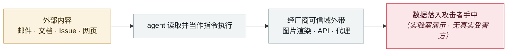

# ShadowLeak

ShadowLeak

      

## 概要

Radware（Zvika Babo / Gabi Nakibly / Maor Uziel）：零点击、**服务端外带**。邮件里藏 HTML 指令，用户只要说「总结今天的邮件」，Deep Research agent 就在 **OpenAI 自己的云上**把数据发到攻击者 URL —— 本地与企业侧防御完全看不见。06-18 经 BugCrowd 报告，8 月初修复，**09-03 标记为已解决**

## 攻击链

## 来源

| # | 来源 | 链接 |
|---|---|---|
| 1 | Radware PDF | <https://www.radware.com/getattachment/7bf74537-e90e-414e-a82b-d7b4935bae08/Threat-Advisory-ShadowLeak-Sept-2025.pdf.aspx> |
| 2 | THN | <https://thehackernews.com/2025/09/shadowleak-zero-click-flaw-leaks-gmail.html> |

## 元数据

| 字段 | 值 |
|---|---|
| 日期 | `2025-09-18`（原文：2025-09-18，精度 `day`） |
| 性质 | 研究演示 `research` |
| 类型 | [`IPI`](../../../../taxonomy/types.md#ipi) 间接提示注入 · [`EXFIL`](../../../../taxonomy/types.md#exfil) 数据外泄 |
| 严重度 | **高** `high` |
| 可信度 | **A** — 一手来源（厂商 / 受害方 / 执法 / 官方报告） |
| 真实伤害 | 否 |
| AI 参与 | 已确认 `confirmed` |
| 地区 | [全球](../../../../regions/global.md) |
| 档案编号 | `2025-09-18-shadowleak` |

**判定依据**：研究机构或厂商的受控演示，`real_harm: false`；收录是为了标记攻击面何时被公开。 判 `high`：真实损害范围有限，或属 CVSS 9+ 的严重缺陷，或是有重要意义的能力实证。 分级口径见 [taxonomy/severity.md](../../../../taxonomy/severity.md) 与 [taxonomy/confidence.md](../../../../taxonomy/confidence.md)。

## 相关

**所属专题**：[零点击数据外泄链](../../../../topics/zero-click-exfil.md)

**同类条目**：

- `2025-09-19` [Notion 3.0 agent「致命三元组」](../../../2025-09/2025-09-19-notion-agent-zhi-ming-san.md)   Notion 3.0 agent hits the lethal trifecta
- `2025-09-25` [ForcedLeak（Salesforce Agentforce）](../../../2025-09/2025-09-25-forcedleak-salesforce-agentforce.md)   ForcedLeak (Salesforce Agentforce)
- `2025-09-30` [Gemini "Trifecta"](../../../2025-09/2025-09-30-gemini-trifecta.md)   Gemini "Trifecta"
- `2025-08-06` [AgentFlayer 零点击攻击集（Black Hat USA）](../../../2025-08/2025-08-06-agentflayer-black-hat-usa.md)   AgentFlayer zero-click attack set (Black Hat USA)

---

[← English original](../../../2025-09/2025-09-18-shadowleak.md) · [2025-09 index](../../../2025-09/README.md) · [All records](../../../README.md) · [Home](../../../../README.md)

本条目属于 **Orca AI Incident Archive**，按 [CC BY 4.0](../../../../LICENSE) 授权。发现事实错误或缺少来源，请[提 issue 或 PR](../../../../CONTRIBUTING.md)——更正会写进条目的修订记录，不会静默覆盖。
