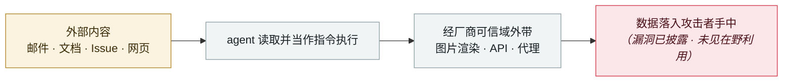

# ForcedLeak（Salesforce Agentforce）

ForcedLeak (Salesforce Agentforce)

      

## 概要

Noma Security，**CVSS 9.4**。攻击者只需一个公开 Web-to-Lead 表单 + 花 **$5** 买下 Salesforce **已过期的 CSP 白名单域名**，即可零交互外带任意 Agentforce 组织的 CRM 数据

## 攻击链

## 来源

| # | 来源 | 链接 |
|---|---|---|
| 1 | Noma Security | <https://noma.security/blog/forcedleak-agent-risks-exposed-in-salesforce-agentforce> |

## 元数据

| 字段 | 值 |
|---|---|
| 日期 | `2025-09-25`（原文：2025-09-25，精度 `day`） |
| 性质 | 漏洞披露 `vulnerability` |
| 类型 | [`IPI`](../../../../taxonomy/types.md#ipi) 间接提示注入 · [`EXFIL`](../../../../taxonomy/types.md#exfil) 数据外泄 |
| 严重度 | **高** `high` |
| 可信度 | **A** — 一手来源（厂商 / 受害方 / 执法 / 官方报告） |
| 真实伤害 | 否 |
| AI 参与 | 已确认 `confirmed` |
| 地区 | [全球](../../../../regions/global.md) |
| 档案编号 | `2025-09-25-forcedleak-salesforce-agentforce` |

**判定依据**：漏洞披露，截至归档未见在野利用证据，故 `real_harm: false`。 判 `high`：真实损害范围有限，或属 CVSS 9+ 的严重缺陷，或是有重要意义的能力实证。 分级口径见 [taxonomy/severity.md](../../../../taxonomy/severity.md) 与 [taxonomy/confidence.md](../../../../taxonomy/confidence.md)。

## 相关

**所属专题**：[零点击数据外泄链](../../../../topics/zero-click-exfil.md)

**同类条目**：

- `2025-09-18` [ShadowLeak](../../../2025-09/2025-09-18-shadowleak.md)   ShadowLeak
- `2025-09-19` [Notion 3.0 agent「致命三元组」](../../../2025-09/2025-09-19-notion-agent-zhi-ming-san.md)   Notion 3.0 agent hits the lethal trifecta
- `2025-09-30` [Gemini "Trifecta"](../../../2025-09/2025-09-30-gemini-trifecta.md)   Gemini "Trifecta"
- `2025-08-06` [AgentFlayer 零点击攻击集（Black Hat USA）](../../../2025-08/2025-08-06-agentflayer-black-hat-usa.md)   AgentFlayer zero-click attack set (Black Hat USA)

---

[← English original](../../../2025-09/2025-09-25-forcedleak-salesforce-agentforce.md) · [2025-09 index](../../../2025-09/README.md) · [All records](../../../README.md) · [Home](../../../../README.md)

本条目属于 **Orca AI Incident Archive**，按 [CC BY 4.0](../../../../LICENSE) 授权。发现事实错误或缺少来源，请[提 issue 或 PR](../../../../CONTRIBUTING.md)——更正会写进条目的修订记录，不会静默覆盖。
