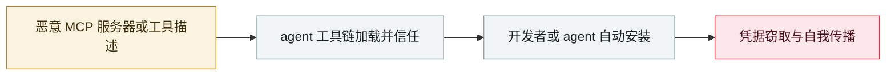

# postmark-mcp 恶意 npm 包

postmark-mcp malicious npm package

      

## 概要

**首个在野的恶意 MCP server**。Koi Security：第 15 版起加入一行代码，把所有经过的邮件静默 BCC 给作者，估计每天约 **1.5 万封**

## 攻击链

## 来源

| # | 来源 | 链接 |
|---|---|---|
| 1 | Koi Security | <https://www.koi.ai/blog> |

## 元数据

| 字段 | 值 |
|---|---|
| 日期 | `2025-09-25`（原文：2025-09-25，精度 `day`） |
| 性质 | 真实事故 `incident` |
| 类型 | [`MCP`](../../../../taxonomy/types.md#mcp) MCP / 工具链 · [`SUPPLY`](../../../../taxonomy/types.md#supply) 供应链投毒 |
| 严重度 | **高** `high` |
| 可信度 | **A** — 一手来源（厂商 / 受害方 / 执法 / 官方报告） |
| 真实伤害 | 是 |
| AI 参与 | 已确认 `confirmed` |
| 地区 | [全球](../../../../regions/global.md) |
| 档案编号 | `2025-09-25-postmark-mcp-npm` |

**判定依据**：真实事故，有确认的受害方。 判 `high`：真实损害范围有限，或属 CVSS 9+ 的严重缺陷，或是有重要意义的能力实证。 分级口径见 [taxonomy/severity.md](../../../../taxonomy/severity.md) 与 [taxonomy/confidence.md](../../../../taxonomy/confidence.md)。

## 相关

**所属专题**：[agent 供应链投毒](../../../../topics/agent-supply-chain.md)

**同类条目**：

- `2025-09-15` [Shai-Hulud npm 蠕虫 v1](../../../2025-09/2025-09-15-shai-hulud-npm.md)   Shai-Hulud npm worm v1
- `2025-09-03` [Claude Code MCP 自动启用绕过](../../../2025-09/2025-09-03-claude-code-mcp.md)   Claude Code MCP auto-enable bypass
- `2025-08-08` [Salesloft Drift OAuth 令牌窃取](../../../2025-08/2025-08-08-salesloft-drift-oauth-theft.md)   Salesloft Drift OAuth token theft
- `2025-08-26` [Nx "s1ngularity"](../../../2025-08/2025-08-26-nx-s1ngularity.md)   Nx "s1ngularity"

---

[← English original](../../../2025-09/2025-09-25-postmark-mcp-npm.md) · [2025-09 index](../../../2025-09/README.md) · [All records](../../../README.md) · [Home](../../../../README.md)

本条目属于 **Orca AI Incident Archive**，按 [CC BY 4.0](../../../../LICENSE) 授权。发现事实错误或缺少来源，请[提 issue 或 PR](../../../../CONTRIBUTING.md)——更正会写进条目的修订记录，不会静默覆盖。
