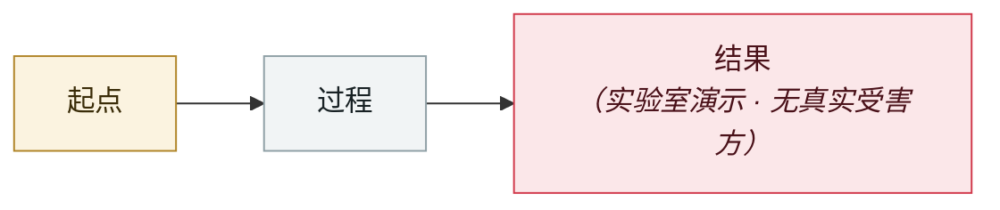

# OpenAI Guardrails 框架上线数日被攻破

OpenAI Guardrails broken days after launch

     

## 概要

HiddenLayer：新框架的 LLM 裁判本身可被提示注入

## 攻击链

## 来源

| # | 来源 | 链接 |
|---|---|---|
| 1 | 安全内参 2025 盘点 | <https://www.secrss.com/articles/86614> |

## 元数据

| 字段 | 值 |
|---|---|
| 日期 | `2025-10-01`（原文：2025-10，精度 `month`） |
| 性质 | 研究演示 `research` |
| 类型 | [`OTHER`](../../../../taxonomy/types.md#other) 其他 |
| 严重度 | **中** `medium` |
| 可信度 | **B** — 研究机构或主流媒体，有可核查细节 |
| 真实伤害 | 否 |
| AI 参与 | 已确认 `confirmed` |
| 地区 | [全球](../../../../regions/global.md) |
| 档案编号 | `2025-10-01-guardrails-kuang-jia-xian-shu` |

**判定依据**：研究机构或厂商的受控演示，`real_harm: false`；收录是为了标记攻击面何时被公开。 判 `medium`：受控演示、中等缺陷，或单用户 / 单机范围的事故。 分级口径见 [taxonomy/severity.md](../../../../taxonomy/severity.md) 与 [taxonomy/confidence.md](../../../../taxonomy/confidence.md)。

---

[← English original](../../../2025-10/2025-10-01-guardrails-kuang-jia-xian-shu.md) · [2025-10 index](../../../2025-10/README.md) · [All records](../../../README.md) · [Home](../../../../README.md)

本条目属于 **Orca AI Incident Archive**，按 [CC BY 4.0](../../../../LICENSE) 授权。发现事实错误或缺少来源，请[提 issue 或 PR](../../../../CONTRIBUTING.md)——更正会写进条目的修订记录，不会静默覆盖。
