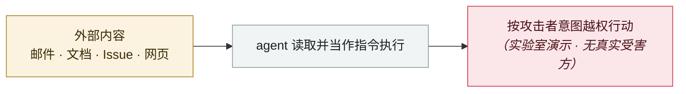

# Brave 披露 Comet 截图型注入

Brave discloses screenshot-based injection in Comet

     

## 概要

图片中的隐藏文字被处理后当成指令。10-01 发现、10-02 通知、10-21 公开（与 Atlas 发布同日）

## 攻击链

## 来源

| # | 来源 | 链接 |
|---|---|---|
| 1 | Brave | <https://brave.com/blog/comet-prompt-injection/> |

## 元数据

| 字段 | 值 |
|---|---|
| 日期 | `2025-10-21`（原文：2025-10-21，精度 `day`） |
| 性质 | 研究演示 `research` |
| 类型 | [`IPI`](../../../../taxonomy/types.md#ipi) 间接提示注入 |
| 严重度 | **中** `medium` |
| 可信度 | **A** — 一手来源（厂商 / 受害方 / 执法 / 官方报告） |
| 真实伤害 | 否 |
| AI 参与 | 已确认 `confirmed` |
| 地区 | [全球](../../../../regions/global.md) |
| 档案编号 | `2025-10-21-brave-comet-pi-lu-jie` |

**判定依据**：研究机构或厂商的受控演示，`real_harm: false`；收录是为了标记攻击面何时被公开。 判 `medium`：受控演示、中等缺陷，或单用户 / 单机范围的事故。 分级口径见 [taxonomy/severity.md](../../../../taxonomy/severity.md) 与 [taxonomy/confidence.md](../../../../taxonomy/confidence.md)。

## 相关

**所属专题**：[零点击数据外泄链](../../../../topics/zero-click-exfil.md)

**同类条目**：

- `2025-10-02` [CometJacking](../../../2025-10/2025-10-02-cometjacking.md)   CometJacking
- `2025-10-08` [CamoLeak（GitHub Copilot Chat）](../../../2025-10/2025-10-08-camoleak-github-copilot-chat.md)   CamoLeak (GitHub Copilot Chat)
- `2025-10-31` [Agent Session Smuggling：A2A 协议上的 agent 互骗](../../../2025-10/2025-10-31-agent-session-smuggling-a2a.md)   Agent Session Smuggling: agents deceiving agents over A2A
- `2025-10-24` [Atlas omnibox 越狱](../../../2025-10/2025-10-24-atlas-omnibox-yue-yu.md)   Atlas omnibox jailbreak

---

[← English original](../../../2025-10/2025-10-21-brave-comet-pi-lu-jie.md) · [2025-10 index](../../../2025-10/README.md) · [All records](../../../README.md) · [Home](../../../../README.md)

本条目属于 **Orca AI Incident Archive**，按 [CC BY 4.0](../../../../LICENSE) 授权。发现事实错误或缺少来源，请[提 issue 或 PR](../../../../CONTRIBUTING.md)——更正会写进条目的修订记录，不会静默覆盖。
