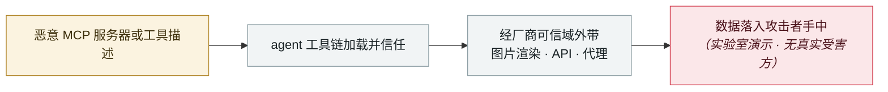

# Shadow Escape：首个经 MCP 的零点击 agent 攻击

Shadow Escape: first zero-click agent attack over MCP

      

## 概要

Operant AI 披露。**不需要用户失误、钓鱼或恶意扩展** —— 直接利用 agent 经合法 MCP 连接已获得的信任，跨 ChatGPT、Claude、Gemini 等主流平台隐形外带数据，包括社保号与病历号

## 攻击链

## 来源

| # | 来源 | 链接 |
|---|---|---|
| 1 | Operant AI | <https://www.operant.ai/art-kubed/shadow-escape> |
| 2 | GlobeNewswire | <https://www.globenewswire.com/news-release/2025/10/22/3171164/0/en/Operant-AI-Discovers-Shadow-Escape-The-First-Zero-Click-Agentic-Attack-via-MCP.html> |

## 元数据

| 字段 | 值 |
|---|---|
| 日期 | `2025-10-22`（原文：2025-10-22，精度 `day`） |
| 性质 | 研究演示 `research` |
| 类型 | [`MCP`](../../../../taxonomy/types.md#mcp) MCP / 工具链 · [`EXFIL`](../../../../taxonomy/types.md#exfil) 数据外泄 |
| 严重度 | **高** `high` |
| 可信度 | **A** — 一手来源（厂商 / 受害方 / 执法 / 官方报告） |
| 真实伤害 | 否 |
| AI 参与 | 已确认 `confirmed` |
| 地区 | [全球](../../../../regions/global.md) |
| 档案编号 | `2025-10-22-shadow-escape-mcp-agent` |

**判定依据**：研究机构或厂商的受控演示，`real_harm: false`；收录是为了标记攻击面何时被公开。 判 `high`：真实损害范围有限，或属 CVSS 9+ 的严重缺陷，或是有重要意义的能力实证。 分级口径见 [taxonomy/severity.md](../../../../taxonomy/severity.md) 与 [taxonomy/confidence.md](../../../../taxonomy/confidence.md)。

## 相关

**所属专题**：[agent 供应链投毒](../../../../topics/agent-supply-chain.md) · [零点击数据外泄链](../../../../topics/zero-click-exfil.md)

**同类条目**：

- `2025-10-02` [CometJacking](../../../2025-10/2025-10-02-cometjacking.md)   CometJacking
- `2025-10-08` [CamoLeak（GitHub Copilot Chat）](../../../2025-10/2025-10-08-camoleak-github-copilot-chat.md)   CamoLeak (GitHub Copilot Chat)
- `2025-10-01` [Framelink Figma MCP RCE](../../../2025-10/2025-10-01-framelink-figma-mcp-rce.md)   Framelink Figma MCP RCE
- `2025-09-03` [Claude Code MCP 自动启用绕过](../../../2025-09/2025-09-03-claude-code-mcp.md)   Claude Code MCP auto-enable bypass

---

[← English original](../../../2025-10/2025-10-22-shadow-escape-mcp-agent.md) · [2025-10 index](../../../2025-10/README.md) · [All records](../../../README.md) · [Home](../../../../README.md)

本条目属于 **Orca AI Incident Archive**，按 [CC BY 4.0](../../../../LICENSE) 授权。发现事实错误或缺少来源，请[提 issue 或 PR](../../../../CONTRIBUTING.md)——更正会写进条目的修订记录，不会静默覆盖。
