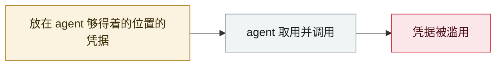

# Claude Code API 密钥外带

Claude Code API key exfiltration

     

## 概要

`.claude/settings.json` 里的恶意 `ANTHROPIC_BASE_URL` 把已认证流量导向攻击者代理，**且发生在信任提示出现之前**。CVE-2026-21852（2026-01-21 公开），**2025-12-28 修复**

## 攻击链

## 来源

| # | 来源 | 链接 |
|---|---|---|
| 1 | Check Point | <https://research.checkpoint.com/2026/rce-and-api-token-exfiltration-through-claude-code-project-files-cve-2025-59536/> |

## 元数据

| 字段 | 值 |
|---|---|
| 日期 | `2025-10-28`（原文：2025-10-28，精度 `day`） |
| 性质 | 漏洞披露 `vulnerability` |
| 类型 | [`CRED`](../../../../taxonomy/types.md#cred) 凭据滥用 |
| 严重度 | **高** `high` |
| 可信度 | **A** — 一手来源（厂商 / 受害方 / 执法 / 官方报告） |
| 真实伤害 | 是 |
| AI 参与 | 已确认 `confirmed` |
| 地区 | [全球](../../../../regions/global.md) |
| 档案编号 | `2025-10-28-claude-code-api` |

**判定依据**：漏洞披露，已确认在野利用，故 `real_harm: true`。 判 `high`：真实损害范围有限，或属 CVSS 9+ 的严重缺陷，或是有重要意义的能力实证。 分级口径见 [taxonomy/severity.md](../../../../taxonomy/severity.md) 与 [taxonomy/confidence.md](../../../../taxonomy/confidence.md)。

## 相关

**同类条目**：

- `2025-09-15` [Shai-Hulud npm 蠕虫 v1](../../../2025-09/2025-09-15-shai-hulud-npm.md)   Shai-Hulud npm worm v1
- `2025-11-21` [Shai-Hulud 2.0](../../../2025-11/2025-11-21-shai-hulud.md)   Shai-Hulud 2.0
- `2025-11-25` [OpenAI 通报 Mixpanel 第三方泄露](../../../2025-11/2025-11-25-mixpanel-tong-bao-di-san.md)   OpenAI reports the third-party Mixpanel breach
- `2025-08-08` [Salesloft Drift OAuth 令牌窃取](../../../2025-08/2025-08-08-salesloft-drift-oauth-theft.md)   Salesloft Drift OAuth token theft

---

[← English original](../../../2025-10/2025-10-28-claude-code-api.md) · [2025-10 index](../../../2025-10/README.md) · [All records](../../../README.md) · [Home](../../../../README.md)

本条目属于 **Orca AI Incident Archive**，按 [CC BY 4.0](../../../../LICENSE) 授权。发现事实错误或缺少来源，请[提 issue 或 PR](../../../../CONTRIBUTING.md)——更正会写进条目的修订记录，不会静默覆盖。
