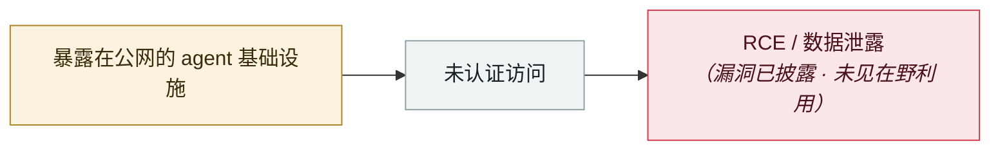

# ServiceNow BodySnatcher

ServiceNow BodySnatcher

     

## 概要

AppOmni 发现 CVE-2025-12420，**CVSS 9.3**。Virtual Agent API 对**所有客户下发同一个硬编码密钥** `servicenowexternalagent`，配合信任邮箱的账号关联逻辑可绕过 MFA/SSO 冒充任意用户。10-30 向多数托管实例推送修复

## 攻击链

## 来源

| # | 来源 | 链接 |
|---|---|---|
| 1 | AppOmni | <https://appomni.com/ao-labs/bodysnatcher-agentic-ai-security-vulnerability-in-servicenow/> |
| 2 | CyberScoop | <https://cyberscoop.com/servicenow-fixes-critical-ai-vulnerability-cve-2025-12420/> |

## 元数据

| 字段 | 值 |
|---|---|
| 日期 | `2025-10-30`（原文：2025-10-30，精度 `day`） |
| 性质 | 漏洞披露 `vulnerability` |
| 类型 | [`INFRA`](../../../../taxonomy/types.md#infra) agent 基础设施暴露 |
| 严重度 | **高** `high` |
| 可信度 | **A** — 一手来源（厂商 / 受害方 / 执法 / 官方报告） |
| 真实伤害 | 否 |
| AI 参与 | 已确认 `confirmed` |
| 地区 | [全球](../../../../regions/global.md) |
| 档案编号 | `2025-10-30-servicenow-bodysnatcher` |

**判定依据**：漏洞披露，截至归档未见在野利用证据，故 `real_harm: false`。 判 `high`：真实损害范围有限，或属 CVSS 9+ 的严重缺陷，或是有重要意义的能力实证。 分级口径见 [taxonomy/severity.md](../../../../taxonomy/severity.md) 与 [taxonomy/confidence.md](../../../../taxonomy/confidence.md)。

## 相关

**所属专题**：[agent 基础设施暴露](../../../../topics/agent-infra.md)

**同类条目**：

- `2025-11-01` [ShadowRay 2.0（Ray 框架）](../../../2025-11/2025-11-01-shadowray-2-ray-framework.md)   ShadowRay 2.0 (Ray framework)
- `2026-01-26` [Clawdbot 网关大规模裸奔](../../../2026-01/2026-01-26-clawdbot-wang-guan-gui-mo.md)   Clawdbot gateways exposed at scale
- `2026-01-29` [OpenClaw Control UI WebSocket 劫持 RCE](../../../2026-01/2026-01-29-openclaw-control-ui-websocket.md)   OpenClaw Control UI WebSocket hijack RCE
- `2026-02-28` [CodeWall 攻破麦肯锡 "Lilli" 内部 AI 平台](../../../2026-02/2026-02-28-codewall-breaches-mckinsey-lilli.md)   CodeWall breaches McKinsey's internal "Lilli" AI platform

---

[← English original](../../../2025-10/2025-10-30-servicenow-bodysnatcher.md) · [2025-10 index](../../../2025-10/README.md) · [All records](../../../README.md) · [Home](../../../../README.md)

本条目属于 **Orca AI Incident Archive**，按 [CC BY 4.0](../../../../LICENSE) 授权。发现事实错误或缺少来源，请[提 issue 或 PR](../../../../CONTRIBUTING.md)——更正会写进条目的修订记录，不会静默覆盖。
