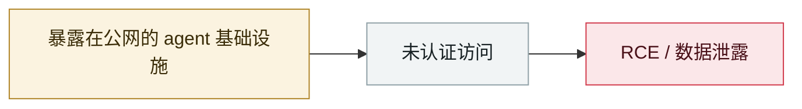

# ShadowRay 2.0（Ray 框架）

ShadowRay 2.0 (Ray framework)

     

> [!WARNING]
> **本条存在争议或未完全证实的事实**，正文中的各方说法并列保留，请勿单独引用其中一方。

## 概要

Oligo Security：利用 **CVE-2023-48022**（Ray 维护者视为「符合设计信任模型」而长期未修）构建自我传播僵尸网络，攻陷 **23 万+** 联网 Ray 服务器（大量搭载 NVIDIA A100），用于挖矿、数据与凭据窃取、DDoS。**攻击载荷大量由 AI 生成**——特征是冗余 docstring、无用 echo、重复注释与模板化错误处理

## 攻击链

## 来源

| # | 来源 | 链接 |
|---|---|---|
| 1 | Oligo | <https://www.oligo.security/blog/shadowray-attack-ai-workloads-actively-exploited-in-the-wild> |

## 元数据

| 字段 | 值 |
|---|---|
| 日期 | `2025-11-01`（原文：2025-11，精度 `month`） |
| 性质 | 真实事故 `incident` |
| 类型 | [`INFRA`](../../../../taxonomy/types.md#infra) agent 基础设施暴露 |
| 严重度 | **严重** `critical` |
| 可信度 | **B** — 研究机构或主流媒体，有可核查细节 |
| 真实伤害 | 是 |
| AI 参与 | 已确认 `confirmed` |
| 地区 | [全球](../../../../regions/global.md) |
| 档案编号 | `2025-11-01-shadowray-2-ray-framework` |

**判定依据**：真实事故，有确认的受害方。 判 `critical`：确认的真实损害达到多组织 / 政府 / 关键基础设施 / 供应链蠕虫级别，或属首次出现且有真实受害方的能力里程碑。 分级口径见 [taxonomy/severity.md](../../../../taxonomy/severity.md) 与 [taxonomy/confidence.md](../../../../taxonomy/confidence.md)。

## 相关

**所属专题**：[agent 基础设施暴露](../../../../topics/agent-infra.md)

**同类条目**：

- `2025-10-30` [ServiceNow BodySnatcher](../../../2025-10/2025-10-30-servicenow-bodysnatcher.md)   ServiceNow BodySnatcher
- `2026-01-26` [Clawdbot 网关大规模裸奔](../../../2026-01/2026-01-26-clawdbot-wang-guan-gui-mo.md)   Clawdbot gateways exposed at scale
- `2026-01-29` [OpenClaw Control UI WebSocket 劫持 RCE](../../../2026-01/2026-01-29-openclaw-control-ui-websocket.md)   OpenClaw Control UI WebSocket hijack RCE
- `2026-02-28` [CodeWall 攻破麦肯锡 "Lilli" 内部 AI 平台](../../../2026-02/2026-02-28-codewall-breaches-mckinsey-lilli.md)   CodeWall breaches McKinsey's internal "Lilli" AI platform

---

[← English original](../../../2025-11/2025-11-01-shadowray-2-ray-framework.md) · [2025-11 index](../../../2025-11/README.md) · [All records](../../../README.md) · [Home](../../../../README.md)

本条目属于 **Orca AI Incident Archive**，按 [CC BY 4.0](../../../../LICENSE) 授权。发现事实错误或缺少来源，请[提 issue 或 PR](../../../../CONTRIBUTING.md)——更正会写进条目的修订记录，不会静默覆盖。
