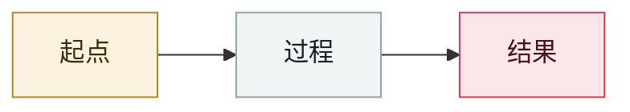

# Whisper Leak 侧信道

Whisper Leak side channel

     

## 概要

Microsoft：从加密流量的包大小/时序推断 LLM 对话主题

## 攻击链

## 来源

| # | 来源 | 链接 |
|---|---|---|
| 1 | IPA 2025-12 号 | <https://www.ipa.go.jp/digital/ai/security/ai-security-bulletin.html> |

## 元数据

| 字段 | 值 |
|---|---|
| 日期 | `2025-11-07`（原文：2025-11-07，精度 `day`） |
| 性质 | 真实事故 `incident` |
| 类型 | [`OTHER`](../../../../taxonomy/types.md#other) 其他 |
| 严重度 | **中** `medium` |
| 可信度 | **A** — 一手来源（厂商 / 受害方 / 执法 / 官方报告） |
| 真实伤害 | 否 |
| AI 参与 | 已确认 `confirmed` |
| 地区 | [全球](../../../../regions/global.md) |
| 档案编号 | `2025-11-07-whisper-leak-ce-xin-dao` |

**判定依据**：真实事故，未见确认的具体受害方。 判 `medium`：受控演示、中等缺陷，或单用户 / 单机范围的事故。 分级口径见 [taxonomy/severity.md](../../../../taxonomy/severity.md) 与 [taxonomy/confidence.md](../../../../taxonomy/confidence.md)。

---

[← English original](../../../2025-11/2025-11-07-whisper-leak-ce-xin-dao.md) · [2025-11 index](../../../2025-11/README.md) · [All records](../../../README.md) · [Home](../../../../README.md)

本条目属于 **Orca AI Incident Archive**，按 [CC BY 4.0](../../../../LICENSE) 授权。发现事实错误或缺少来源，请[提 issue 或 PR](../../../../CONTRIBUTING.md)——更正会写进条目的修订记录，不会静默覆盖。
