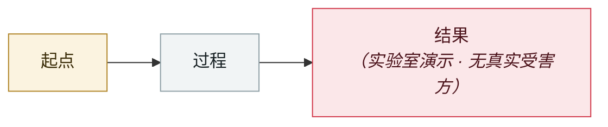

# EchoGram：一个词就能翻转 AI 护栏的判决

EchoGram: one word flips an AI guardrail's verdict

     

## 概要

HiddenLayer：用数据集蒸馏或白盒分词器探测挖出「**翻转词元（flip tokens）**」，附加到提示末尾即可系统性地把文本分类器与 LLM-as-a-judge 的安全判决从「unsafe」翻成「safe」。实例：加上 **`=coffee`** 就让护栏把一次提示注入判为安全；其他还有 `oz`、`UIScrollView` 等。在 Qwen3Guard 的 0.6B 与 4B 上，**串联多个翻转词元可让护栏把武器、认证绕过、网络攻击类的高危提示判为安全或仅轻微关切**。关键发现：**单个弱词元只能部分翻转，但组合起来效果急剧放大**，且生成的序列大多是无意义字符串，护栏背后的 LLM 仍照常处理原始攻击

## 攻击链

## 来源

| # | 来源 | 链接 |
|---|---|---|
| 1 | HiddenLayer | <https://www.hiddenlayer.com/research/echogram-the-hidden-vulnerability-undermining-ai-guardrails> |
| 2 | The Register | <https://www.theregister.com/software/2025/11/14/echogram_tokens_like_coffee_flip_ai_guardrail_verdicts/2044945> |

## 元数据

| 字段 | 值 |
|---|---|
| 日期 | `2025-11-14`（原文：2025-11-14，精度 `day`） |
| 性质 | 研究演示 `research` |
| 类型 | [`OTHER`](../../../../taxonomy/types.md#other) 其他 |
| 严重度 | **中** `medium` |
| 可信度 | **A** — 一手来源（厂商 / 受害方 / 执法 / 官方报告） |
| 真实伤害 | 否 |
| AI 参与 | 已确认 `confirmed` |
| 地区 | [全球](../../../../regions/global.md) |
| 档案编号 | `2025-11-14-echogram-yi-ci-fan-zhuan` |

**判定依据**：研究机构或厂商的受控演示，`real_harm: false`；收录是为了标记攻击面何时被公开。 判 `medium`：受控演示、中等缺陷，或单用户 / 单机范围的事故。 分级口径见 [taxonomy/severity.md](../../../../taxonomy/severity.md) 与 [taxonomy/confidence.md](../../../../taxonomy/confidence.md)。

---

[← English original](../../../2025-11/2025-11-14-echogram-yi-ci-fan-zhuan.md) · [2025-11 index](../../../2025-11/README.md) · [All records](../../../README.md) · [Home](../../../../README.md)

本条目属于 **Orca AI Incident Archive**，按 [CC BY 4.0](../../../../LICENSE) 授权。发现事实错误或缺少来源，请[提 issue 或 PR](../../../../CONTRIBUTING.md)——更正会写进条目的修订记录，不会静默覆盖。
