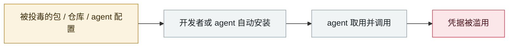

# Shai-Hulud 2.0

Shai-Hulud 2.0

      

## 概要

第二波自我复制蠕虫，**796 个唯一 npm 包**被后门化，**25,000+ 仓库 / 约 350 个用户**受影响（Zapier、ENS Domains、PostHog、Postman 等）。改在 **preinstall 阶段**执行（依赖解析前），在构建系统上近乎 100% 命中、无需任何用户交互

## 攻击链

## 来源

| # | 来源 | 链接 |
|---|---|---|
| 1 | Wiz | <https://www.wiz.io/blog/shai-hulud-2-0-ongoing-supply-chain-attack> |
| 2 | Unit 42 | <https://unit42.paloaltonetworks.com/npm-supply-chain-attack/> |
| 3 | Datadog | <https://securitylabs.datadoghq.com/articles/shai-hulud-2.0-npm-worm/> |

## 元数据

| 字段 | 值 |
|---|---|
| 日期 | `2025-11-21` → `2025-11-24`（原文：2025-11-21→24，精度 `day`） |
| 性质 | 真实事故 `incident` |
| 类型 | [`SUPPLY`](../../../../taxonomy/types.md#supply) 供应链投毒 · [`CRED`](../../../../taxonomy/types.md#cred) 凭据滥用 |
| 严重度 | **严重** `critical` |
| 可信度 | **A** — 一手来源（厂商 / 受害方 / 执法 / 官方报告） |
| 真实伤害 | 是 |
| AI 参与 | 已确认 `confirmed` |
| 地区 | [全球](../../../../regions/global.md) |
| 档案编号 | `2025-11-21-shai-hulud` |

**判定依据**：真实事故，有确认的受害方。 判 `critical`：确认的真实损害达到多组织 / 政府 / 关键基础设施 / 供应链蠕虫级别，或属首次出现且有真实受害方的能力里程碑。 分级口径见 [taxonomy/severity.md](../../../../taxonomy/severity.md) 与 [taxonomy/confidence.md](../../../../taxonomy/confidence.md)。

## 相关

**所属专题**：[agent 供应链投毒](../../../../topics/agent-supply-chain.md)

**同类条目**：

- `2025-11-25` [OpenAI 通报 Mixpanel 第三方泄露](../../../2025-11/2025-11-25-mixpanel-tong-bao-di-san.md)   OpenAI reports the third-party Mixpanel breach
- `2025-10-28` [Claude Code API 密钥外带](../../../2025-10/2025-10-28-claude-code-api.md)   Claude Code API key exfiltration
- `2025-12-15` [「隐私」浏览器扩展倒卖 AI 对话](../../../2025-12/2025-12-15-yin-si-liu-lan-qi.md)   "Privacy" browser extensions resell AI conversations
- `2025-12-30` [Chrome 扩展窃取 ChatGPT/DeepSeek 对话](../../../2025-12/2025-12-30-chrome-chatgpt-deepseek.md)   Chrome extensions steal ChatGPT and DeepSeek conversations

---

[← English original](../../../2025-11/2025-11-21-shai-hulud.md) · [2025-11 index](../../../2025-11/README.md) · [All records](../../../README.md) · [Home](../../../../README.md)

本条目属于 **Orca AI Incident Archive**，按 [CC BY 4.0](../../../../LICENSE) 授权。发现事实错误或缺少来源，请[提 issue 或 PR](../../../../CONTRIBUTING.md)——更正会写进条目的修订记录，不会静默覆盖。
