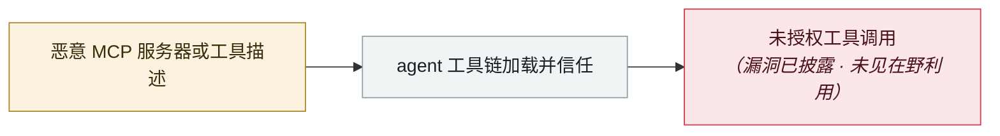

# MCP TypeScript SDK DNS 重绑定

MCP TypeScript SDK DNS rebinding

     

## 概要

CVE-2025-66414，**CVSS 8.1**。localhost 上运行且未开 `enableDnsRebindingProtection` 的无认证 HTTP MCP server，可被恶意网站经 DNS 重绑定绕过同源策略调用工具。**v1.24.0 修复**，`createMcpExpressApp()` 绑定 localhost 时默认开启保护

## 攻击链

## 来源

| # | 来源 | 链接 |
|---|---|---|
| 1 | GHSA-w48q-cv73-mx4w | <https://github.com/modelcontextprotocol/typescript-sdk/security/advisories/GHSA-w48q-cv73-mx4w> |

## 元数据

| 字段 | 值 |
|---|---|
| 日期 | `2025-12-01`（原文：2025-12，精度 `month`） |
| 性质 | 漏洞披露 `vulnerability` |
| 类型 | [`MCP`](../../../../taxonomy/types.md#mcp) MCP / 工具链 |
| 严重度 | **中** `medium` |
| 可信度 | **A** — 一手来源（厂商 / 受害方 / 执法 / 官方报告） |
| 真实伤害 | 否 |
| AI 参与 | 已确认 `confirmed` |
| 地区 | [全球](../../../../regions/global.md) |
| 档案编号 | `2025-12-01-mcp-typescript-sdk-dns` |

**判定依据**：漏洞披露，截至归档未见在野利用证据，故 `real_harm: false`。 判 `medium`：受控演示、中等缺陷，或单用户 / 单机范围的事故。 分级口径见 [taxonomy/severity.md](../../../../taxonomy/severity.md) 与 [taxonomy/confidence.md](../../../../taxonomy/confidence.md)。

## 相关

**所属专题**：[agent 供应链投毒](../../../../topics/agent-supply-chain.md)

**同类条目**：

- `2025-12-06` [IDEsaster](../../../2025-12/2025-12-06-idesaster.md)   IDEsaster
- `2025-12-01` [Anthropic Git MCP Server 三连 CVE](../../../2025-12/2025-12-01-anthropic-git-mcp-server.md)   Three CVEs in Anthropic's Git MCP Server
- `2025-10-22` [Shadow Escape：首个经 MCP 的零点击 agent 攻击](../../../2025-10/2025-10-22-shadow-escape-mcp-agent.md)   Shadow Escape: first zero-click agent attack over MCP
- `2025-10-01` [Framelink Figma MCP RCE](../../../2025-10/2025-10-01-framelink-figma-mcp-rce.md)   Framelink Figma MCP RCE

---

[← English original](../../../2025-12/2025-12-01-mcp-typescript-sdk-dns.md) · [2025-12 index](../../../2025-12/README.md) · [All records](../../../README.md) · [Home](../../../../README.md)

本条目属于 **Orca AI Incident Archive**，按 [CC BY 4.0](../../../../LICENSE) 授权。发现事实错误或缺少来源，请[提 issue 或 PR](../../../../CONTRIBUTING.md)——更正会写进条目的修订记录，不会静默覆盖。
